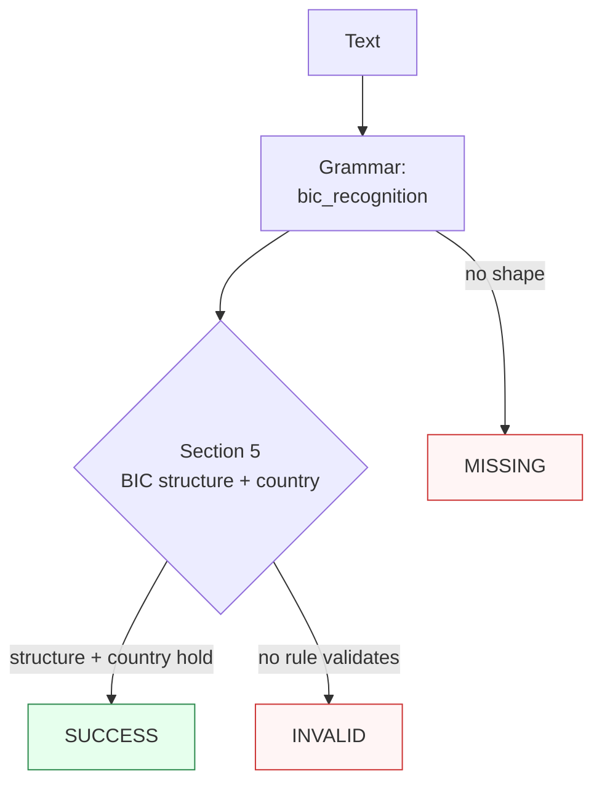

Canonicalizes **one BIC mention** per call — an 8- or 11-character Business Identifier Code in compact or SWIFT grouped display (with an optional `BIC`/`SWIFT` label) — to compact uppercase form.

> **In plain language:** give it `deutdeff`, `BIC: DEUTDEFF500`, `DEUT DE FF`, or `BNPA FR PP XXX` and it hands back `DEUTDEFF`, `DEUTDEFF500`, or `BNPAFRPPXXX` when the shape is a real BIC structure per ISO 9362:2022 §5 with a known country code. The spec defines no checksum, so validation is structural (length 8 or 11, per-position charset, ISO 3166-1 country lookup plus `XK`); the location-code second character and the `XXX` head-office branch are informative and never rejected.

---

## What it recognizes — and what it does not

| Recognizes | Does not recognize |
|------------|--------------------|
| Compact BIC-8 (`DEUTDEFF`, lowercase folds up) and BIC-11 (`DEUTDEFF500`, `BNPAFRPPXXX`) | Wrong lengths (`DEUTDEF` 7, `DEUTDEFF5` 9, `DEUTDEFF50` 10, `DEUTDEFF5000` 12) → `MISSING` |
| SWIFT grouped display, single spaces only (`DEUT DE FF`, `DEUT DE FF 500`, `BNPA FR PP XXX`) | Double-spaced display (`DEUT  DE FF`) → `MISSING` |
| Fused `BIC`/`SWIFT` label with separator (`BIC: DEUTDEFF`, `SWIFT: BNPAFRPPXXX`, `bic - NEDSZAJJ`) | Glued label (`BICDEUTDEFF`, `SWIFTDEUTDEFF500`, no separator) → `MISSING` |
| Kosovo `XK` user-assigned code (`BANKXK22`, `CBKIXKPRXXX`) | Unknown country (`DEUTXXFF`, `BNPAQQPP`) → recognized, then `INVALID` |
| Bank codes with digits (`DE1TDEFF`, 4!c since 2014) | Digit in the country position (`DEUT1EFF`, 2!a must be A–Z) → `MISSING` |
| | Glued surroundings (`XDEUTDEFF`, `DEUTDEFFY`) → `MISSING` |
| | Lowercase English trigrams at end of text (`call me at`, `call me at.`, `call me at noon`) → `MISSING` |

---

## Canonical output

Default `output_format` is `"bic"` (identity — `normalize()` returns compact uppercase).

| `output_format` | Renders | Example |
|-----------------|---------|---------|
| *(default)* `bic` / `None` / `"default"` | Compact uppercase, branch as matched | `DEUTDEFF`, `DEUTDEFF500` |
| `grouped` | SWIFT paper form, single spaces between the 4-2-2-3 groups (encoding) | `DEUT DE FF` from `DEUTDEFF`, `DEUT DE FF 500` from `DEUTDEFF500` |
| `bic11` | Always 11 chars: BIC-8 gains `XXX` head office (lossy expansion); BIC-11 is identity | `DEUTDEFFXXX` from `DEUTDEFF` |

Any other value raises `ContractError` — including `compact`, `paper`, and `hyphenated`, which belong to other capabilities' vocabularies, not BIC's.

```python
from paxman.capabilities import BIC
import paxman

paxman.register_all_shipped()
print(paxman.canonicalize("deutdeff", BIC.create_contract()).canonicalized_value)
print(paxman.canonicalize("BIC: DEUTDEFF500", BIC.create_contract()).canonicalized_value)
print(paxman.canonicalize("DEUT DE FF", BIC.create_contract()).canonicalized_value)
print(paxman.canonicalize("DEUTDEFF", BIC.create_contract(output_format="grouped")).canonicalized_value)
print(paxman.canonicalize("DEUTDEFF", BIC.create_contract(output_format="bic11")).canonicalized_value)
```

---

## Contract

```python
contract = BIC.create_contract(
    output_format=None,  # "bic" (default), "grouped", "bic11"
    # plus every common field: suppress_common_words / excluded_rules / pinned_rules / year / extra_grammars
)
```

- No grammar toggles: one grammar (`bic_recognition`), one rule (`Section 5-bic-structure-country`).
- `year` filters by `publication_year`; e.g., `year=2021` drops the ISO 9362:2022 rule → `DEUTDEFF` becomes `INVALID`.

---

## Statuses

| Input | Contract | Status | Value / why |
|-------|----------|--------|-------------|
| `DEUTDEFF` | defaults | `SUCCESS` | `"DEUTDEFF"` |
| `deutdeff` | defaults | `SUCCESS` | `"DEUTDEFF"` (case folds up) |
| `BIC: DEUTDEFF` | defaults | `SUCCESS` | `"DEUTDEFF"` (label recognized, span covers `BIC DEUTDEFF`) |
| `DEUT DE FF` | defaults | `SUCCESS` | `"DEUTDEFF"` (grouped recognized) |
| `BNPA FR PP XXX` | defaults | `SUCCESS` | `"BNPAFRPPXXX"` (grouped 11 recognized) |
| `DEUTDEFF` | `output_format="grouped"` | `SUCCESS` | `"DEUT DE FF"` |
| `DEUTDEFF` | `output_format="bic11"` | `SUCCESS` | `"DEUTDEFFXXX"` (lossy `XXX` expansion) |
| `DEUTXXFF` | any | `INVALID` | recognized shape, unknown country code |
| `DEUTDEFF` | `year=2021` | `INVALID` | rule is 2022, dropped |
| `DEUTDEFF5` | any | `MISSING` | 9 chars, no shape matches |
| `DEUT1EFF` | any | `MISSING` | digit in country position, grammar charset blocks |
| `BICDEUTDEFF` | any | `MISSING` | glued label needs a separator |
| `XDEUTDEFF` | any | `MISSING` | word guard blocks left glue |
| `DEUT  DE FF` | any | `MISSING` | double spaces not allowed in grouped display |
| `call me at noon` | any | `MISSING` | English-phrase filter, not a BIC |
| `DEUTDEFF / BNPAFRPP` | any | raises `MultipleMentionsError` | two distinct BICs |
| `DEUTDEFF` | `output_format="compact"` | raises `ContractError` | format not offered |

A single grammar plus a single deterministic rule yields at most one value, so `AMBIGUOUS` is unreachable for this capability. Two distinct BICs raise `MultipleMentionsError`; two identical mentions coalesce to one `SUCCESS`.



---

## Notebook snippet — normalize a mixed column

```python
import paxman
from paxman.capabilities import BIC
from paxman.core.domain import Resolution
from paxman.core.errors import ContractError

paxman.register_all_shipped()
contract = BIC.create_contract()

rows = [
    "DEUTDEFF",
    "deutdeff",
    "DEUTDEFF500",
    "BIC: DEUTDEFF",
    "SWIFT: BNPAFRPPXXX",
    "DEUT DE FF",
    "DEUT DE FF 500",
    "BNPA FR PP XXX",
    "BANKXK22",
    "DEUTXXFF",
    "DEUT1EFF",
    "DEUTDEFF5",
    "BICDEUTDEFF",
    "call me at noon",
]

for text in rows:
    r = paxman.canonicalize(text, contract)
    val = r.canonicalized_value if r.status == Resolution.SUCCESS else "—"
    rule = r.candidates[0].validation_rule if r.candidates else "—"
    print(f"{text!r:24} → {r.status.value:10} {val!r:16} ({rule})")

try:
    BIC.create_contract(output_format="compact")
except ContractError as e:
    print(f"compact → ContractError: {e}")
```

---

## Provenance

- **ISO 9362:2022** §5 BIC structure plus country lookup (length 8 or 11, per-position charset, ISO 3166-1 country plus `XK`; no checksum) — `Section 5-bic-structure-country`

Each candidate's `validation_rule` carries the section, and `candidate.provenance[0].publication_year` the year.

See also: [Execution Result](../concepts/execution-result/), [Provenance](../concepts/provenance/), [Segmentation](https://github.com/nexusnv/paxman-python/blob/main/docs/recipes/segmentation.md).
