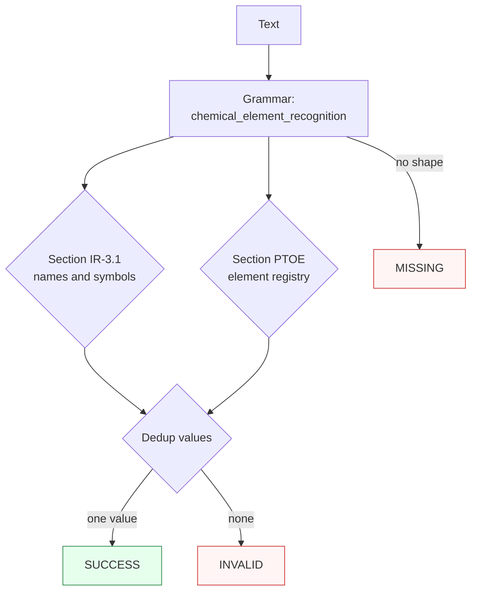

Canonicalizes **one element mention** per call — an IUPAC symbol (case-exact), an English element name (case-insensitive, including the `aluminum`/`cesium` aliases), or a labeled atomic number (`element 26`, `Z=26`) — to the proper-case IUPAC symbol.

> **In plain language:** give it `Fe`, `fe`, `iron` (or `IRON`), `aluminum`, or `element 26` / `Z=26` and it hands back `Fe` when the shape is a real element designation per the IUPAC Red Book 2005 Ch. IR-3 (symbols and names) or the IUPAC Periodic Table 2022 (atomic numbers 1–118). The symbol branch is case-exact (`fe` folds to `Fe`, but `FE` is unclaimed by design), and atomic numbers need their label — bare `26` is never claimed.

---

## What it recognizes — and what it does not

| Recognizes | Does not recognize |
|------------|--------------------|
| Proper-case symbols (`Fe`, `C`, `Og`) and their all-lowercase fold (`fe` → `Fe`) | All-caps or mixed wrong-case symbols (`FE`, `fE`) → `MISSING` |
| English names, case-insensitive (`iron`, `Iron`, `IRON` → `Fe`); 120 names including the Table I aliases `aluminum` → `Al` and `cesium` → `Cs` | Retired or non-IUPAC names (`ununtrium`, `sulphur`, `ferrum`) → `MISSING` |
| Labeled atomic numbers (`element 26`, `Z=26`, `Z = 92`, `atomic number 118`); leading zeros fold (`element 026` → `26`) | Bare integers (`26`) → `MISSING` (the label is part of the pattern) |
| | Label glued without a separator (`element26`, `Z26`) → `MISSING` |
| | Isotope/formula-glued shapes (`Fe-56`, `56Fe`, `Fe2O3`, `NaCl`) → `MISSING` |
| | Unknown symbol-like tokens (`Xx`) → `MISSING` (unclaimed, not validated) |
| | Prose without an element shape (`hello world`) → `MISSING` |
| | Out-of-range labeled numbers (`element 119`, `Z = 300`) are recognized but no rule validates them → `INVALID` |

---

## Canonical output

Default `output_format` is `"symbol"` (identity — `normalize()` returns the proper-case symbol).

| `output_format` | Renders | Example |
|-----------------|---------|---------|
| *(default)* `symbol` / `None` / `"default"` | Proper-case IUPAC symbol | `Fe` |
| `name` | Lowercase IUPAC English name (encoding — 1:1 symbol↔name map; the lowercase rendering re-enters through the name path) | `iron` from `Fe` |

`atomic_number` is deliberately not offered: rendering `Fe` as bare `"26"` cannot re-enter — bare integers are unclaimable by design, so `canonicalize("26")` is `MISSING` and the value would not be a fixed point. Store the `symbol` form for round-trippable output. Any other value raises `ContractError` — including `atomic_number`, `number`, `""`, and `"SYMBOL"` (case-sensitive).

```python
from paxman.capabilities import ChemicalElement
import paxman

paxman.register_all_shipped()
print(paxman.canonicalize("Fe", ChemicalElement.create_contract()).canonicalized_value)
print(paxman.canonicalize("iron", ChemicalElement.create_contract()).canonicalized_value)
print(paxman.canonicalize("element 26", ChemicalElement.create_contract()).canonicalized_value)
print(paxman.canonicalize("Fe", ChemicalElement.create_contract(output_format="name")).canonicalized_value)
print(paxman.canonicalize("element 26", ChemicalElement.create_contract(output_format="name")).canonicalized_value)
```

---

## Contract

```python
contract = ChemicalElement.create_contract(
    output_format=None,  # "symbol" (default), "name"
    # plus every common field: suppress_common_words / excluded_rules / pinned_rules / year / extra_grammars
)
```

- No grammar toggles: one grammar (`chemical_element_recognition`), two rules (`Section IR-3.1-names-and-symbols`, `Section PTOE-element-registry`).
- `year` filters by `publication_year`; e.g., `year=2005` keeps the Red Book 2005 rule but drops the 2022 registry → `Fe` stays `SUCCESS` while `element 26` becomes `INVALID`.

---

## Statuses

| Input | Contract | Status | Value / why |
|-------|----------|--------|-------------|
| `Fe` | defaults | `SUCCESS` | `"Fe"` (symbol path) |
| `fe` | defaults | `SUCCESS` | `"Fe"` (lowercase folds) |
| `IRON` | defaults | `SUCCESS` | `"Fe"` (name path, case-insensitive) |
| `aluminum` | defaults | `SUCCESS` | `"Al"` (alias resolves, never renders) |
| `element 026` | defaults | `SUCCESS` | `"Fe"` (leading zeros fold) |
| `Z = 92` | defaults | `SUCCESS` | `"U"` (labeled atomic number) |
| `Iron (Fe)` | defaults | `SUCCESS` | `"Fe"` (co-referent mentions coalesce) |
| `26` | any | `MISSING` | bare integer, label required |
| `FE` | any | `MISSING` | all-caps unclaimed by design |
| `Xx` | any | `MISSING` | unclaimed symbol-like token |
| `Fe-56` | any | `MISSING` | isotope guard, no claim |
| `hello world` | any | `MISSING` | no element shape |
| `element 119` | any | `INVALID` | recognized label, out of range 1–118 |
| `Fe` | `year=2004` | `INVALID` | both rules (2005, 2022) dropped |
| `element 26` | `year=2005` | `INVALID` | registry rule is 2022, dropped |
| `Fe` | `output_format="atomic_number"` | raises `ContractError` | Z view not offered (no re-entry) |
| `Fe and Cu` (two distinct mentions) | any | raises `MultipleMentionsError` | split first |



---

## Notebook snippet — normalize a mixed column

```python
import paxman
from paxman.capabilities import ChemicalElement
from paxman.core.domain import Resolution
from paxman.core.errors import ContractError

paxman.register_all_shipped()
contract = ChemicalElement.create_contract()

rows = [
    "Fe",
    "fe",
    "IRON",
    "aluminum",
    "element 026",
    "Z = 92",
    "26",
    "FE",
    "element 119",
    "hello world",
]

for text in rows:
    r = paxman.canonicalize(text, contract)
    val = r.canonicalized_value if r.status == Resolution.SUCCESS else "—"
    rule = r.candidates[0].validation_rule if r.candidates else "—"
    print(f"{text!r:16} → {r.status.value:10} {val!r:8} ({rule})")

try:
    ChemicalElement.create_contract(output_format="atomic_number")
except ContractError as e:
    print(f"atomic_number → ContractError: {e}")
```

---

## Provenance

- **Nomenclature of Inorganic Chemistry (IUPAC Recommendations 2005), Chapter IR-3** §IR-3.1 names and symbols of the elements (118 symbols; 120 names including the Table I footnoted alternatives `aluminum` and `cesium`) — `Section IR-3.1-names-and-symbols`
- **IUPAC Periodic Table of the Elements** 04 May 2022 release (118 elements, Z 1–118) — `Section PTOE-element-registry`

Each candidate's `validation_rule` carries the section, and `candidate.provenance[0].publication_year` the year.

See also: [Execution Result](../concepts/execution-result/), [Provenance](../concepts/provenance/), [Segmentation](https://github.com/nexusnv/paxman-python/blob/main/docs/recipes/segmentation.md).
