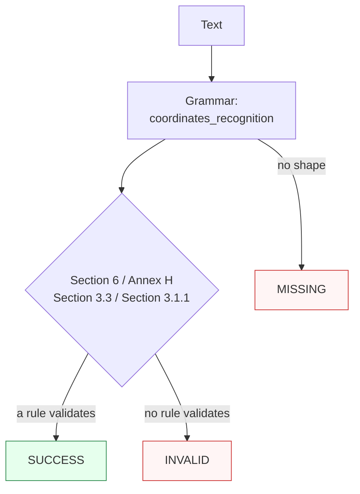

Canonicalizes **one WGS 84 coordinate mention** per call — a decimal pair, hemisphere-marked pair, DMS/DDM pair, `geo:` URI, ISO 6709 string, or GeoJSON lon-first pair (with optional altitude on the carriers) — to a signed lat-first decimal pair.

> **In plain language:** give it `48.8566, 2.3522`, `40° 26′ 46″ N 79° 58′ 56″ W`, `geo:48.8566,2.3522`, `+48.8577+002.2950/`, or `[2.295, 48.8577]` and it hands back `48.8566, 2.3522` (and friends) when the shape is a real WGS 84 point per ISO 6709:2022 §6, RFC 5870 §3.3, or RFC 7946 §3.1.1. Latitude must land in [-90, 90], longitude in [-180, 180]; a foreign CRS label is rejected, never silently re-datumed.

---

## What it recognizes — and what it does not

| Recognizes | Does not recognize |
|------------|--------------------|
| Decimal pairs with `,`, `;`, `/`, or marked-whitespace separators (`48.8566, 2.3522`, `41.5;-81.0`, `+40.446 -79.982`, parenthesized `(41.5, -81.0)`) | Bare prose number runs (`pages 12 40`) and dotted quads (`192.168.1.1`) → `MISSING` |
| Hemisphere letters, front or back, any case (`N 48.8566, E 2.3522`, `41.5 N 81.0 W`) | Contradictory sign plus hemisphere (`-41.5 N, -81.0 W`) → `INVALID` |
| DMS (`40° 26′ 46″ N 79° 58′ 56″ W`, ASCII `23 26' 22" N 23 27' 30" E`) and DDM (`40° 26.767′ N 79° 58.933′ W`) | Unit overflow (`40° 70′ 0″ N …`, minutes ≥ 60) → `INVALID` |
| `geo:` URIs with optional altitude and explicit WGS 84 CRS (`geo:48.8577,2.295,350`, `geo:48.8566,2.3522;crs=wgs84`, `crs=WGS_84` also accepted) | Foreign CRS (`geo:48.8566,2.3522;crs=ed50`) → `INVALID` — no silent datum transform |
| ISO 6709 strings, degree or DM/DMS widths, with optional altitude (`+48.8577+002.2950/`, `+48.8577+002.2950+350/`) | Missing Annex H solidus (`+48.8577+002.2950`) → `INVALID` |
| GeoJSON lon-first pairs, inverted losslessly (`[2.295, 48.8577]`, `[2.295, 48.8577, 350]`) | Out-of-range envelopes (`91.0, 0.0`, `0.0, 181.0`) → `INVALID` |
| Up to 7 fraction digits, quantized to the 6 dp canonical quantum | 8+-digit fractions (`48.85660005, 2.3522`) → `MISSING` |

---

## Canonical output

Default `output_format` is `"decimal"` (identity — `normalize()` returns the lat-first pair `lat, lon[, alt]`).

| `output_format` | Renders | Example |
|-----------------|---------|---------|
| *(default)* `decimal` / `None` / `"default"` | Signed lat-first pair, 6 dp round-half-even, trailing zeros stripped, `-0` folded to `0` | `48.8566, 2.3522` |
| `iso6709` | ISO 6709 Annex H string expression, fraction padded to 4 places (encoding) | `+48.8566+002.3522/` |
| `geo_uri` | RFC 5870 `geo:` URI (encoding) | `geo:48.8566,2.3522` |
| `geojson_pair` | RFC 7946 lon-first pair (encoding) | `[2.3522, 48.8566]` |
| `dms` | Degrees-minutes-integer-seconds (documented quantization, 1″ render quantum) | `48°51′24″N 2°21′8″E` |
| `dm` | Degrees-decimal-minutes to 0.001′ (documented quantization) | `48°51.396′N 2°21.132′E` |

Quantization is observable: `48.8566005, 2.0` canonicalizes to `48.8566, 2` while `48.8566015, 2.0` rounds half-even up to `48.856602, 2`; `-0.0, -0.0` folds to `0, 0`. Altitude, when present, rides along in every format (`geo:48.8577,2.295,350` → `+48.8577+002.2950+350/`, `geo:48.8577,2.295,350`, `[2.295, 48.8577, 350]`, `…E, 350`). `dms`/`dm` drop sub-quantum digits, so re-canonicalizing a `dms` rendering is a fixed point that drifts within half a render quantum — never stored as canonical.

Any other value raises `ContractError` — including `utm`, which this capability has never offered (there is no silent datum transform to project onto).

```python
from paxman.capabilities import Coordinates
import paxman

paxman.register_all_shipped()
print(paxman.canonicalize("48.8566, 2.3522", Coordinates.create_contract()).canonicalized_value)
print(paxman.canonicalize("40° 26′ 46″ N 79° 58′ 56″ W", Coordinates.create_contract()).canonicalized_value)
print(paxman.canonicalize("geo:48.8566,2.3522", Coordinates.create_contract()).canonicalized_value)
print(paxman.canonicalize("+48.8577+002.2950/", Coordinates.create_contract()).canonicalized_value)
print(paxman.canonicalize("[2.295, 48.8577]", Coordinates.create_contract()).canonicalized_value)
print(paxman.canonicalize("48.8566, 2.3522", Coordinates.create_contract(output_format="iso6709")).canonicalized_value)
print(paxman.canonicalize("48.8566, 2.3522", Coordinates.create_contract(output_format="dms")).canonicalized_value)
```

---

## Contract

```python
contract = Coordinates.create_contract(
    output_format=None,  # "decimal" (default), "iso6709", "geo_uri", "geojson_pair", "dms", "dm"
    # plus every common field: suppress_common_words / excluded_rules / pinned_rules / year / extra_grammars
)
```

- No grammar toggles: one grammar (`coordinates_recognition`), four rules (`Section 6-coordinate-structure`, `Section Annex-h-string-expression`, `Section 3.3-geo-uri-validity`, `Section 3.1.1-position`).
- `year` filters by `publication_year`; e.g., `year=2010` drops the ISO 6709:2022 rules → `48.8566, 2.3522` becomes `INVALID` while `geo:48.8566,2.3522` still validates via RFC 5870 (2010).

---

## Statuses

| Input | Contract | Status | Value / why |
|-------|----------|--------|-------------|
| `48.8566, 2.3522` | defaults | `SUCCESS` | `"48.8566, 2.3522"` |
| `40° 26′ 46″ N 79° 58′ 56″ W` | defaults | `SUCCESS` | `"40.446111, -79.982222"` (DMS recognized) |
| `geo:48.8566,2.3522` | defaults | `SUCCESS` | `"48.8566, 2.3522"` (RFC 5870) |
| `+48.8577+002.2950/` | defaults | `SUCCESS` | `"48.8577, 2.295"` (two ISO rules agree, one value) |
| `[2.295, 48.8577]` | defaults | `SUCCESS` | `"48.8577, 2.295"` (lon-first inverted) |
| `hello world` | any | `MISSING` | no coordinate shape |
| `48.85660005, 2.3522` | any | `MISSING` | 8-digit fraction exceeds the 7-digit recognition cap |
| `91.0, 0.0` | any | `INVALID` | latitude outside [-90, 90] |
| `-41.5 N, -81.0 W` | any | `INVALID` | sign/hemisphere conflict |
| `40° 70′ 0″ N 79° 0′ 0″ W` | any | `INVALID` | minutes ≥ 60 |
| `geo:48.8566,2.3522;crs=wgs84` | defaults | `SUCCESS` | `"48.8566, 2.3522"` (explicit WGS 84 CRS) |
| `geo:48.8566,2.3522;crs=ed50` | any | `INVALID` | foreign CRS, never re-datumed |
| `+48.8577+002.2950` | any | `INVALID` | Annex H solidus missing |
| `48.8566, 2.3522` | `year=2010` | `INVALID` | Section 6 rule is 2022, dropped |
| `geo:48.8566,2.3522` | `year=2010` | `SUCCESS` | RFC 5870 rule is 2010, kept |
| `48.8566, 2.3522` | `output_format="utm"` | raises `ContractError` | format never offered |

One grammar (`single_value=True`) plus rules that all normalize to the same compact pair yields at most one value, so `AMBIGUOUS` is unreachable for this capability.



---

## Notebook snippet — normalize a mixed column

```python
import paxman
from paxman.capabilities import Coordinates
from paxman.core.domain import Resolution
from paxman.core.errors import ContractError

paxman.register_all_shipped()
contract = Coordinates.create_contract()

rows = [
    "48.8566, 2.3522",
    "40° 26′ 46″ N 79° 58′ 56″ W",
    "40° 26.767′ N 79° 58.933′ W",
    "geo:48.8577,2.295,350",
    "+48.8577+002.2950/",
    "[2.295, 48.8577]",
    "(41.5, -81.0)",
    "48.8566005, 2.0",
    "-0.0, -0.0",
    "91.0, 0.0",
    "-41.5 N, -81.0 W",
    "hello world",
]

for text in rows:
    r = paxman.canonicalize(text, contract)
    val = r.canonicalized_value if r.status == Resolution.SUCCESS else "—"
    rule = r.candidates[0].validation_rule if r.candidates else "—"
    print(f"{text!r:38} → {r.status.value:10} {val!r:28} ({rule})")

try:
    Coordinates.create_contract(output_format="utm")
except ContractError as e:
    print(f"utm → ContractError: {e}")
```

---

## Provenance

- **ISO 6709:2022** §6 Coordinate structure (decimal/DMS/DDM/ISO shapes, sign/hemisphere consistency, lat [-90, 90] / lon [-180, 180]) — `Section 6-coordinate-structure`
- **ISO 6709:2022** Annex H String expression of a point (trailing solidus, WGS 84 CRS family) — `Section Annex-h-string-expression`
- **IETF RFC 5870 (2010)** §3.3 Geo URI validity (`geo:` branch, WGS 84 only) — `Section 3.3-geo-uri-validity`
- **IETF RFC 7946 (2016)** §3.1.1 Position (GeoJSON lon-first pair, altitude optional) — `Section 3.1.1-position`

Each candidate's `validation_rule` carries the section, and `candidate.provenance[0].publication_year` the year.

See also: [Execution Result](../concepts/execution-result/), [Provenance](../concepts/provenance/), [Segmentation](https://github.com/nexusnv/paxman-python/blob/main/docs/recipes/segmentation.md).
