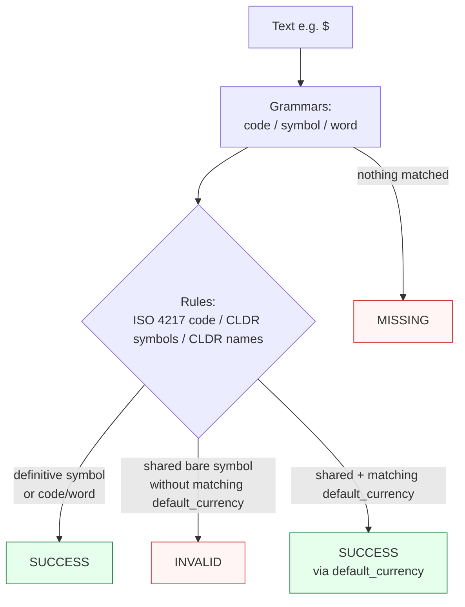

Canonicalizes **one currency identifier** per call — a code, a symbol, or a display name — to the uppercase ISO 4217 alpha-3 code. No amounts: `"USD 500"` is the [Money](money/) capability's domain.

> **In plain language:** give it `"usd"`, `"€"`, `"euro"`, or `"$"` and it tells you which currency code the spec says that identifier means. A bare shared symbol like `"$"` is deliberately `INVALID` unless you say which currency you mean.

---

## What it recognizes — and what it does not

| Recognizes | Does not recognize |
|------------|--------------------|
| Lowercase or uppercase alpha-3 codes (`usd` → `USD`) | Codes with wrong length or unsupported casing (`US`, `USDD`) — not matched by the grammar, therefore `MISSING` |
| CLDR display-name words (`euro` → `EUR`, `yen` → `JPY`) | Amount-glued tokens like `US$5` — not recognized at all |
| CLDR currency symbols (`€` → `EUR`, `¥` → `JPY`) | Bare shared symbols like `"$"` without disambiguation — recognized but `INVALID` unless you opt in |
| Shared bare symbols (`$`) — 29 codes share this CLDR symbol | A `default_currency` code that is not one of that symbol's own candidates — stays `INVALID` |

> **Why shared symbols fail by default:** `"$"` is the CLDR symbol for 29 different currencies. Guessing would be wrong most of the time, so Paxman requires you to opt in.

---

## Canonical output

Single format — always an uppercase alpha-3 code.

| `output_format` | Renders |
|-----------------|---------|
| *(only)* `code` / `None` / `"default"` | `USD`, `EUR`, … |

Any other value raises `ContractError`.

```python
from paxman.capabilities import Currency
import paxman

paxman.register_all_shipped()
Currency.create_contract().output_format  # "code"
paxman.canonicalize("usd", Currency.create_contract()).canonicalized_value  # "USD"
paxman.canonicalize("euro", Currency.create_contract()).canonicalized_value  # "EUR"
```

---

## Contract

```python
contract = Currency.create_contract(
    default_currency=None,  # str | None — uppercase alpha-3, e.g. "USD"
    output_format=None,  # "code" (only format)
    # plus every common field: excluded_rules / pinned_rules / year / extra_grammars
)
```

- When `default_currency` is `None` (the default), a shared bare symbol like `"$"` is recognized but never resolved → `INVALID`.
- When `default_currency` is set, the symbol resolves **only if** that code is one of the symbol's own CLDR candidates. `"$"` with `default_currency="USD"` → `USD`; `"$"` with `default_currency="MYR"` stays `INVALID` because `MYR`'s symbol is `RM`, not `"$"`.
- `default_currency` never remaps a definitive symbol (`€` is always `EUR`) or a qualified symbol (`US$` is always `USD`).

```python
from paxman.capabilities import Currency
import paxman

paxman.register_all_shipped()

paxman.canonicalize("$", Currency.create_contract()).status.value  # "invalid"
paxman.canonicalize(
    "$", Currency.create_contract(default_currency="USD")
).canonicalized_value  # "USD"
paxman.canonicalize(
    "$", Currency.create_contract(default_currency="MYR")
).status.value  # "invalid" — MYR is not a $ candidate
```

See [Contracts](../concepts/contracts/) and the [API Reference](../api-reference/#contracts--somecapabilitycreate_contract).

---

## Statuses

| Input | Contract | Status | Why |
|-------|----------|--------|-----|
| `usd` | defaults | `SUCCESS` | → `USD` (case fold + ISO 4217 validation) |
| `euro` | defaults | `SUCCESS` | CLDR display name → `EUR` |
| `€` | defaults | `SUCCESS` | definitive symbol → `EUR` |
| `$` | defaults | `INVALID` | shared bare symbol, no `default_currency` |
| `$` | `default_currency="USD"` | `SUCCESS` | `USD` is a `$` candidate |
| `US$` | any | `SUCCESS` | qualified symbol → `USD` |
| `notacurrency` | any | `MISSING` | no pattern |
| `USD and EUR` (two different values) | any | raises `MultipleMentionsError` | split first |



---

## Notebook snippet

```python
import paxman
from paxman.capabilities import Currency
from paxman.core.domain import Resolution

paxman.register_all_shipped()
c_default = Currency.create_contract()
c_usd = Currency.create_contract(default_currency="USD")

for text in ["usd", "euro", "€", "$", "US$", "notacurrency"]:
    r = paxman.canonicalize(text, c_default)
    tag = r.status.value
    val = r.canonicalized_value or "—"
    print(f"{text!r:10} default → {tag:10} {val!r}")
    if text == "$":
        r2 = paxman.canonicalize(text, c_usd)
        print(
            f"  with default_currency=USD → {r2.status.value:10} {r2.canonicalized_value!r}"
        )
```

---

## Provenance

- **ISO 4217** — alpha-3 currency codes.
- **CLDR** — currency symbols and display names.

Compare [Money](money/) when your input includes amounts; Currency is identifier-only.

See also: [Money](money/), [Execution Result](../concepts/execution-result/), [Candidates & Ambiguity](../concepts/candidates-and-ambiguity/).
