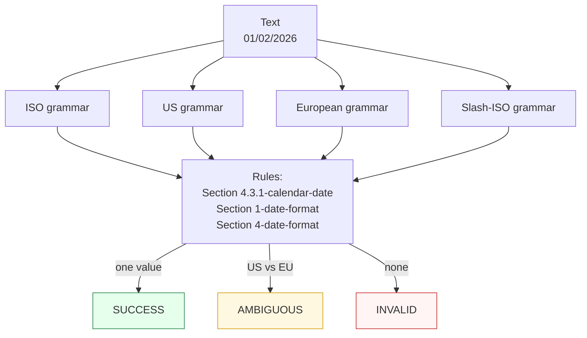

# Date

Canonicalizes **one calendar date** per call to ISO `YYYY-MM-DD` — or to US form when requested.

> **In plain language:** give it a date written any of the common ways and it hands back the ISO form if a spec says the date is real. Ambiguous numeric forms like `01/02/2026` are surfaced as `AMBIGUOUS` rather than guessed.

---

## What it recognizes — and what it does not

| Recognizes | Does not recognize |
|------------|--------------------|
| `2026-01-15` — ISO 8601 `YYYY-MM-DD` | Times, durations, or datetimes (`2026-01-15T10:00`) — dates only |
| `2026/01/15` — slash-ISO `YYYY/MM/DD` | Month names (`15 January 2026`) |
| `01/02/2026` — US `MM/DD/YYYY` and European `DD/MM/YYYY` (kept as competing interpretations) | Relative expressions (`today`, `next Tuesday`) |

All four shapes emit the same notation; which rules accept them depends on the contract and the spec calendar logic.

---

## Canonical output

Default `output_format` is `"ISO"` (`YYYY-MM-DD`).

| `output_format` | Renders | Example |
|-----------------|---------|---------|
| *(default)* `ISO` / `None` / `"default"` | `YYYY-MM-DD` | `2026-01-15` |
| `US` | `MM/DD/YYYY` | `01/15/2026` |

Any other value raises `ContractError`.

```python
from paxman.capabilities import Date
import paxman

paxman.register_all_shipped()
paxman.canonicalize(
    "2026-01-15", Date.create_contract()
).canonicalized_value  # "2026-01-15"
paxman.canonicalize(
    "2026-01-15", Date.create_contract(output_format="US")
).canonicalized_value  # "01/15/2026"
```

The `two_digit_base_year` field is relevant only when the input contains a 2-digit year — e.g. with `two_digit_base_year=2000`, `"01/02/26"` expands relative to 2000. Otherwise omit it.

---

## Contract

```python
contract = Date.create_contract(
    two_digit_base_year=None,  # int | None — base year for 2-digit expansion, e.g. 2000
    output_format=None,  # "ISO" (default) or "US"
    # plus every common field: excluded_rules / pinned_rules / year / extra_grammars
)
```

- `two_digit_base_year` shapes how `YY` is expanded; it does not affect which grammars run.
- Use `pinned_rules` when you want only one jurisdiction's calendar (e.g. pin to ISO 8601); use `year` to restrict to rules published up to a given year.

---

## Statuses

| Input | Contract | Status | Value / why |
|-------|----------|--------|-------------|
| `2026-01-15` | defaults | `SUCCESS` | `"2026-01-15"` |
| `2026/01/15` | defaults | `SUCCESS` | slash-ISO → `"2026-01-15"` |
| `01/02/2026` | defaults | `AMBIGUOUS` | US → `2026-01-02` vs European → `2026-02-01` — same span, different values |
| `01/02/2026` | `pinned_rules=["…calendar-date"]` (ISO only) | `SUCCESS` or `INVALID` | only the pinned spec's reading remains |
| `2026-13-01` | any | `INVALID` | recognized but no calendar accepts month 13 |
| `hello` | any | `MISSING` | no date pattern at all |
| `2026-01-15, 2026-02-01` | any | raises `MultipleMentionsError` | two distinct dates — split first |



---

## Notebook snippet — normalize a column with ambiguity surfaced

```python
import paxman
from paxman.capabilities import Date
from paxman.core.domain import Resolution

paxman.register_all_shipped()
contract = Date.create_contract()

rows = ["2026-01-15", "2026/01/15", "01/02/2026", "2026-13-01", "hello"]

for text in rows:
    r = paxman.canonicalize(text, contract)
    if r.status == Resolution.SUCCESS:
        print(f"{text!r:15} → {r.canonicalized_value}")
    elif r.status == Resolution.AMBIGUOUS:
        vals = sorted({c.value for c in r.candidates})
        print(f"{text!r:15} → AMBIGUOUS {vals}")
    else:
        print(f"{text!r:15} → {r.status.value}")
```

---

## Provenance

Validated values cite the calendar spec whose rule accepted the notation — e.g. ISO 8601 (`Section 4.3.1-calendar-date`), US federal rules (`Section 1-date-format`), or CENELEC EN 50160 (`Section 4-date-format`), with section citation on `candidate.validation_rule` and `publication_year` on `candidate.provenance[0]`.

```python
for c in result.candidates:
    p = c.provenance[0]
    print(
        c.value,
        "via",
        c.validation_rule,
        f"({p.specification_name}, {p.publication_year})",
    )
```

See also: [Execution Result](../concepts/execution-result.md), [Candidates & Ambiguity](../concepts/candidates-and-ambiguity.md), [Segmentation](../../recipes/segmentation.md).
