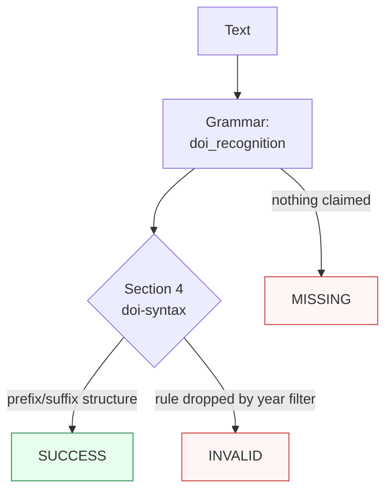

Canonicalizes **one DOI mention** per call — bare (`10.1038/nature12345`), case variants, resolver URLs (`https://doi.org/…`), `doi:`/`DOI:` labels, or `urn:doi:`/`info:doi/` carriers — to the bare lowercase `10.registrant/suffix` name.

> **In plain language:** give it any documented spelling of a Digital Object Identifier and it hands back the canonical bare name per ISO 26324:2025. There is no check digit and no registry: validation requires a correctly shaped prefix plus a non-empty suffix containing none of whitespace, double quotes, ampersands, or apostrophes. Case folds ASCII-only — non-Latin capitals (`Á` vs `á`) are distinct names.

---

## What it recognizes — and what it does not

| Recognizes | Does not recognize |
|------------|--------------------|
| Bare names, any Basic-Latin case (`10.1038/nature12345`, `10.1038/NATURE12345` — folds to lowercase) | Suffix-only strings (`nature12345`) → `MISSING` (prefix required) |
| Dotted sub-registrants (`10.13003/5jchdy`) and suffix dots/slashes (`10.7774/cevr.2016.5.1.19`) | Truncated (`10.1038/`, `10.103`) → `MISSING` (`/` + non-empty suffix required) |
| Resolver URLs (`https://doi.org/…`, `http://…`, legacy `dx.` host, `www.` host — span includes URL) | Non-`10.` handles (`20.500.1234/abc`) → `MISSING` (`10.` gate) |
| `doi:`/`DOI:` labels, `urn:doi:`/`info:doi/` carriers (span includes carrier) | shortDOI (`10/gf2p3c`) → `MISSING` (not DOI names, Handbook §6.5) |
| Literal `%2F` in suffixes (retained, never decoded; hex letters fold) | Proxy URN-colon form (`https://doi.org/urn:doi:10.123:456`) → `MISSING` (deferred) |
| Embedded mentions (`See 10.1038/nature12345.` — trailing `.`/`)`/`,` excluded) | Inner whitespace (`10.1038 / x`) → `MISSING` |
| Over-long registrants (`10.1234567890/x`) → `MISSING` (4–9 digit bound) | X-glued prefixes (`x10.1038/…`) → `MISSING` (word boundary) |

**Case law:** ASCII `A–Z` ≡ `a–z` for equivalence only (Handbook Ch.3); the fold preserves every other code point byte-identically and performs no Unicode normalization — precomposed vs decomposed spellings never coalesce.

---

## Canonical output

Default `output_format` is `"doi"` (bare lowercase `10.registrant/suffix`).

| `output_format` | Renders | Example |
|-----------------|---------|---------|
| *(default)* `doi` / `None` / `"default"` | Bare lowercase name | `10.1038/nature12345` |
| `url` | Resolver link | `https://doi.org/10.1038/nature12345` |

Any other value raises `ContractError`. The offered format re-enters under the default contract (ADR-0010 fixed point).

```python
from paxman.capabilities import DOI
import paxman

paxman.register_all_shipped()
print(paxman.canonicalize("DOI: 10.1038/NATURE12345", DOI.create_contract()).canonicalized_value)
print(paxman.canonicalize("https://doi.org/10.1038/nature12345", DOI.create_contract()).canonicalized_value)
print(paxman.canonicalize("10.1038/nature12345", DOI.create_contract(output_format="url")).canonicalized_value)
print(paxman.canonicalize("urn:doi:10.1000/182", DOI.create_contract()).canonicalized_value)
```

---

## Contract

```python
contract = DOI.create_contract(
    output_format=None,  # "doi" (default); None/"default"/"doi" all resolve to it
    # plus every common field: suppress_common_words / excluded_rules / pinned_rules / year / extra_grammars
)
```

- One grammar: `doi_recognition` (bare core + carrier groups, ASCII-only fold).
- One rule: `Section 4-doi-syntax` (ISO 26324:2025 structure; PARSER, always-active — no registry flag exists).
- `year` filters by `publication_year`; e.g., `year=2020` drops the 2025 rule → `10.1038/…` becomes `INVALID`.
- Deterministic by construction: same input + contract + vendored snapshot → same output. No clock, no registry lookup.

---

## Statuses

| Input | Contract | Status | Value / why |
|-------|----------|--------|-------------|
| `10.1038/nature12345` | defaults | `SUCCESS` | `"10.1038/nature12345"` |
| `10.1038/NATURE12345` / mixed case | defaults | `SUCCESS` | ASCII fold restores lowercase |
| `https://doi.org/…` / `doi:` / `urn:doi:` carriers | defaults | `SUCCESS` | carriers stripped, span includes carrier |
| `10.5594/SMPTE.ST2067-21.2020` | defaults | `SUCCESS` | `"10.5594/smpte.st2067-21.2020"` (Handbook vector) |
| Unallocated-but-shaped (`10.99999/x`) | defaults | `SUCCESS` | storable, no registry (UUID precedent) |
| No `10.`/slash/suffix, shortDOI, URN-colon form | defaults | `MISSING` | nothing claimed / policy gates |
| two distinct DOIs | defaults | raises `MultipleMentionsError` | un-segmented multi-entity input (`single_value=True`) |
| `10.1038/…` | `year=2020` | `INVALID` | rule is 2025, dropped |
| `10.1038/…` | `output_format="upper"` | raises `ContractError` | never offered |



**Sibling note:** a resolver URL also matches the URL shape — each side resolves under its own contract (DOI `SUCCESS` bare, URL `SUCCESS` absolute URI). Bare numerics (`10.1000/182`) stay clear of Phone/Date grammars. The `urn:doi:` form is URN-shaped; URN-side behavior belongs to future work.

---

## Notebook snippet — normalize a mixed column

```python
import paxman
from paxman.capabilities import DOI
from paxman.core.domain import Resolution

paxman.register_all_shipped()
contract = DOI.create_contract()

rows = [
    "10.1038/nature12345",
    "DOI: 10.1038/NATURE12345",
    "https://doi.org/10.7774/cevr.2016.5.1.19",
    "http://dx.doi.org/10.1000/182",
    "urn:doi:10.13003/5jchdy",
    "10/gf2p3c",
    "not a doi",
]

for text in rows:
    r = paxman.canonicalize(text, contract)
    val = r.canonicalized_value if r.status == Resolution.SUCCESS else "—"
    rule = r.candidates[0].validation_rule if r.candidates else "—"
    print(f"{text!r:46} → {r.status.value:10} {val!r:40} ({rule})")
```

---

## Provenance

- **ISO 26324:2025** (specification; DOI name syntax: prefix/suffix, no checksum, no registry) — `Section 4-doi-syntax` (vendored version 2025)

Each candidate's `validation_rule` carries the section, and `candidate.provenance[0].publication_year` the year.

See also: [ISBN](./isbn/), [ISSN](./issn/), [ORCID](./orcid/), [URL](./url/), [Execution Result](../concepts/execution-result/), [Provenance](../concepts/provenance/).
