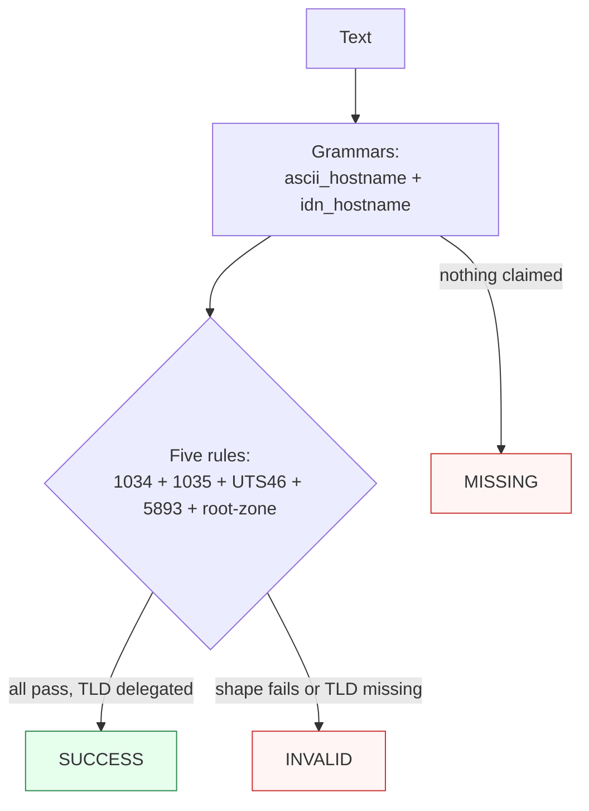

Canonicalizes **one hostname mention** per call — mixed-case (`EXAMPLE.COM`), root-dotted (`example.com.`), Unicode U-labels (`münchen.de`), ACE A-labels (`xn--mnchen-3ya.de`), fullwidth/dot-variant spellings (`ｅxample。ｊｐ`), NFD decomposed forms, and free-text-embedded names — to the lowercase ASCII A-label form with no trailing dot.

> **In plain language:** give it any documented spelling of an internet hostname and it hands back the canonical ASCII form per RFC 1034/1035, UTS #46, and RFC 5893, keeping only names whose TLD is delegated in the IANA Root Zone Database. Case folds (DNS names are case-insensitive); a trailing root dot is stripped; `ß` stays `ß` (non-transitional processing — `straße.de` and `STRASSE.DE` are different names).

---

## What it recognizes — and what it does not

| Recognizes | Does not recognize |
|------------|--------------------|
| Bare FQDNs, any ASCII case (`example.com`, `EXAMPLE.COM` — folds to lowercase) | Single labels (`localhost`, `com`, `de`) → `INVALID` (two-label minimum; intranet scope deferred) |
| Root-dotted names (`example.com.` — dot stripped; `example.com..` → `INVALID`, empty label) | Underscore labels (`_dmarc.example.com`) → `INVALID` (STD3 rules on) |
| U-labels (`münchen.de`), NFD (decomposed umlaut — NFC before encode), fullwidth (`ｅxample。ｊｐ` → `example.jp`), mapped dots (`example。com`) | Invisible controls (embedded U+202E RLO → `INVALID`); zero-width space is *removed* (U+200B is stripped, bare `example.com` succeeds) |
| ACE labels (`XN--MNCHEN-3YA.de` — case-insensitive input, round-trip verified) | Broken ACE (`xn--.com` → `INVALID`, empty payload) |
| Hyphenated labels (`exam--ple.com`); digit-first labels (`3m3.com` — RFC 1123) | Leading/trailing hyphens (`-cdn.example.com`, `example-.com`); `--` at 3rd/4th without `xn--` (`ex--ample.com`) |
| Embedded mentions (`visit example.com today`, padded `  example.com  `) | Containers (`user@example.com`, `https://example.com/`, `*.example.com`, `[::1]` → `MISSING`, boundary-killed) |
| Numeric TLD shapes (`example.123`, `192.168.0.1` — recognized, then rejected) | Undelegated TLDs → `INVALID` (registry LOOKUP miss, not a shape failure) |

**Case law:** U-label and A-label are one entity (RFC 5890 §2.3 — `münchen.de` ≡ `xn--mnchen-3ya.de`); NFC converges decomposed spellings before encoding (W2 ≡ W5).

---

## Canonical output

Default `output_format` is `"ascii"` (lowercase A-label dotted name, no trailing dot).

| `output_format` | Renders | Example |
|-----------------|---------|---------|
| *(default)* `ascii` / `None` / `"default"` | A-label canonical | `xn--mnchen-3ya.de` |
| `unicode` | U-label presentation (each `xn--` label Punycode-decoded) | `münchen.de` |

Any other value raises `ContractError`. The offered format re-enters under the default contract (ADR-0010 fixed point).

```python
from paxman.capabilities import Domain
import paxman

paxman.register_all_shipped()
print(paxman.canonicalize("münchen.DE.", Domain.create_contract()).canonicalized_value)
print(paxman.canonicalize("XN--MNCHEN-3YA.de", Domain.create_contract()).canonicalized_value)
print(paxman.canonicalize("münchen.de", Domain.create_contract(output_format="unicode")).canonicalized_value)
print(paxman.canonicalize("straße.de", Domain.create_contract()).canonicalized_value)
```

---

## Contract

```python
contract = Domain.create_contract(
    output_format=None,  # "ascii" (default); None/"default"/"ascii" all resolve to it
    # plus every common field: suppress_common_words / excluded_rules / pinned_rules / year / extra_grammars
)
```

- Two grammars: `ascii_hostname` (LDH shapes, case-neutral) + `idn_hostname` (any script, reserved-ASCII excluded; ASCII overlap dedups by span).
- Five rules: `Section-3.1-name-syntax` + `Section-2.3.4-label-length` + `UTS46-statuses` + `Section-2-bidi-context` (all PARSER) and `root-zone-membership` (the single LOOKUP_TABLE — IANA TLD membership ANDed with the other four; no corroboration → `INVALID`).
- Single-label acceptance and underscore selectors are not shipped (deferred scope, no knobs).
- Deterministic by construction: same input + contract + vendored snapshots → same output. No clock, no network (the IANA snapshot is vendored).

---

## Statuses

| Input | Contract | Status | Value / why |
|-------|----------|--------|-------------|
| `example.com` / `EXAMPLE.COM` / `example.com.` | defaults | `SUCCESS` | `"example.com"` (fold + root-dot strip) |
| `münchen.de` / `münchen.DE` / `XN--MNCHEN-3YA.de` / NFD | defaults | `SUCCESS` | `"xn--mnchen-3ya.de"` (one entity) |
| `straße.de` vs `STRASSE.DE` | defaults | `SUCCESS` | `"xn--strae-oqa.de"` vs `"strasse.de"` (non-transitional) |
| `foo.unknowntld-xyz`, `example.123`, `192.168.0.1` | defaults | `INVALID` | recognized; TLD not delegated |
| `localhost`, `com`, `de` (whole input, suppression on) | defaults | `INVALID` | single label (never `MISSING` once recognized) |
| `user@example.com`, `https://example.com/`, `*.example.com` | defaults | `MISSING` | nothing claimed (boundary kills) |
| `a.com;b.com` | defaults | raises `MultipleMentionsError` | un-segmented multi-entity input (`single_value=True`) |
| `a.com;a.com` | defaults | `SUCCESS` | `"a.com"` (same value dedups, no raise) |
| `example.com` | `output_format="bogus"` | raises `ContractError` | never offered |



**Sibling note:** a bare hostname also matches inside URL/Email text — each side resolves under its own contract. An `https://…` carrier belongs to the URL capability (Domain sees only the boundary-killed spans → `MISSING`).

---

## Notebook snippet — normalize a mixed column

```python
import paxman
from paxman.capabilities import Domain
from paxman.core.domain import Resolution

paxman.register_all_shipped()
contract = Domain.create_contract()

rows = [
    "münchen.DE.",
    "EXAMPLE.COM",
    "ｅxample。ｊｐ",
    "visit example.com today",
    "foo.unknowntld-xyz",
    "user@example.com",
    "not a domain",
]

for text in rows:
    r = paxman.canonicalize(text, contract)
    val = r.canonicalized_value if r.status == Resolution.SUCCESS else "—"
    rule = r.candidates[0].validation_rule if r.candidates else "—"
    print(f"{text!r:46} → {r.status.value:10} {val!r:40} ({rule})")
```

---

## Provenance

- **RFC 1034 §3.1** (specification; name syntax: ≥2 labels, no empty label) — `Section-3.1-name-syntax` (vendored version 1987)
- **RFC 1035 §2.3.4** (specification; 63 octets/label, 253 chars/name, measured post-encode) — `Section-2.3.4-label-length` (vendored version 1987)
- **UTS #46 v18.0.0** (specification; statuses, STD3 rules, hyphen checks, ACE round trip; shipped table 15.1.0) — `UTS46-statuses`
- **RFC 5893 §2** (specification; Bidi rule six conditions, plus ContextJ join-control rejection) — `Section-2-bidi-context` (vendored version 2010)
- **IANA Root Zone Database** (registry; tlds-alpha snapshot v2026092300, 1,438 entries) — `root-zone-membership`

Each candidate's `validation_rule` carries the section, and `candidate.provenance[0].publication_year` the year.

See also: [URL](./url/), [Email](./email/), [Execution Result](../concepts/execution-result/), [Provenance](../concepts/provenance/).
