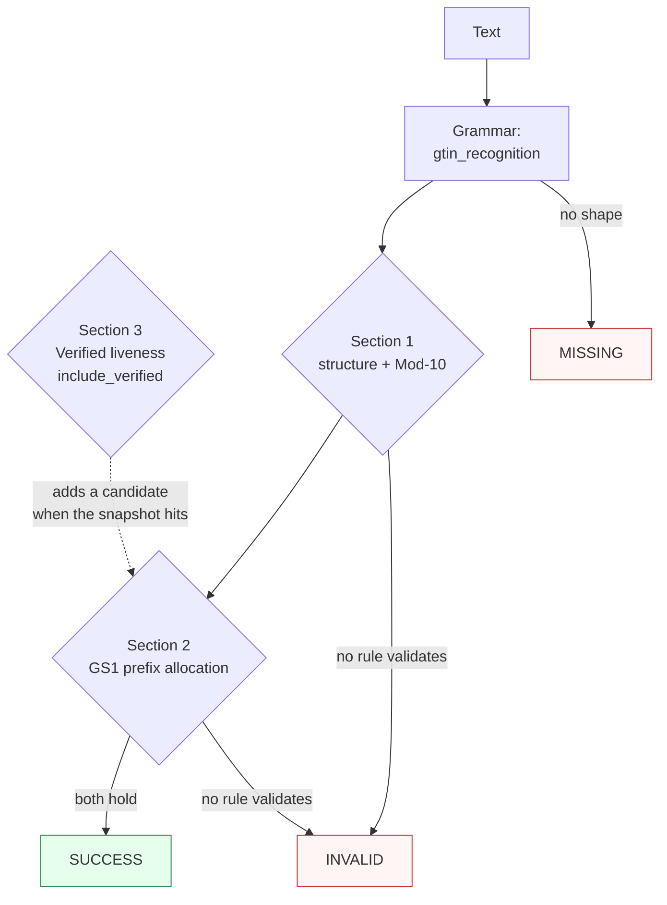

Canonicalizes **one GTIN mention** per call — a compact GTIN-8/12/13/14 run, a zero-padded 14-digit field, a space- or hyphen-grouped display form, an `(01)`/`AI 01`-carried element, or a `GTIN`/`UPC`/`EAN`-labelled prose mention — to the 14-digit zero-padded storage form.

> **In plain language:** give it `614141999996`, `590-1234-12345-7`, `6 14141 99999 6`, `GTIN: 00614141999996`, or `(01) 03453120000011` and it hands back the 14-digit zero-padded form (`00614141999996`, `05901234123457`, `03453120000011`) when the length is exactly 8, 12, 13, or 14 ASCII digits, the GS1 Mod-10 check digit holds, and the leading digits fall in an allocated GS1 prefix range. A bad check digit or an unallocated prefix is `INVALID`, never a guess; shapes outside the recognized spellings are `MISSING`.

---

## What it recognizes — and what it does not

| Recognizes | Does not recognize |
|------------|--------------------|
| Compact native per length — GTIN-8 `96385074`, UPC-A `614141999996`, EAN-13 `5012345670003`, GTIN-14 `10614141999993` | UPC-E 6-digit symbol (`012345`) → `MISSING` (**DEFER** — expansion to `upce_recognition` community grammar) |
| Zero-padded 14-digit equivalents (`00614141999996`, `05012345670003`, `00196618007309`) — the official GS1 XML/GDSN storage form | Runs of 6/7/9/10/11/15+ digits (`012345`, `1234567`, `6141419999`, `501234567000345`) → `MISSING` (**REJECT** — exact-length gate; truncated stems are generation-only inputs) |
| Space-grouped HRI (`6 14141 99999 6`, `1234 5670`) | Tabs / newlines / dots / slashes as separators, or double spaces (`614141  999996`) → `MISSING` (single space or hyphen between digit groups only) |
| Hyphen-grouped and mixed-separator forms (`590-1234-12345-7`, `590 1234-12345 7`, `6-14141 99999-6`) — separators stripped, never emitted | Glued label (`GTIN00614141999996`, no separator) → `MISSING` |
| Fused labels, case-insensitive (`GTIN: 00614141999996`, `upc-614141999996`, `EAN-13: 5012345670003`, `GTIN-14 10614141999993`) — span includes the label | Fullwidth digits (`６１４１４１９９９９９６`) → `MISSING` (ASCII digits only) |
| AI markers `(01)`-parens or `AI 01`-keyword (`(01)03453120000011`, `(01) 03453120000011`, `AI 01 03453120000011`, stacked `GTIN: (01) …`) — span includes the marker | A bare leading `01` (`01345678901234`) is **never** an AI marker — the digits are taken verbatim as a 14-digit run (validation then decides) |
| Prose-embedded, quoted, bracketed, trailing-period (`Batch 5012345670003 shipped.`, `"614141999996"`, `[5012345670003]`, `614141999996.`) | Bars, quiet zones, guard bars, symbol images — non-text, out of scope (**REJECT**) |
| True GTIN-14 indicator digits 1–8 (`10614141999993`, `2061414199993`) — packaging levels are distinct entities | Coupon/extended shapes are not special-cased: 13-digit `020…`/`981…` families validate like any number (`0201234567899` → `SUCCESS`), a glued `+add-on` reads its core (`036000291452+12345` → `00036000291452`), while a hyphen add-on or `CPN…` prefix → `MISSING` (no coupon grammar in v1) |
| Bookland `978`/`979`-prefixed GTIN-13 (`9780471117094`) — recognized as GTIN-13 syntactically (ISBN precedence is cross-capability, decided by which capability you call) | Two distinct GTINs in one call → raises `MultipleMentionsError` (split first — see [Segmentation](https://github.com/nexusnv/paxman-python/blob/main/docs/recipes/segmentation.md)) |

The 8-digit UPC-E HRI form collides with GTIN-8: `01234567` is claimed as an 8-digit run and validates as GTIN-8 iff the Mod-10 check passes — it is never expanded to UPC-A in v1.

---

## Canonical output

Default `output_format` is `"gtin14"` — the 14-digit zero-padded storage form (check-preserving: `digits.rjust(14, "0")`).

| `output_format` | Renders | Example |
|-----------------|---------|---------|
| *(default)* `gtin14` / `None` / `"default"` | 14-digit zero-padded | `00614141999996` from `614141999996` |
| `native` | The spelled length as entered (encoding — the zero-strip/zero-pad pair is reversible without side input, so re-entry recovers its pre-image exactly; identity for a true 14-digit spelling) | `614141999996` from `614141999996`; `00614141999996` spelled 14 stays `00614141999996` |

Any other value raises `ContractError` — including `hri`: the space-grouped HRI layout is **deferred** because only the UPC-A (`6 14141 99999 6`) and EAN-8 (`1234 5670`) groupings are attested in fetched sources; EAN-13/GTIN-14 groupings stay unconfirmed, and groupings are never invented.

```python
from paxman.capabilities import GTIN
import paxman

paxman.register_all_shipped()
print(
    paxman.canonicalize("614141999996", GTIN.create_contract()).canonicalized_value
)  # → "00614141999996"
print(
    paxman.canonicalize("590-1234-12345-7", GTIN.create_contract()).canonicalized_value
)  # → "05901234123457"
print(
    paxman.canonicalize("(01) 03453120000011", GTIN.create_contract()).canonicalized_value
)  # → "03453120000011"
print(
    paxman.canonicalize(
        "614141999996", GTIN.create_contract(output_format="native")
    ).canonicalized_value
)  # → "614141999996"
print(
    paxman.canonicalize("GTIN: 00614141999996", GTIN.create_contract()).canonicalized_value
)  # → "00614141999996"
```

---

## Contract

```python
contract = GTIN.create_contract(
    output_format=None,       # "gtin14" (default), "native"
    include_verified=False,   # add the Verified-by-GS1 liveness lookup
    # plus every common field: suppress_common_words / excluded_rules / pinned_rules / year / extra_grammars
)
```

- No grammar toggles: one grammar (`gtin_recognition`), three rules (`Section 1-gtin-structure-check-digit`, `Section 2-gs1-prefix`, `Section 3-verified-liveness`).
- `include_verified=True` adds the Verified-by-GS1 snapshot lookup **alongside** the always-active structure + prefix pair. An extra active authority whose lookup misses contributes no candidate — it does not veto — so results stay `SUCCESS` on the strength of the corroborated structure/prefix pair. To make liveness the only authority, pin it: `pinned_rules=("Section 3-verified-liveness",), include_verified=True` → recognized-but-unvalidated is `INVALID`. The shipped snapshot is empty (add-only refresh), so pinning it always misses by default.
- `year` filters by `publication_year` (GenSpecs 2026, Prefix 2026, Verified 2019); e.g. `year=2018` drops every rule → `INVALID`, while `year=2026` keeps the structure + prefix pair → `SUCCESS`.
- Single-value: two distinct GTINs in one call raise `MultipleMentionsError` — split first per `docs/recipes/segmentation.md`. Identical values (including padded-vs-native spellings of the same entity) coalesce to one `SUCCESS`.

---

## Statuses

| Input | Contract | Status | Value / why |
|-------|----------|--------|-------------|
| `96385074` | defaults | `SUCCESS` | `"00000096385074"` (GTIN-8 zero-padded) |
| `614141999996` | defaults | `SUCCESS` | `"00614141999996"` (UPC-A) |
| `5012345670003` | defaults | `SUCCESS` | `"05012345670003"` (EAN-13) |
| `6291041500213` | defaults | `SUCCESS` | `"06291041500213"` |
| `10614141999993` | defaults | `SUCCESS` | `"10614141999993"` (true GTIN-14, identity) |
| `2061414199993` | defaults | `SUCCESS` | `"02061414199993"` (indicator-2 packaging level) |
| `03453120000011` / `00196618007309` | defaults | `SUCCESS` | identity (already the 14-digit storage form) |
| `9780471117094` | defaults | `SUCCESS` | `"09780471117094"` (Bookland GTIN-13 syntactically; ISBN precedence is cross-capability) |
| `590-1234-12345-7` | defaults | `SUCCESS` | `"05901234123457"` (hyphens stripped, never emitted) |
| `6 14141 99999 6` / `1234 5670` | defaults | `SUCCESS` | `"00614141999996"` / `"00000012345670"` (HRI groupings collapse) |
| `(01) 03453120000011` / `AI 01 03453120000011` | defaults | `SUCCESS` | `"03453120000011"` (marker absorbed into the span) |
| `GTIN: 00614141999996` / `upc-614141999996` / `EAN-13: 5012345670003` | defaults | `SUCCESS` | label absorbed into the span |
| `Batch 5012345670003 shipped.` | defaults | `SUCCESS` | `"05012345670003"` (prose-embedded; trailing period excluded) |
| `00614141999996 and 614141999996` | defaults | `SUCCESS` | one value — padded-vs-native duplicates of the same entity coalesce |
| `00614141999996` | `output_format="native"` | `SUCCESS` | `"00614141999996"` (spelled 14 → identity); `614141999996` → `"614141999996"` |
| `614141999996` | `include_verified=True` | `SUCCESS` | `"00614141999996"` — the extra lookup misses the shipped-empty snapshot and adds no candidate; structure + prefix corroborate (non-veto) |
| `614141999996` | `year=2026` | `SUCCESS` | structure + prefix rules are 2026, kept |
| `614141999997` | any | `INVALID` | recognized shape, Mod-10 check digit fails |
| `9991414199996` | any | `INVALID` | check-valid, but the native prefix is unallocated |
| `01234567` | any | `INVALID` | 8-digit UPC-E HRI collision — claimed as GTIN-8, Mod-10 fails (a check-valid 8-digit run would succeed) |
| `01345678901234` | any | `INVALID` | bare `01` taken verbatim as a 14-digit run; Mod-10 fails |
| `5012345670003` | `pinned_rules=("Section 3-verified-liveness",), include_verified=True` | `INVALID` | liveness pinned as the only authority; shipped-empty snapshot rejects, nothing else can validate |
| `614141999996` | `year=2018` | `INVALID` | every rule is newer, dropped |
| `012345` (UPC-E 6-digit) | any | `MISSING` | **DEFER** — UPC-E expansion is not recognized in v1; a community grammar via `extra_grammars` is the extension path |
| `1234567` / `61414199999` / `6141419999` / `501234567000345` | any | `MISSING` | **REJECT** — 7/9/10/11/15-digit runs are not GTIN shapes (exact-length gate) |
| `GTIN00614141999996` | any | `MISSING` | glued label needs a separator |
| `６１４１４１９９９９９６` | any | `MISSING` | **REJECT** — ASCII digits only, no homoglyph folding |
| `614141  999996` (double space) | any | `MISSING` | single space or hyphen between digit groups only |
| Bars / quiet-zone text | any | `MISSING` | **REJECT** — non-text symbol overhead is out of scope |
| `614141999996` | `output_format="hri"` | raises `ContractError` | not an offered format — HRI groupings deferred (never invented) |
| `614141999996` | `output_format="grouped"` | raises `ContractError` | not an offered format |
| Two distinct GTINs in one call | any rule-active contract | raises `MultipleMentionsError` | split first — with every rule filtered out (e.g. `year=2018`, above) no candidates exist to trip the invariant, so the call resolves `INVALID` instead |

Two deterministic rules over one single-value grammar (with a third snapshot-gated lookup that never vetoes) yield at most one value, so `AMBIGUOUS` is unreachable for this capability.



---

## Notebook snippet — normalize a mixed column

```python
import paxman
from paxman.capabilities import GTIN
from paxman.core.domain import Resolution
from paxman.core.errors import ContractError, MultipleMentionsError

paxman.register_all_shipped()
contract = GTIN.create_contract()

rows = [
    "96385074",
    "614141999996",
    "590-1234-12345-7",
    "6 14141 99999 6",
    "(01) 03453120000011",
    "GTIN: 00614141999996",
    "Batch 5012345670003 shipped.",
    "614141999997",
    "9991414199996",
    "012345",
    "61414199999",
    "GTIN00614141999996",
    "not a gtin",
]

for text in rows:
    r = paxman.canonicalize(text, contract)
    val = r.canonicalized_value if r.status == Resolution.SUCCESS else "—"
    rule = r.candidates[0].validation_rule if r.candidates else "—"
    print(f"{text!r:34} → {r.status.value:10} {val!r:20} ({rule})")

try:
    GTIN.create_contract(output_format="hri")
except ContractError as e:
    print(f"hri → ContractError: {e}")

try:
    paxman.canonicalize("614141999996 / 5012345670003", contract)
except MultipleMentionsError:
    print("two distinct → MultipleMentionsError")
```

---

## Provenance

- **GS1 General Specifications (GenSpecs) 26.0** §1 GTIN structure — lengths 8/12/13/14, ASCII digits, and the Mod-10 check digit (weights 3/1 rightmost-anchored, `(10 - sum % 10) % 10`) — `Section 1-gtin-structure-check-digit` (`PARSER`). Specification at `https://ref.gs1.org/standards/genspecs/`.
- **GS1 Prefix allocation** — leading-digit membership over the published MO ranges plus the 4-character GTIN-8 exception blocks; native digits are tested (never the zero padding) — `Section 2-gs1-prefix` (`LOOKUP_TABLE`, always active, so every `SUCCESS` is corroborated by both the structure and the prefix authority). Reference at `https://www.gs1.org/standards/id-keys/company-prefix`.
- **Verified by GS1** — issued/live registration in the Verified snapshot (add-only, shipped empty) — `Section 3-verified-liveness` (`LOOKUP_TABLE`, gated behind `include_verified=False`). Service at `https://www.gs1.org/services/verified-by-gs1`.

Each candidate's `validation_rule` carries the section, and `candidate.provenance[0].publication_year` the year.

See also: [Execution Result](../concepts/execution-result/), [Provenance](../concepts/provenance/), [Segmentation](https://github.com/nexusnv/paxman-python/blob/main/docs/recipes/segmentation.md).
