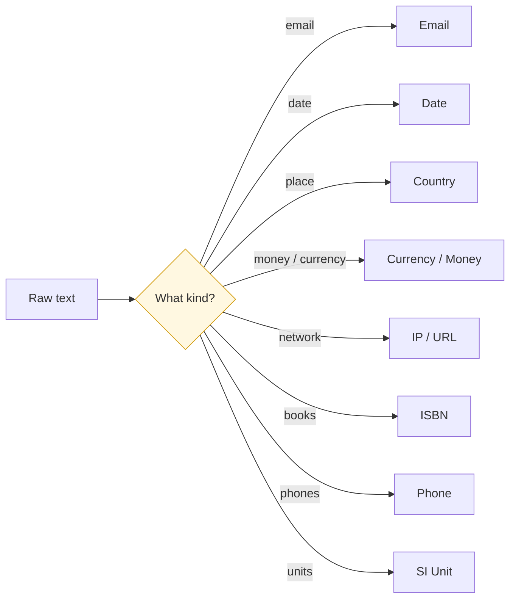

Each page below is a self-contained guide for one kind of identifier Paxman can canonicalize. Read the one that matches your data, copy the notebook snippet, and adapt the contract flags to your needs.

All capabilities share the same call shape — only the import, the factory, and the domain vocabulary change:

```python
import paxman
from paxman.capabilities import X  # Email, Country, ...

paxman.register_all_shipped()  # once, before first use
contract = X.create_contract(...)  # domain flags here
result = paxman.canonicalize(text, contract)
```

For the shared concepts behind these pages see [Contracts](../concepts/contracts/), [Pipeline](../concepts/pipeline/), [Execution Result](../concepts/execution-result/), and the [API Reference](../api-reference/).

---

## Choose by what you have

| Your data looks like… | Read |
|-----------------------|------|
| `user@example.com`, `user at example dot com` | [Email](email/) |
| `2026-01-15`, `01/02/2026`, `2026/01/15` | [Date](date/) |
| `US`, `United States`, `Alemania` | [Country](country/) |
| `USD`, `$`, `euro`, `¥` (identifiers without amounts) | [Currency](currency/) |
| `192.168.1.1`, `2001:db8::1` | [IP](ip/) |
| `9780306406157`, `0306406152` | [ISBN](isbn/) |
| `0317-8471`, `0378-5955` | [ISSN](issn/) |
| `en`, `en-US`, `zh-Hans-CN`, `German` | [Language](language/) |
| `USD 500`, `$500`, `1.000,50 EUR` (currency **with** amount) | [Money](money/) |
| `+1 555 123 4567`, `(555) 234-5678`, `tel:+15551234567` | [Phone](phone/) |
| `kg`, `m/s²`, `megahertz`, `kPa` | [SI Unit](si-unit/) |
| `https://example.com`, `http://münchen.de` | [URL](url/) |

> The set above reflects the **current release**. New capabilities are added in minor releases — check `paxman.capabilities` or the latest release notes if you don't see what you need.



---

## What each page covers

Every capability page answers the same questions in the same order:

1. **What it canonicalizes** and what it explicitly does not.
2. **Recognized forms** — what patterns match, with what grammars.
3. **Canonical output & `output_format`** — default and offered renderings.
4. **Contract flags** — which knobs change recognition and validation.
5. **Statuses** — concrete `SUCCESS` / `MISSING` / `INVALID` / `AMBIGUOUS` examples.
6. **Notebook snippet** — runnable cleaning loop for a column.
7. **Provenance** — which specifications vouch for the answer.

Start with the capability that matches your column; if you need more than one, register both and loop per cell (see the [Segmentation Recipe](https://github.com/nexusnv/paxman-python/blob/main/docs/recipes/segmentation.md) for text that mixes kinds).

---

## One mention per call

Paxman resolves **one presumed entity per `canonicalize()` call** (see [Pipeline](../concepts/pipeline/)). Text that contains two different entities with different canonical values raises `MultipleMentionsError` rather than returning a merged answer — split first, then loop.

```python
from paxman.core.errors import MultipleMentionsError

try:
    result = paxman.canonicalize("alice@example.com, bob@example.org", contract)
except MultipleMentionsError:
    # split the input and canonicalize each piece — see the segmentation recipe
    ...
```
