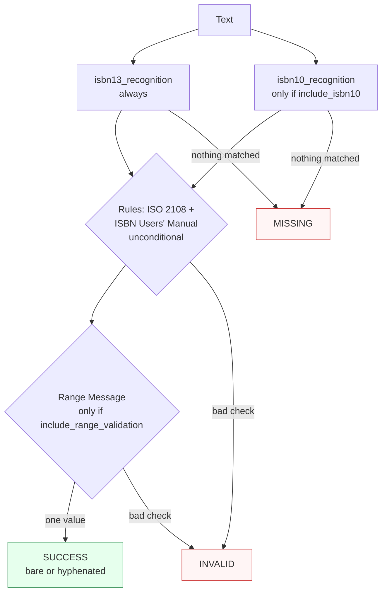

Canonicalizes **one ISBN identifier** per call with check-digit validation, converting legacy ISBN-10 to ISBN-13 when enabled.

> **In plain language:** give it `"9780306406157"` or `"0306406152"` and it hands back the 13-digit ISBN if the check digit is correct. The hyphenated form is a presentation option — the underlying value is always the bare digits unless you ask for hyphens.

---

## What it recognizes — and what it does not

| Recognizes | Does not recognize |
|------------|--------------------|
| ISBN-13 bare digits with `978` or `979` prefix (`9780306406157`) | ISBNs with wrong check digits — recognized but `INVALID` |
| ISBN-10 (`0306406152`) — only when `include_isbn10=True` (the default) | ISBN-10 when `include_isbn10=False` → `MISSING` |
| Hyphenated input is normalized regardless of input hyphens — output hyphens are via `output_format` | Informal variants or partial numbers — `MISSING` |

---

## Canonical output

Default `output_format` is `"isbn13"` (bare 13 digits).

| `output_format` | Renders | Example for `9780110002224` |
|-----------------|---------|------------------------------|
| *(default)* `isbn13` / `None` / `"default"` | bare 13 digits | `9780110002224` |
| `hyphenated` | hyphenated by registrant-range (ISBN Range Message, longest-match) | `978-0-11-000222-4` |

Hyphenation is presentation only — provenance remains the same; the hyphen positions come from the authoritative Range Message table.

```python
from paxman.capabilities import ISBN
import paxman

paxman.register_all_shipped()
paxman.canonicalize(
    "9780110002224", ISBN.create_contract()
).canonicalized_value  # "9780110002224"
paxman.canonicalize(
    "9780110002224", ISBN.create_contract(output_format="hyphenated")
).canonicalized_value  # "978-0-11-000222-4"
paxman.canonicalize(
    "0306406152", ISBN.create_contract()
).canonicalized_value  # "9780306406157" (10 → 13)
```

---

## Contract

```python
contract = ISBN.create_contract(
    include_isbn10=True,  # bool, default True  — recognize ISBN-10
    include_range_validation=False,  # bool, default False — gate the registrant-range rule/provenance
    output_format=None,  # "isbn13" (default) or "hyphenated"
    # plus every common field: excluded_rules / pinned_rules / year / extra_grammars
)
```

- With `include_isbn10=False`, only the `isbn13_recognition` grammar runs — ISBN-10 input is `MISSING` (never seen), not `INVALID`.
- `output_format="hyphenated"` controls hyphenation (uses the Range Message longest-match table) and works regardless of `include_range_validation`. `include_range_validation=True` separately enables the Range Message registrant-range rule that adds provenance — it does not change the canonical digits, and hyphenation does not by itself add that provenance.

---

## Statuses

| Input | Contract | Status | Why |
|-------|----------|--------|-----|
| `9780306406157` | defaults | `SUCCESS` | bare ISBN-13, check digit valid |
| `0306406152` | defaults | `SUCCESS` | ISBN-10 → `9780306406157` |
| `0306406152` | `include_isbn10=False` | `MISSING` | grammar not active |
| `9780306406150` (bad check) | any | `INVALID` | recognized but check digit fails |
| `hello` | any | `MISSING` | no ISBN pattern |
| Two distinct ISBNs in one call | any | raises `MultipleMentionsError` | split first |



---

## Notebook snippet

```python
import paxman
from paxman.capabilities import ISBN
from paxman.core.domain import Resolution

paxman.register_all_shipped()
c = ISBN.create_contract()
c_hyph = ISBN.create_contract(output_format="hyphenated")

for text in ["9780306406157", "0306406152", "9780306406150", "hello"]:
    r = paxman.canonicalize(text, c)
    rh = paxman.canonicalize(text, c_hyph)
    a = r.canonicalized_value or "—"
    b = rh.canonicalized_value or "—"
    print(f"{text!r:20} → bare {a!r:15} hyphenated {b!r:20} status={r.status.value}")
```

---

## Provenance

- **ISO 2108** — GS1 / ISBN prefix.
- **ISBN Users' Manual** — ISBN-13 / ISBN-10 check-digit logic.
- **ISBN Range Message** — registrant-range hyphenation and provenance (only with `include_range_validation=True`).

See also: [Execution Result](../concepts/execution-result/), [Provenance](../concepts/provenance/), [Segmentation](https://github.com/nexusnv/paxman-python/blob/main/docs/recipes/segmentation.md).
