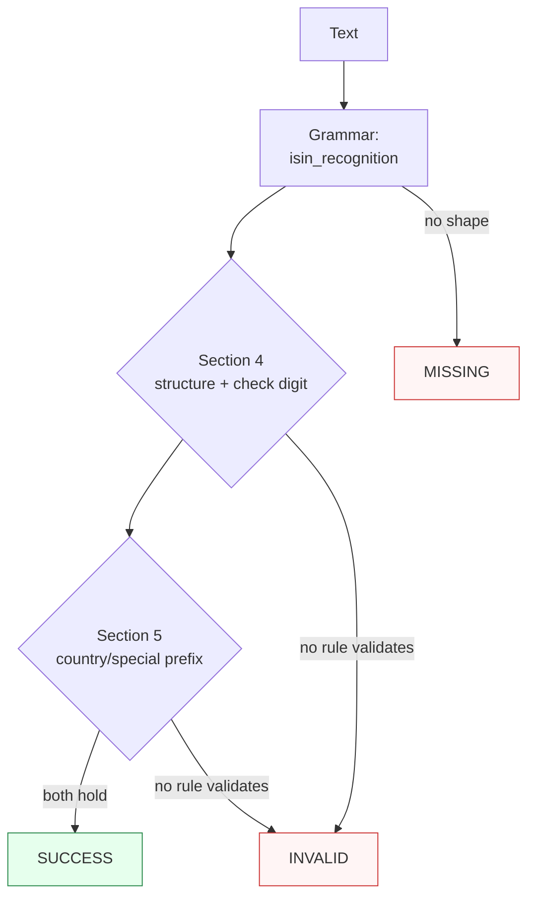

Canonicalizes **one ISIN mention** per call — a bare 12-character code, single-space groupings, or an `ISIN`-labelled form — to compact uppercase form.

> **In plain language:** give it `US0378331005`, `US 037833 100 5`, or `ISIN: US0378331005` and it hands back `US0378331005` when the shape is `CC+NSIN+C` (2-letter prefix, 9-character national identifier, numeric check digit), the modulus 10 Double-Add-Double check digit holds per ISO 6166:2021 §4, and the prefix is an ISO 3166-1 alpha-2 code or an attested special prefix per the ANNA ISIN Guidelines. A bad check digit or an unattested prefix is `INVALID`, never a guess; shapes outside the recognized spellings are `MISSING`.

---

## What it recognizes — and what it does not

| Recognizes | Does not recognize |
|------------|--------------------|
| Bare compact 12-char (`US0378331005`, `AU0000XVGZA3`, `GB0002634946`, `XS0931417173`; lowercase folds up) | Hyphen-separated (`US-037833-100-5`) → `MISSING` (hyphen tolerance deferred — see statuses) |
| Single-space groupings (`US 037833 100 5`, `US037833 1005`, `PL0000 503132`) | Double spaces (`US  037833 100 5`) → `MISSING` |
| `ISIN` label with separator (`ISIN: US0378331005`, `ISIN US0378331005`, `isin: us0378331005` — case-insensitive) | Glued label (`ISINUS0378331005`, no separator) → `MISSING` |
| National shapes with leading zeros (`FR0000131104`, `PL0000503132`, `IS0000000040`, `DE000BAY0017`) | Wrong lengths (`US037833100` 11, `US03783310055` 13) → `MISSING` (rejected — not ISIN shapes) |
| Attested special prefixes (`XS0931417173` international, plus `EU`/`EZ`/`XT`/`XA`–`XD`/`XF`/`XK`/`QS`/`QT` with a valid check digit) | Letter check digit (`US037833100A`) → `MISSING` (position 12 must be `0-9`) |
| Embedded in prose (`see ISIN GB0002634946 (London)`) | Glued surroundings (`XUS0378331005`, `US0378331005X`) → `MISSING` |
| | Prose without an ISIN shape (`not an isin`) → `MISSING` |

---

## Canonical output

Default `output_format` is `"isin"` (identity — `normalize()` returns the compact string).

| `output_format` | Renders | Example |
|-----------------|---------|---------|
| *(default)* `isin` / `None` / `"default"` | Compact uppercase 12-char | `US0378331005` |
| `grouped` | Spaced display `CC NNNNNN NNN C` (encoding — validation runs on the stripped compact form, so the rendering re-enters exactly) | `US 037833 100 5` from `US0378331005` |

Any other value raises `ContractError` — including `compact`, which is not an offered alias (normalize outside the call if you need that spelling).

```python
from paxman.capabilities import ISIN
import paxman

paxman.register_all_shipped()
print(paxman.canonicalize("us0378331005", ISIN.create_contract()).canonicalized_value)
print(paxman.canonicalize("ISIN: GB0002634946", ISIN.create_contract()).canonicalized_value)
print(paxman.canonicalize("US 037833 100 5", ISIN.create_contract()).canonicalized_value)
print(paxman.canonicalize("US0378331005", ISIN.create_contract(output_format="grouped")).canonicalized_value)
print(paxman.canonicalize("XS0931417173", ISIN.create_contract()).canonicalized_value)
```

---

## Contract

```python
contract = ISIN.create_contract(
    output_format=None,  # "isin" (default), "grouped"
    # plus every common field: suppress_common_words / excluded_rules / pinned_rules / year / extra_grammars
)
```

- No grammar toggles: one grammar (`isin_recognition`), two rules (`Section 4-isin-structure-check-digit`, `Section 5-country-and-special-prefix`).
- `year` filters by `publication_year`; e.g., `year=2020` drops both rules (2021, 2025) → `US0378331005` becomes `INVALID`, while `year=2021` keeps the ISO structure rule → still `SUCCESS`.
- Single-value: two distinct ISINs in one call raise `MultipleMentionsError` — split first per `docs/recipes/segmentation.md`.

---

## Statuses

| Input | Contract | Status | Value / why |
|-------|----------|--------|-------------|
| `US0378331005` | defaults | `SUCCESS` | `"US0378331005"` |
| `us0378331005` | defaults | `SUCCESS` | `"US0378331005"` (case folds up) |
| `ISIN: US0378331005` | defaults | `SUCCESS` | label absorbed into the span |
| `US 037833 100 5` | defaults | `SUCCESS` | `"US0378331005"` (grouping recognized, spaces stripped) |
| `AU0000XVGZA3` / `GB0002634946` | defaults | `SUCCESS` | country-prefix ISINs, check digit holds |
| `XS0931417173` | defaults | `SUCCESS` | special-prefix ISIN (international securities) |
| `FR0000131104` / `PL0000503132` / `IS0000000040` | defaults | `SUCCESS` | zero-padded national shapes |
| `US0378331005` | `output_format="grouped"` | `SUCCESS` | `"US 037833 100 5"` |
| `US0378331005` | `pinned_rules=("Section 4-isin-structure-check-digit",)` | `SUCCESS` | ISO rule alone corroborates (vacuity clause) |
| `US0378331003` | any | `INVALID` | recognized shape, check digit fails |
| `ZZ0378331001` | any | `INVALID` | recognized shape, prefix has no Registration Authority attestation (provisional, excluded in v1) |
| `US0378331005` | `year=2020` | `INVALID` | both rules are newer, dropped |
| `US0378331005` | `excluded_rules=(both,)` | `INVALID` | no rule validates |
| `US-037833-100-5` | any | `MISSING` | **DEFER** — hyphen tolerance is not recognized in v1; a community grammar via `extra_grammars` is the extension path |
| `US037833100` (11) / `US03783310055` (13) | any | `MISSING` | **REJECT** — short/long forms are not ISIN shapes |
| `US037833100A` | any | `MISSING` | **REJECT** — position 12 must be numeric |
| `ISINUS0378331005` | any | `MISSING` | glued label needs a separator |
| `US  037833 100 5` | any | `MISSING` | double spaces are not a grouping separator |
| `not an isin` | any | `MISSING` | no ISIN shape |
| `US0378331005` | `output_format="compact"` | raises `ContractError` | not an offered format |
| Two distinct ISINs in one call | any | raises `MultipleMentionsError` | split first |

Two deterministic rules over one single-value grammar yield at most one value, so `AMBIGUOUS` is unreachable for this capability.



---

## Notebook snippet — normalize a mixed column

```python
import paxman
from paxman.capabilities import ISIN
from paxman.core.domain import Resolution
from paxman.core.errors import ContractError

paxman.register_all_shipped()
contract = ISIN.create_contract()

rows = [
    "US0378331005",
    "us0378331005",
    "ISIN: GB0002634946",
    "US 037833 100 5",
    "AU0000XVGZA3",
    "XS0931417173",
    "FR0000131104",
    "US0378331003",
    "ZZ0378331001",
    "US-037833-100-5",
    "US037833100",
    "ISINUS0378331005",
    "not an isin",
]

for text in rows:
    r = paxman.canonicalize(text, contract)
    val = r.canonicalized_value if r.status == Resolution.SUCCESS else "—"
    rule = r.candidates[0].validation_rule if r.candidates else "—"
    print(f"{text!r:24} → {r.status.value:10} {val!r:16} ({rule})")

try:
    ISIN.create_contract(output_format="compact")
except ContractError as e:
    print(f"compact → ContractError: {e}")
```

---

## Provenance

- **ISO 6166:2021** §4 ISIN structure plus check digit (12 chars `CC+NSIN+C`; modulus 10 Double-Add-Double over the letter-expanded payload, `A=10 … Z=35`) — `Section 4-isin-structure-check-digit` (`PARSER`). Catalogue at `https://www.iso.org/standard/78502.html`.
- **ANNA ISIN Guidelines** V25 (Dec 2025) §5 country and special prefix allowlist (ISO 3166-1 alpha-2, 249 codes, plus 12 attested special prefixes) — `Section 5-country-and-special-prefix` (`LOOKUP_TABLE`). Reference at `https://anna-web.org/wp-content/uploads/2025/11/ISIN-Guidelines-Dec-2025_Amendment_clean.pdf`.

Attestation strength inside the 12 special prefixes: **Guidelines-attested** (`EU`, `XS`, `XA`, `XB`, `XC`, `XD`, `XT`); **Registration-Authority-attested** (`EZ` — ISO TC68 briefing plus ANNA identifiers page plus DSB listings); **validator/user-assigned-range** (`XF`, `XK`, `QS`, `QT` — within the `XA`–`XZ` and `QM`–`QZ` user-assigned ranges, corroborated by validator snapshots). `ZZ` is provisional with no Registration Authority attestation and is excluded in v1 (recognized shape, `INVALID`).

> **V26 note:** the ANNA ISIN Guidelines V26 (Jun 2026) supersedes V25. This capability pins V25 as its v1 authority; re-attest the prefix table against V26 before adopting it.

Each candidate's `validation_rule` carries the section, and `candidate.provenance[0].publication_year` the year.

See also: [Execution Result](../concepts/execution-result/), [Provenance](../concepts/provenance/), [Segmentation](https://github.com/nexusnv/paxman-python/blob/main/docs/recipes/segmentation.md).
