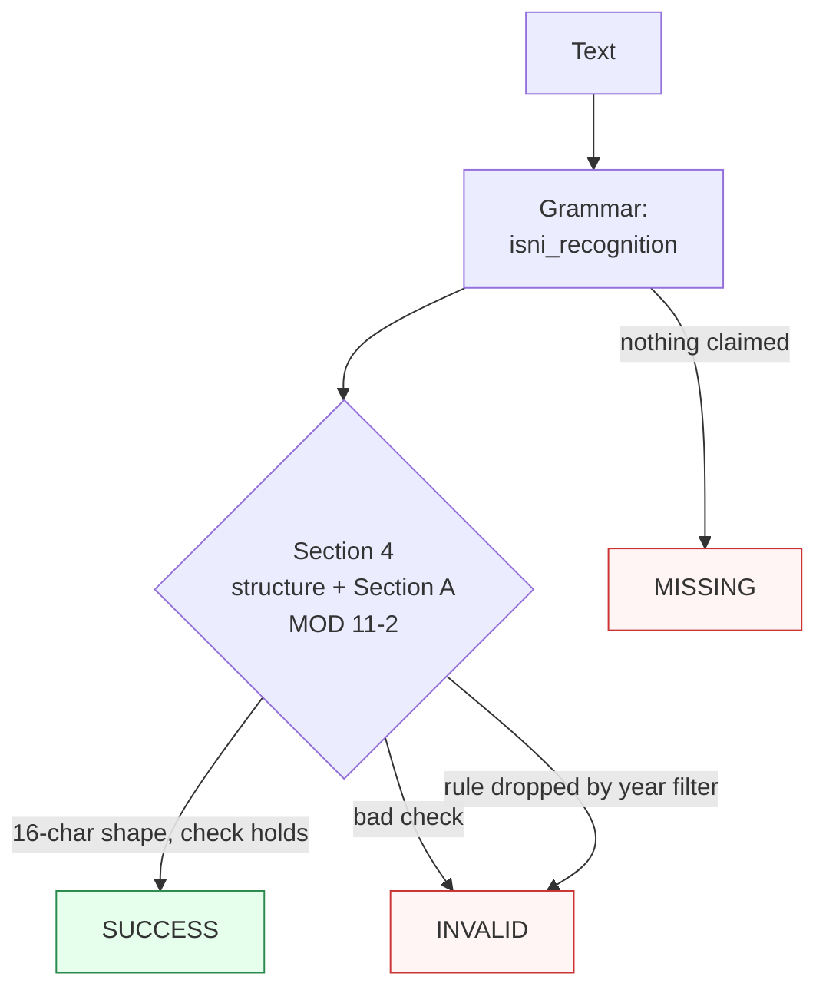

Canonicalizes **one ISNI mention** per call — a spaced display (`0000 0001 2103 2683`), a compact 16-char run, a hyphenated form, an `ISNI`-labelled mention, an `isni.org` URI, or a `urn:isni:` carrier — to the spaced display form.

> **In plain language:** give it `ISNI 0000 0001 2103 2683`, `0000000121032683`, or `https://isni.org/isni/0000000121032683` and it hands back `0000 0001 2103 2683` when the shape is 15 digits plus a MOD 11-2 check character per ISO 27729:2024. A bad check digit is `INVALID`, never a guess; shapes outside the recognized spellings are `MISSING`.

---

## What it recognizes — and what it does not

| Recognizes | Does not recognize |
|------------|--------------------|
| Spaced display (`0000 0001 2103 2683`, `ISNI 0000 0001 2103 2683`; lowercase folds up) | Double spaces / tabs between quads (`0000  0001 …`) → `MISSING` (single space only) |
| Compact 16-char (`0000000121032683`, Wikidata/VIAF dumps) | Wrong lengths (15/17-char runs) → `MISSING` (length guard) |
| Hyphenated (`0000-0001-2103-2683` — ORCID-style input normalizes to spaced) | `X` mid-run (`000X 0001 …`) → `MISSING` (check position 16 only) |
| `ISNI` label with separator (`ISNI: …`, `ISNI-…` — case-insensitive) | Glued label (`ISNI0000…`, no separator) → `MISSING` |
| `isni.org` URIs (`https://isni.org/isni/…`, `http://`, `www.` variants) | MARC `(isni)…` / VIAF `ISNI\|…` wrappers — inner compact mention still resolves as an embedded mention (no dedicated wrapper pattern in v1) |
| `urn:isni:` carrier (`urn:isni:0000000121241960`) | Fullwidth digits → `MISSING` (ASCII only, no autocorrection) |
| Lowercase `x` check (`…955x` → `…955X`) | Glued surroundings (`X0000…`, `…2683Y`) → `MISSING` (word boundary) |
| Embedded mentions (`see ISNI 0000 0001 2103 2683 (Shakespeare)`) | Prose without an ISNI shape (`not an isni`) → `MISSING` |

---

## Canonical output

Default `output_format` is `"isni"` (spaced display `XXXX XXXX XXXX XXXC`).

| `output_format` | Renders | Example |
|-----------------|---------|---------|
| *(default)* `isni` / `None` / `"default"` | Spaced display | `0000 0001 2103 2683` |
| `compact` | 16-char, no spaces | `0000000121032683` |
| `urn` | IANA carrier | `urn:isni:0000000121241960` |

Any other value raises `ContractError` — including `hyphenated`, which is ORCID's presentation, not ISNI's. Every offered format re-enters under the default contract (ADR-0010 fixed point).

```python
from paxman.capabilities import ISNI
import paxman

paxman.register_all_shipped()
print(paxman.canonicalize("ISNI 0000 0001 2103 2683", ISNI.create_contract()).canonicalized_value)
print(paxman.canonicalize("0000000121032683", ISNI.create_contract()).canonicalized_value)
print(paxman.canonicalize("0000-0001-2103-2683", ISNI.create_contract()).canonicalized_value)
print(paxman.canonicalize("0000000121032683", ISNI.create_contract(output_format="urn")).canonicalized_value)
```

---

## Contract

```python
contract = ISNI.create_contract(
    output_format=None,  # "isni" (default); None/"default"/"isni" all resolve to it
    # plus every common field: suppress_common_words / excluded_rules / pinned_rules / year / extra_grammars
)
```

- One grammar: `isni_recognition` (spaced/compact/hyphen + label/host/carrier groups).
- Two rules: `Section 4-isni-structure` + `Section A-mod11-2-check-character` (ISO 27729:2024; both PARSER, always-active — no registry flag exists).
- `year` filters by `publication_year`; e.g., `year=2023` drops the 2024 rules → `0000000121032683` becomes `INVALID`.
- Deterministic by construction: same input + contract + vendored snapshot → same output. No clock, no registry lookup.

---

## Statuses

| Input | Contract | Status | Value / why |
|-------|----------|--------|-------------|
| `ISNI 0000 0001 2103 2683` | defaults | `SUCCESS` | `"0000 0001 2103 2683"` |
| `0000000121032683` / hyphenated twin | defaults | `SUCCESS` | same spaced canonical (presentation-only dedup) |
| `https://isni.org/isni/…` / `urn:isni:…` | defaults | `SUCCESS` | carriers stripped, span includes carrier |
| `0000 0001 2281 955x` | defaults | `SUCCESS` | `"0000 0001 2281 955X"` (lowercase-x tolerance) |
| `000000012146438X` | defaults | `SUCCESS` | `X` check digit validates |
| `0000000121032684` | defaults | `INVALID` | recognized shape, MOD 11-2 fails |
| `ISNI0000000121032683` | defaults | `MISSING` | glued label needs a separator |
| `000000012103268` (15) / 17-char | defaults | `MISSING` | length guard |
| two distinct ISNIs | defaults | raises `MultipleMentionsError` | un-segmented multi-entity input (`single_value=True`) |
| `0000000121032683` | `year=2023` | `INVALID` | rules are 2024, dropped |
| `0000000121032683` | `output_format="hyphenated"` | raises `ContractError` | never offered |



**Sibling note:** a hyphenated 16-digit string also matches the ORCID shape — each side resolves under its own contract (ISNI `SUCCESS` spaced, ORCID `SUCCESS` hyphenated). The same holds for `ORCID:`-labeled or `urn:orcid:`-carried digits: ORCID iDs are ISNI-compatible by design, so structurally valid digits resolve as ISNI with ISO 27729 provenance (symmetric with shipped ORCID claiming `ISNI:` labels). Unassigned-but-shaped numbers read `SUCCESS` (storable, no registry — UUID precedent).

---

## Notebook snippet — normalize a mixed column

```python
import paxman
from paxman.capabilities import ISNI
from paxman.core.domain import Resolution

paxman.register_all_shipped()
contract = ISNI.create_contract()

rows = [
    "ISNI 0000 0001 2103 2683",
    "0000000121032683",
    "0000-0001-2103-2683",
    "https://isni.org/isni/0000000121032683",
    "urn:isni:0000000121241960",
    "0000 0001 2281 955x",
    "0000000121032684",
    "ISNI0000000121032683",
    "not an isni",
]

for text in rows:
    r = paxman.canonicalize(text, contract)
    val = r.canonicalized_value if r.status == Resolution.SUCCESS else "—"
    rule = r.candidates[0].validation_rule if r.candidates else "—"
    print(f"{text!r:46} → {r.status.value:10} {val!r:24} ({rule})")
```

---

## Provenance

- **ISO 27729:2024** (specification; 16-char structure: 15 digits + MOD 11-2 check character) — `Section 4-isni-structure` (vendored version 2024-11)
- **ISO 27729:2024 Annex A** (specification; MOD 11-2 over the first 15 decimal digits, `X` = 10) — `Section A-mod11-2-check-character`

Each candidate's `validation_rule` carries the section, and `candidate.provenance[0].publication_year` the year.

See also: [ORCID](./orcid/), [ISBN](./isbn/), [Execution Result](../concepts/execution-result/), [Provenance](../concepts/provenance/).
