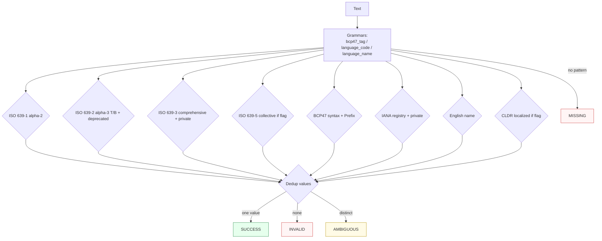

Canonicalizes **one language mention** per call — a bare code, a BCP 47 tag, or a display name — to a canonical BCP 47 tag.

> **In plain language:** give it `en`, `eng`, `en-US`, `zh-Hans-CN`, `German`, or `deutsch` and it hands back the BCP 47 canonical tag (`en`, `de`, `zh-Hans-CN`) if a real spec says that name means that language. Localized and collective/private codes are off by default so results are predictable; turn them on when you need them.

---

## What it recognizes — and what it does not

| Recognizes (current release — growing) | Does not recognize |
|----------------------------------------|--------------------|
| Bare ISO 639 codes: alpha-2 (`en`, `de`), alpha-3 Term/Bib (`eng`/`ger`), comprehensive (`cmn`), collective (`aav` when `include_collective=True`), private `qaa` when `include_private=True` | Bare 4-letter codes (`abcd`) — 4 is script, not language; 1-letter (`x`) |
| BCP 47 tags (`en-US`, `zh-Hans-CN`, `es-419`, `sl-nedis`, `en-a-foo`, `x-private`, `art-lojban`→`jbo`, `en-GB-oed`→`en-GB-oxendict`) with `_`→`-` folding (`fr_FR`→`fr-FR`) | Malformed tags (`en--US`, `en-`, `en-US-123456789` 9-char subtag, duplicate extension `en-a-foo-a-bar` second `a`) |
| English display names — 60-entry curatorial subset (`German`→`de`, `Serbo Croatian`→`sh`, `Norwegian Bokmal`→`nb`, `Cherokee`→`chr`) | Names outside the 60 (`Klingonish`) → `MISSING` (grammar emits no match, not `INVALID`) |
| CLDR localized names — 24-entry subset (`allemand`→`de`, `deutsch`→`de`) — only when `include_localized=True` | Localized names when flag off — recognized but `INVALID` (no authority claims them) |
| Grandfathered / deprecated Preferred-Value (`i-cherokee`→`chr`, `iw`→`he`, `scc`→`sr` historical) | Private subtags (`qaa`, `Qaaa`, `ZZ`) without `include_private` → `INVALID` |

> **Subset disclaimer:** English 60 + localized 24 are hand-curated from `paxman/shared_data/language_snapshot.json` — not the full IANA Registry Description set (7,900+) or CLDR v46 root. Names outside are `MISSING`, not `INVALID`, so no false negative under current completeness. ISO 639 code tables (alpha-2 184, alpha-3 487, comprehensive 7,000+, collective 115) *are* comprehensive. Plan: generate full IANA Description + CLDR root via `tools/regenerate_language_data.py`.

---

## Canonical output

Default `output_format` is `"bcp47"` (identity).

| `output_format` | Renders | Example |
|-----------------|---------|---------|
| *(default)* `bcp47` / `None` / `"default"` | BCP 47 canonical tag (B→T, Deprecated→Preferred, case-canonical) | `en-US`, `zh-Hans-CN`, `chr` (from `i-cherokee`) |
| `alpha2` | ISO 639-1 alpha-2 when available else Term else itself (`ger`→`de`) | `en` from `eng`, `de` from `ger`/`deu`, `chr` passthrough |
| `alpha3` | ISO 639-2 Term lower (`de`→`deu`, `en`→`eng`) | `eng` from `en`, `deu` from `de` |
| `alpha3-bib` | Bibliographic (`deu`→`ger`, `fra`→`fre`) | `ger` from `de`, `fre` from `fr` |
| `name` | English Description title (via reverse map) | `German` from `de`, `English` from `eng`, `Chinese` from `zh-Hans-CN` |

Any other value raises `ContractError`.

```python
from paxman.capabilities import Language
import paxman

paxman.register_all_shipped()
paxman.canonicalize("German", Language.create_contract()).canonicalized_value  # "de"
paxman.canonicalize("de", Language.create_contract(output_format="alpha3")).canonicalized_value  # "deu"
paxman.canonicalize("de", Language.create_contract(output_format="alpha3-bib")).canonicalized_value  # "ger"
paxman.canonicalize("deu", Language.create_contract(output_format="alpha2")).canonicalized_value  # "de"
paxman.canonicalize("de", Language.create_contract(output_format="name")).canonicalized_value  # "German"
paxman.canonicalize("en-US", Language.create_contract()).canonicalized_value  # "en-US"
```

---

## Contract

```python
contract = Language.create_contract(
    include_private=False,     # bool, default False — qaa-qtz / Qaaa-Qabx / QM-QZ etc. + x-
    include_collective=False,  # bool, default False — ISO 639-5 families (aav, ber, gem…)
    include_localized=False,   # bool, default False — CLDR 24 localized display names
    output_format=None,        # "bcp47" (default), "alpha2", "alpha3", "alpha3-bib", "name"
    # plus every common field: suppress_common_words / excluded_rules / pinned_rules / year / extra_grammars
)
```

- `include_private` gates `Section 4-private-alpha-3` and `Section-iana-registry-private`; without it `qaa` is `INVALID` (grammar claims, no rule validates).
- `include_collective` gates `Section 4-collective-code`; without it `aav` is `INVALID` (use `aav` as clean vector; `aus` overlaps ISO 639-2 so it succeeds even without flag).
- `include_localized` gates `Section-localized-names`; without it `allemand` is recognized but `INVALID`.
- `year` filters by `publication_year`; e.g., `year=2008` drops BCP 47 RFC 5646 (2009) → `en-US` becomes `INVALID`.

---

## Statuses

| Input | Contract | Status | Value / why |
|-------|----------|--------|-------------|
| `en` | defaults | `SUCCESS` | `"en"` |
| `eng` | defaults | `SUCCESS` | `"de"`? `eng→en` via alpha2 mapping |
| `ger` | defaults | `SUCCESS` | `"de"` (B→T `ger→deu`→`de`) |
| `German` | defaults | `SUCCESS` | `de` (English name) |
| `deutsch` | `include_localized=True` | `SUCCESS` | `de` (CLDR) |
| `deutsch` | defaults | `INVALID` | recognized but no localized rule |
| `aav` | defaults | `INVALID` | collective needs flag |
| `aav` | `include_collective=True` | `SUCCESS` | `aav` |
| `qaa` | `include_private=True` | `SUCCESS` | `qaa` |
| `en-US` | `year=2008` | `INVALID` | BCP 47 rule is 2009, dropped |
| `de-nedis` | any | `INVALID` | variant prefix `nedis` requires `sl` |
| `Serbo-Croatian` | any | `AMBIGUOUS` | `serbo-croatian` (BCP 47 well-formed) vs `sh` (English name) — use spaced `Serbo Croatian` |
| `Klingonish` | any | `MISSING` | no language pattern |
| `en, fr` (two different mentions) | any | raises `MultipleMentionsError` | split first |



---

## Notebook snippet — normalize a mixed column

```python
import paxman
from paxman.capabilities import Language
from paxman.core.domain import Resolution
from paxman.core.errors import CapabilityError, ContractError, MultipleMentionsError

paxman.register_all_shipped()
contract = Language.create_contract(include_localized=True, include_private=True)
contract_coll = Language.create_contract(include_collective=True)

rows = ["en", "eng", "ger", "German", "deutsch", "zh-Hans-CN", "en-US", "qaa", "aav", "Serbo-Croatian", "not a language", "en, fr"]

for text in rows:
    for label, c in [("default+local+private", contract), ("+collective", contract_coll)]:
        try:
            r = paxman.canonicalize(text, c)
        except (MultipleMentionsError, CapabilityError, ContractError) as e:
            print(f"{text!r:20} [{label}] → exception {type(e).__name__}: {e}")
            continue
        val = r.canonicalized_value if r.status == Resolution.SUCCESS else "—"
        prov = r.candidates[0].provenance[0].specification_name if r.candidates else "—"
        rule = r.candidates[0].validation_rule if r.candidates else "—"
        print(f"{text!r:20} [{label:22}] → {r.status.value:10} {val!r:15} ({rule} / {prov})")
```

---

## Provenance

- **ISO 639-1:2002** alpha-2 (184) + English names — `Section 4-alpha-2-code`, `Section-english-name-mapping`
- **ISO 639-2:1998** alpha-3 T/B (487, B→T `ger→deu`) — `Section 4-alpha-3-code`
- **ISO 639-3:2007** comprehensive (7,000+, SIL RA) — `Section 4-comprehensive-alpha-3`, `Section 4-private-alpha-3` (`qaa-qtz`)
- **ISO 639-5:2008** collective families (115, when `include_collective`) — `Section 4-collective-code`
- **BCP 47 RFC 5646** Section 2.1 Language-Tag ABNF (2009-09) + variant Prefix guard — `Section 2.1-syntax`
- **IANA Language Subtag Registry** Rolling File-Date 2026-08-08 — `Section-iana-registry`, `Section-iana-registry-private` (qaa-qtz/Qaaa-Qabx/QM-QZ/AA/XA-XZ/ZZ/x-)
- **CLDR Language Display Names** v46 (2025, Unicode) — `Section-localized-names` (24, when `include_localized`)

Each candidate's `validation_rule` carries the section, and `candidate.provenance[0].publication_year` the year.

See also: [Execution Result](../concepts/execution-result/), [Provenance](../concepts/provenance/), [Segmentation](https://github.com/nexusnv/paxman-python/blob/main/docs/recipes/segmentation.md).

