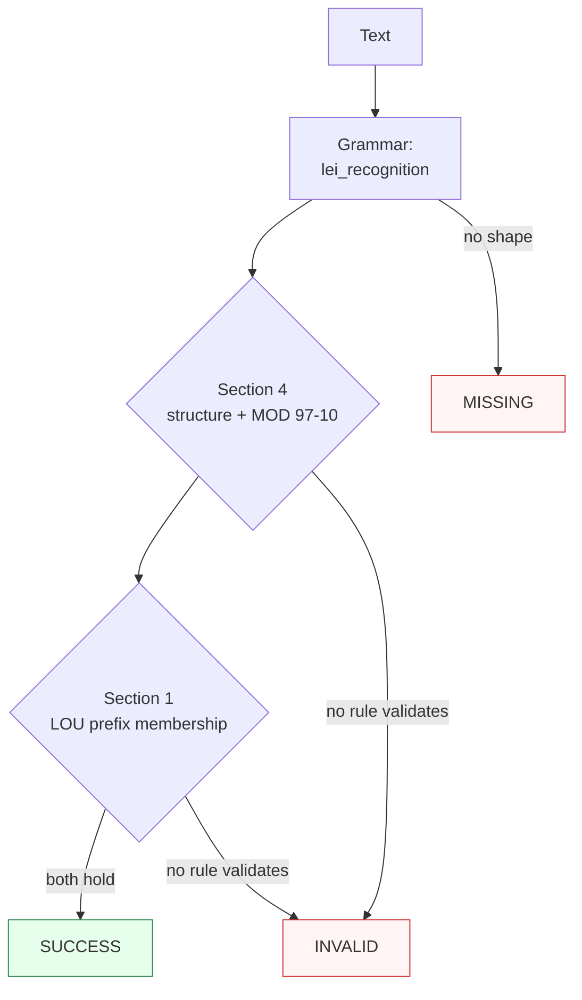

Canonicalizes **one LEI mention** per call — a bare 20-character code, a single-spaced form, or an `LEI`-labelled / `urn:lei:`-carried form — to compact uppercase form.

> **In plain language:** give it `5493000IBP32UQZ0KL24`, `5493 000IBP32UQZ0KL24`, `LEI: 5493000IBP32UQZ0KL24`, or `urn:lei:5493000IBP32UQZ0KL24` and it hands back `5493000IBP32UQZ0KL24` when the shape is `LOU+entity+check` (4-character LOU prefix, 14-character entity block, 2 numeric check digits), the whole-string MOD 97-10 remainder is 1 per ISO 17442-1:2020 §4, and the prefix is an accredited LOU block per the GLEIF LOU prefix list. A bad check digit or an unattested prefix is `INVALID`, never a guess; shapes outside the recognized spellings are `MISSING`.

---

## What it recognizes — and what it does not

| Recognizes | Does not recognize |
|------------|--------------------|
| Bare compact 20-char (`213800KUD8LAJWSQ9D15`, `5493000IBP32UQZ0KL24`, `7LTWFZYICNSX8D621K86`; lowercase folds up) | Hyphen-separated (`5493-000I-BP32-UQZ0-KL24`) → `MISSING` (hyphen tolerance deferred — see statuses) |
| Single-space forms (`5493 000IBP32UQZ0KL24`, `2138 00KU D8LA JWSQ 9D15`) | Double spaces / tabs (`5493  000IBP32UQZ0KL24`) → `MISSING` |
| `LEI` label with separator (`LEI: 213800KUD8LAJWSQ9D15`, `lei 5493000IBP32UQZ0KL24`, `LEI-213800KUD8LAJWSQ9D15` — case-insensitive) | Glued label (`LEI5493000IBP32UQZ0KL24`, no separator) → `MISSING` |
| `urn:lei:` carrier (`urn:lei:213800KUD8LAJWSQ9D15`, `URN:LEI:5493000IBP32UQZ0KL24` — case-insensitive) | Wrong lengths (19 / 21 chars) → `MISSING` (rejected — not LEI shapes) |
| Non-`00` entity content (`7LTWFZYICNSX8D621K86` carries `FZ` at positions 5–6) | Fullwidth homoglyphs (`213800KUD8LAJWSQ9D1\uff15`) → `MISSING` (ASCII only) |
| Embedded in prose (`see LEI 213800KUD8LAJWSQ9D15 (London)`) | Glued surroundings (`X213800KUD8LAJWSQ9D15`, `213800KUD8LAJWSQ9D15Y`) → `MISSING` |
| | Prose without an LEI shape (`not an lei`) → `MISSING` |

---

## Canonical output

Default `output_format` is `"lei"` (identity — `normalize()` returns the compact string).

| `output_format` | Renders | Example |
|-----------------|---------|---------|
| *(default)* `lei` / `None` / `"default"` | Compact uppercase 20-char | `5493000IBP32UQZ0KL24` |
| `urn` | `urn:lei:` carrier (encoding — the carrier branch re-recognizes the rendering to the same compact pre-image, so it re-enters exactly) | `urn:lei:5493000IBP32UQZ0KL24` from `5493000IBP32UQZ0KL24` |

Any other value raises `ContractError` — including `compact`, which is not an offered alias (normalize outside the call if you need that spelling).

```python
from paxman.capabilities import LEI
import paxman

paxman.register_all_shipped()
print(
    paxman.canonicalize(
        "5493000ibp32uqz0kl24", LEI.create_contract()
    ).canonicalized_value
)
print(
    paxman.canonicalize(
        "LEI: 213800KUD8LAJWSQ9D15", LEI.create_contract()
    ).canonicalized_value
)
print(
    paxman.canonicalize(
        "5493 000IBP32UQZ0KL24", LEI.create_contract()
    ).canonicalized_value
)
print(
    paxman.canonicalize(
        "5493000IBP32UQZ0KL24", LEI.create_contract(output_format="urn")
    ).canonicalized_value
)
print(
    paxman.canonicalize(
        "7LTWFZYICNSX8D621K86", LEI.create_contract()
    ).canonicalized_value
)
```

---

## Contract

```python
contract = LEI.create_contract(
    output_format=None,  # "lei" (default), "urn"
    # plus every common field: suppress_common_words / excluded_rules / pinned_rules / year / extra_grammars
)
```

- No grammar toggles: one grammar (`lei_recognition`), two rules (`Section 4-lei-structure-mod97-10`, `Section 1-lou-prefix-membership`).
- `year` filters by `publication_year`; e.g., `year=2019` drops both rules (2020, 2026) → `213800KUD8LAJWSQ9D15` becomes `INVALID`, while `year=2020` keeps the ISO structure rule → still `SUCCESS`.
- Single-value: two distinct LEIs in one call raise `MultipleMentionsError` — split first per `docs/recipes/segmentation.md`.

---

## Statuses

| Input | Contract | Status | Value / why |
|-------|----------|--------|-------------|
| `213800KUD8LAJWSQ9D15` | defaults | `SUCCESS` | `"213800KUD8LAJWSQ9D15"` |
| `5493000ibp32uqz0kl24` | defaults | `SUCCESS` | `"5493000IBP32UQZ0KL24"` (case folds up) |
| `LEI: 213800KUD8LAJWSQ9D15` | defaults | `SUCCESS` | label absorbed into the span |
| `urn:lei:5493000IBP32UQZ0KL24` | defaults | `SUCCESS` | carrier absorbed into the span |
| `5493 000IBP32UQZ0KL24` | defaults | `SUCCESS` | `"5493000IBP32UQZ0KL24"` (spacing recognized, spaces stripped) |
| `213800WSGIIZCXF1P572` / `506700GE1G29325QX363` | defaults | `SUCCESS` | further accredited-LOU LEIs, check digits hold |
| `7LTWFZYICNSX8D621K86` | defaults | `SUCCESS` | non-`00` entity content never rejects |
| `5493000IBP32UQZ0KL24` | `output_format="urn"` | `SUCCESS` | `"urn:lei:5493000IBP32UQZ0KL24"` |
| `213800KUD8LAJWSQ9D15` | `pinned_rules=("Section 4-lei-structure-mod97-10",)` | `SUCCESS` | ISO rule alone corroborates (vacuity clause) |
| `213800KUD8LXJWSQ9D15` | any | `INVALID` | recognized shape, check digit fails (remainder 55, not 1) |
| `ZZZZ0000000000000016` | any | `INVALID` | recognized shape with valid check digits, prefix has no accredited-LOU attestation |
| `213800KUD8LAJWSQ9D15` | `year=2019` | `INVALID` | both rules are newer, dropped |
| `213800KUD8LAJWSQ9D15` | `excluded_rules=(both,)` | `INVALID` | no rule validates |
| `5493-000I-BP32-UQZ0-KL24` | any | `MISSING` | **DEFER** — hyphen tolerance is not recognized in v1; a community grammar via `extra_grammars` is the extension path |
| 19- / 21-char forms | any | `MISSING` | **REJECT** — short/long forms are not LEI shapes |
| `LEI5493000IBP32UQZ0KL24` | any | `MISSING` | glued label needs a separator |
| `5493  000IBP32UQZ0KL24` | any | `MISSING` | double spaces are not a grouping separator |
| `not an lei` | any | `MISSING` | no LEI shape |
| `5493000IBP32UQZ0KL24` | `output_format="compact"` | raises `ContractError` | not an offered format |
| Two distinct LEIs in one call | any | raises `MultipleMentionsError` | split first |

Two deterministic rules over one single-value grammar yield at most one value, so `AMBIGUOUS` is unreachable for this capability.



---

## Notebook snippet — normalize a mixed column

```python
import paxman
from paxman.capabilities import LEI
from paxman.core.domain import Resolution
from paxman.core.errors import ContractError

paxman.register_all_shipped()
contract = LEI.create_contract()

rows = [
    "213800KUD8LAJWSQ9D15",
    "5493000ibp32uqz0kl24",
    "LEI: 213800KUD8LAJWSQ9D15",
    "urn:lei:5493000IBP32UQZ0KL24",
    "5493 000IBP32UQZ0KL24",
    "7LTWFZYICNSX8D621K86",
    "213800WSGIIZCXF1P572",
    "213800KUD8LXJWSQ9D15",
    "ZZZZ0000000000000016",
    "5493-000I-BP32-UQZ0-KL24",
    "213800KUD8LAJWSQ9D1",
    "LEI5493000IBP32UQZ0KL24",
    "not an lei",
]

for text in rows:
    r = paxman.canonicalize(text, contract)
    val = r.canonicalized_value if r.status == Resolution.SUCCESS else "—"
    rule = r.candidates[0].validation_rule if r.candidates else "—"
    print(f"{text!r:32} → {r.status.value:10} {val!r:24} ({rule})")

try:
    LEI.create_contract(output_format="compact")
except ContractError as e:
    print(f"compact → ContractError: {e}")
```

---

## Provenance

- **ISO 17442-1:2020** §4 LEI structure plus check digits (20 chars `LOU4+entity14+check2`, charset `[A-Z0-9]{18}[0-9]{2}`; whole-string ISO/IEC 7064:2003 MOD 97-10, `A=10 … Z=35`, remainder 1, no rearrangement) — `Section 4-lei-structure-mod97-10` (`PARSER`). Catalogue at `https://www.iso.org/standard/78829.html`.
- **GLEIF LOU prefix list** §1 accredited-LOU prefix membership (4-char issuer blocks observed in the accredited-LOU directory and on real records in the GLEIF concatenated file; append-only snapshot — codes survive LOU retirement and transfer) — `Section 1-lou-prefix-membership` (`LOOKUP_TABLE`). Download at `https://www.gleif.org/en/lei-data/gleif-concatenated-file/download-the-concatenated-file`.

Issued/live membership is deferred in v1: liveness is not validity — an LEI with valid structure, check digits, and an accredited prefix is `SUCCESS` whether or not it is currently issued.

Each candidate's `validation_rule` carries the section, and `candidate.provenance[0].publication_year` the year.

See also: [Execution Result](../concepts/execution-result/), [Provenance](../concepts/provenance/), [Segmentation](https://github.com/nexusnv/paxman-python/blob/main/docs/recipes/segmentation.md).
