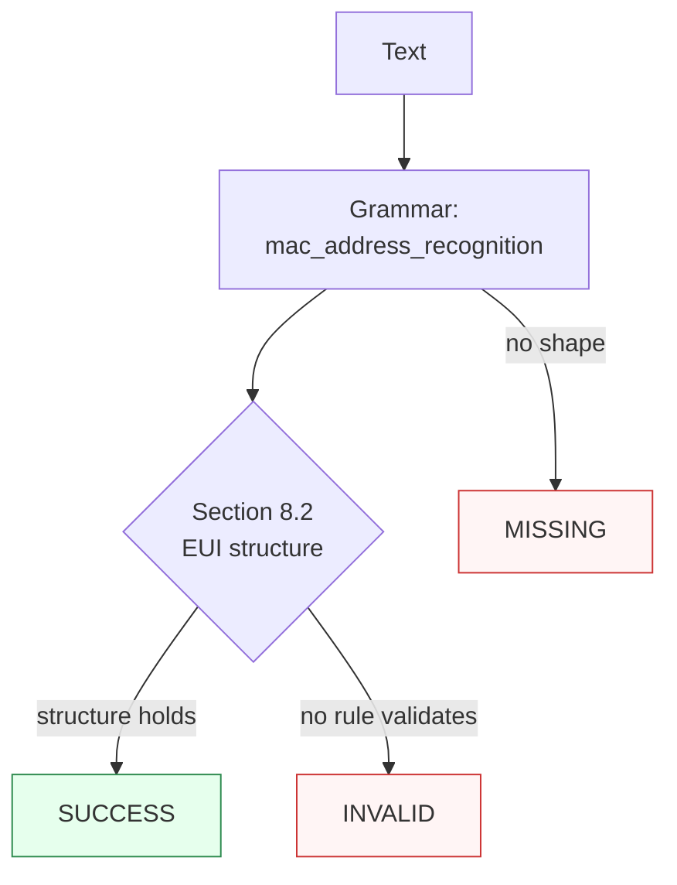

Canonicalizes **one MAC address mention** per call — an EUI-48 or EUI-64 in colon, hyphen, Cisco tri-dot, or bare hex (with an optional fused `MAC` label) — to uppercase colon form.

> **In plain language:** give it `00-1A-2B-3C-4D-5E`, `001A.2B3C.4D5E`, `001A2B3C4D5E`, or `MAC: 00:1A:2B:3C:4D:5E` and it hands back `00:1A:2B:3C:4D:5E` when the shape is a real EUI-48/EUI-64 structure per IEEE Std 802-2024 §8.2. The spec defines no checksum, so validation is structural (hex length + shape); I/G and U/L bits are informative and never rejected.

---

## What it recognizes — and what it does not

| Recognizes | Does not recognize |
|------------|--------------------|
| Colon EUI-48 (`00:1A:2B:3C:4D:5E`, lowercase folds up) and EUI-64 (`00:1A:2B:3C:4D:5E:66:77`) | Truncated shapes (`00:1A:2B:3C:4D`, 7-octet `00:1A:2B:3C:4D:5E:66`) → `MISSING` |
| Hyphen EUI-48/EUI-64 (`00-1A-2B-3C-4D-5E`) | Non-hex or wrong-length runs (`001A2B3C4D5E66`, 14 hex) → `MISSING` |
| Cisco tri-dot hextets (`001A.2B3C.4D5E`) | Glued label (`MAC001A2B3C4D5E`, no separator) → `MISSING` |
| Bare hex, 12 (`001A2B3C4D5E`) or 16 (`001A2B3C4D5E6677`) digits | Prose without an address shape (`not a mac`) → `MISSING` |
| Fused `MAC` label with separator (`MAC: 00:1A:2B:3C:4D:5E`) | |

---

## Canonical output

Default `output_format` is `"colon"` (identity — `normalize()` returns colon form).

| `output_format` | Renders | Example |
|-----------------|---------|---------|
| *(default)* `colon` / `None` / `"default"` | Uppercase colon-separated octets | `00:1A:2B:3C:4D:5E` |
| `hyphen` | Uppercase hyphen-separated (encoding) | `00-1A-2B-3C-4D-5E` |
| `bare` | Uppercase hex, no separators (encoding) | `001A2B3C4D5E` |
| `cisco` | Uppercase tri-dot hextets (encoding) | `001A.2B3C.4D5E` |
| `eui64` | Same-entity expansion: EUI-48 gains `FF:FE` after the OUI (`...2B:FF:FE:3C...`); EUI-64 is identity | `00:1A:2B:FF:FE:3C:4D:5E` from `00:1A:2B:3C:4D:5E` |

Any other value raises `ContractError` — including `bit_reversed`, removed in v0.4.0 per ADR-0010 (bit-reversal is an involution on the same identifier, not a canonical fixed point; store the `colon` form for round-trippable output).

```python
from paxman.capabilities import MacAddress
import paxman

paxman.register_all_shipped()
print(paxman.canonicalize("00-1A-2B-3C-4D-5E", MacAddress.create_contract()).canonicalized_value)
print(paxman.canonicalize("001A.2B3C.4D5E", MacAddress.create_contract()).canonicalized_value)
print(paxman.canonicalize("001A2B3C4D5E6677", MacAddress.create_contract()).canonicalized_value)
print(paxman.canonicalize("00:1A:2B:3C:4D:5E", MacAddress.create_contract(output_format="hyphen")).canonicalized_value)
print(paxman.canonicalize("00:1A:2B:3C:4D:5E", MacAddress.create_contract(output_format="eui64")).canonicalized_value)
```

---

## Contract

```python
contract = MacAddress.create_contract(
    output_format=None,  # "colon" (default), "hyphen", "bare", "cisco", "eui64"
    # plus every common field: suppress_common_words / excluded_rules / pinned_rules / year / extra_grammars
)
```

- No grammar toggles: one grammar (`mac_address_recognition`), one rule (`Section 8.2-eui-structure`).
- `year` filters by `publication_year`; e.g., `year=2020` drops the IEEE 802-2024 rule → `00:1A:2B:3C:4D:5E` becomes `INVALID`.

---

## Statuses

| Input | Contract | Status | Value / why |
|-------|----------|--------|-------------|
| `00:1A:2B:3C:4D:5E` | defaults | `SUCCESS` | `"00:1A:2B:3C:4D:5E"` |
| `00-1A-2B-3C-4D-5E` | defaults | `SUCCESS` | `"00:1A:2B:3C:4D:5E"` (hyphen recognized) |
| `001A.2B3C.4D5E` | defaults | `SUCCESS` | `"00:1A:2B:3C:4D:5E"` (Cisco recognized) |
| `001A2B3C4D5E6677` | defaults | `SUCCESS` | `"00:1A:2B:3C:4D:5E:66:77"` (EUI-64) |
| `MAC: 00:1A:2B:3C:4D:5E` | defaults | `SUCCESS` | fused label, span covers the address |
| `00:1A:2B:3C:4D` | any | `MISSING` | truncated, no shape matches |
| `MAC001A2B3C4D5E` | any | `MISSING` | glued label needs a separator |
| `00:1A:2B:3C:4D:5E` | `year=2020` | `INVALID` | rule is 2024, dropped |
| `00:1A:2B:3C:4D:5E` | `output_format="bit_reversed"` | raises `ContractError` | format removed in v0.4.0 |

A single grammar plus a single deterministic rule yields at most one value, so `AMBIGUOUS` is unreachable for this capability.



---

## Notebook snippet — normalize a mixed column

```python
import paxman
from paxman.capabilities import MacAddress
from paxman.core.domain import Resolution
from paxman.core.errors import ContractError

paxman.register_all_shipped()
contract = MacAddress.create_contract()

rows = [
    "00:1A:2B:3C:4D:5E",
    "00-1A-2B-3C-4D-5E",
    "001A.2B3C.4D5E",
    "001A2B3C4D5E",
    "001A2B3C4D5E6677",
    "MAC: 00:1A:2B:3C:4D:5E",
    "00:1A:2B:3C:4D",
    "not a mac",
]

for text in rows:
    r = paxman.canonicalize(text, contract)
    val = r.canonicalized_value if r.status == Resolution.SUCCESS else "—"
    rule = r.candidates[0].validation_rule if r.candidates else "—"
    print(f"{text!r:28} → {r.status.value:10} {val!r:24} ({rule})")

try:
    MacAddress.create_contract(output_format="bit_reversed")
except ContractError as e:
    print(f"bit_reversed → ContractError: {e}")
```

---

## Provenance

- **IEEE Std 802-2024** §8.2 Universal addresses (EUI-48/EUI-64 structure; no checksum — proved by absence across IEEE Std 802 and RFC 7042) — `Section 8.2-eui-structure`
- **RFC 7042** IANA Considerations and IETF Protocol Usage for EUI-48/EUI-64 (EUI-48→EUI-64 `FF:FE` expansion backing the `eui64` format)

Each candidate's `validation_rule` carries the section, and `candidate.provenance[0].publication_year` the year.

See also: [Execution Result](../concepts/execution-result/), [Provenance](../concepts/provenance/), [Segmentation](https://github.com/nexusnv/paxman-python/blob/main/docs/recipes/segmentation.md).
