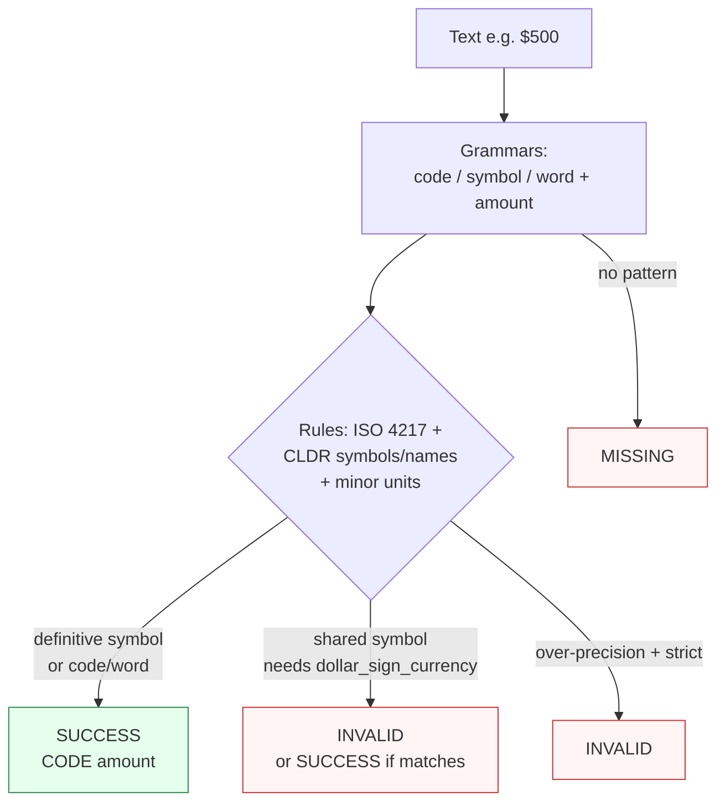

Canonicalizes **one money amount paired with a currency** per call to `CODE amount` padded to ISO 4217 minor units.

> **In plain language:** give it `"USD500"` or `"1.000,50 EUR"` and it hands back `"USD 500.00"` / `"EUR 1000.50"` if the specs say the amount and currency go together. Currency without an amount — or an amount without a currency — is not Money's domain (see [Currency](currency.md)).

---

## What it recognizes — and what it does not

| Recognizes (currency + amount adjacent) | Does not recognize |
|-----------------------------------------|--------------------|
| `USD500`, `USD 500.00`, `EUR 1.000,50` | Currency identifier alone (`USD`) — use [Currency](currency.md) |
| `€500`, `¥1000`, `US$ 500` (qualified symbol) | Bare shared symbol without disambiguation (`$500` with default contract) — recognized but `INVALID` |
| `1.000,50 EUR` — European comma-decimal: last separator is the decimal point | Amount-glued tokens without a clean boundary — `MISSING` |
| `$500` with `dollar_sign_currency="USD"` — opt-in for shared symbols | Bare `$` without `dollar_sign_currency` — `INVALID` |

> Shared symbol handling mirrors Currency's `default_currency` idea but for amounts: Money uses `dollar_sign_currency` (same semantics, different name because it shapes amounts).

---

## Canonical output

Default `output_format` is `"code_amount"` (space between code and amount).

| `output_format` | Renders | Example for USD 500 |
|-----------------|---------|---------------------|
| *(default)* `code_amount` / `None` / `"default"` | `CODE + space + amount` | `USD 500.00` |
| `compact` | removes the single space | `USD500.00` |

The amount is padded/normalized to the currency's ISO 4217 minor units (e.g. 2 decimals for USD/EUR). How over-precision is handled depends on `precision` (see contract).

```python
from paxman.capabilities import Money
import paxman

paxman.register_all_shipped()
# Money.create_contract() is a contract — use paxman.canonicalize() to get a result
paxman.canonicalize(
    "USD500", Money.create_contract()
).canonicalized_value  # "USD 500.00"
paxman.canonicalize(
    "USD500", Money.create_contract(output_format="compact")
).canonicalized_value  # "USD500.00"
paxman.canonicalize(
    "1.000,50 EUR", Money.create_contract()
).canonicalized_value  # "EUR 1000.50"
```

---

## Contract

```python
contract = Money.create_contract(
    dollar_sign_currency=None,  # str | None — uppercase alpha-3, e.g. "USD"
    precision="strict",  # "strict" (default) | "truncate" | "round" — over-precision policy
    output_format=None,  # "code_amount" (default) or "compact"
    # plus every common field: excluded_rules / pinned_rules / year / extra_grammars
)
```

- **`dollar_sign_currency`**: when `None` (default), a multi-candidate bare symbol amount like `$500` is recognized but never resolved → `INVALID`. When set, `$` resolves to that code **only if** it is one of `$`'s own CLDR candidates. `€500` never needs this — `€` is definitive for `EUR`.
- **`precision`**: how to treat more fractional digits than the currency's minor units allow — `strict` rejects → `INVALID`, `truncate` drops excess digits, `round` half-to-even.
- `output_format` never affects validation — only the space.

```python
paxman.canonicalize("$500", Money.create_contract()).status.value  # "invalid"
paxman.canonicalize(
    "$500", Money.create_contract(dollar_sign_currency="USD")
).canonicalized_value  # "USD 500.00"
# MYR is not a "$" candidate (its CLDR symbol is "RM"), so it stays INVALID even when requested
paxman.canonicalize(
    "$500", Money.create_contract(dollar_sign_currency="MYR")
).status.value  # "invalid"
paxman.canonicalize(
    "USD 1.999", Money.create_contract(precision="strict")
).status.value  # "invalid" — too many decimals for USD
paxman.canonicalize(
    "USD 1.999", Money.create_contract(precision="round")
).canonicalized_value  # "USD 2.00"
```

---

## Statuses

| Input | Contract | Status | Why |
|-------|----------|--------|-----|
| `USD500` | defaults | `SUCCESS` | → `USD 500.00` |
| `€500` | defaults | `SUCCESS` | → `EUR 500.00` (definitive symbol) |
| `$500` | defaults | `INVALID` | shared symbol, no `dollar_sign_currency` |
| `$500` | `dollar_sign_currency="USD"` | `SUCCESS` | → `USD 500.00` |
| `1.000,50 EUR` | defaults | `SUCCESS` | European comma-decimal → `EUR 1000.50` |
| `USD 1.999` | `precision="strict"` | `INVALID` | over-precision → rejected |
| `hello` | any | `MISSING` | no Money pattern |
| Two different amounts | any | raises `MultipleMentionsError` | split first |



---

## Notebook snippet — clean a column with mixed formats

```python
import paxman
from paxman.capabilities import Money
from paxman.core.domain import Resolution
from paxman.core.errors import CapabilityError, ContractError, MultipleMentionsError

paxman.register_all_shipped()
c_strict = Money.create_contract()
c_usd = Money.create_contract(dollar_sign_currency="USD")
c_round = Money.create_contract(precision="round")

rows = ["USD500", "€500", "$500", "1.000,50 EUR", "USD 1.999", "hello"]

for text in rows:
    for label, c in [("strict", c_strict), ("USD bare-$", c_usd), ("round", c_round)]:
        try:
            r = paxman.canonicalize(text, c)
        except (MultipleMentionsError, CapabilityError, ContractError) as e:
            print(f"{text!r:15} [{label:10}] → exception {type(e).__name__}: {e}")
            continue
        val = r.canonicalized_value if r.status == Resolution.SUCCESS else "—"
        print(f"{text!r:15} [{label:10}] → {r.status.value:10} {val!r}")
```

---

## Provenance

- **ISO 4217** — currency codes and minor units.
- **CLDR** — currency symbols and display names.

Compare [Currency](currency.md) for identifier-only canonicalization (no amount).

See also: [Execution Result](../concepts/execution-result.md), [Segmentation](https://github.com/nexusnv/paxman-python/blob/main/docs/recipes/segmentation.md).
