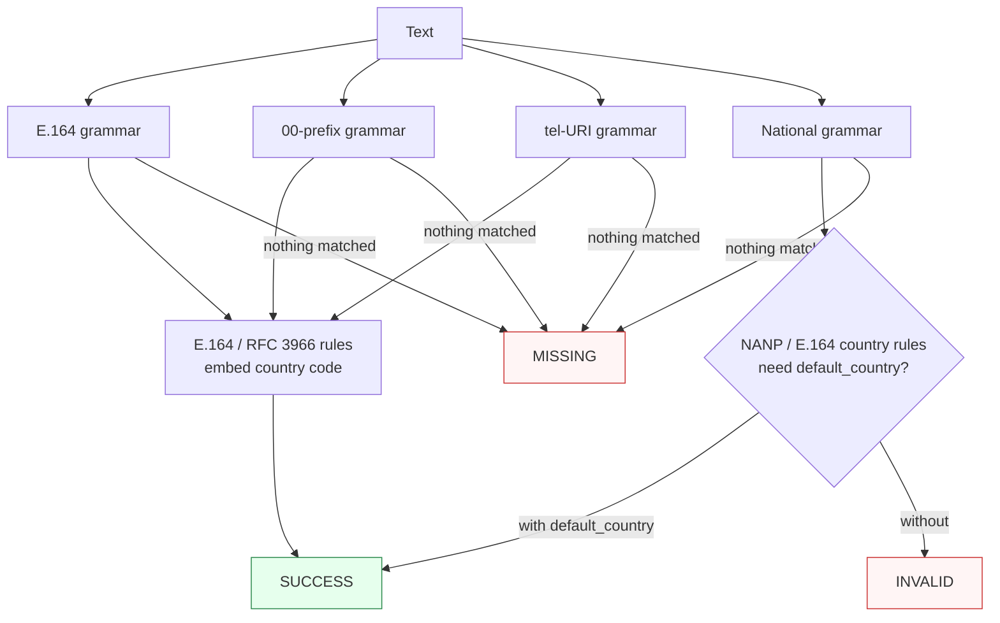

Canonicalizes **one phone number** per call to E.164 (or to tel-URI / national form when requested).

> **In plain language:** give it `"+1 555 123 4567"` or `"(555) 234-5678"` and it hands back `"+15551234567"` if the numbering plan says the number is valid. National-shaped numbers need you to say which country's plan to use.

---

## What it recognizes — and what it does not

| Recognizes | Does not recognize |
|------------|--------------------|
| E.164 international (`+1 5551234567`) | Text that only mentions a country without digits |
| `00`-prefix international (`0044 20 ...`) | Extensions without a dialable number |
| `tel:` URI (`tel:+1-555-123-4567`) | Plain prose — `MISSING` |
| NANP / national numbers (`(555) 234-5678`) — only when a `default_country` is provided that is in the NANP | National-shaped input without `default_country` — recognized but `INVALID` |

---

## Canonical output

Default `output_format` is `"e164"`.

| `output_format` | Renders | Example |
|-----------------|---------|---------|
| *(default)* `e164` / `None` / `"default"` | `+` + country code + national significant number | `+15551234567` |
| `rfc3966` | `tel:` URI | `tel:+15551234567` |
| `national` | National significant number (no `+` or `tel:`) | `5551234567` |

`national` works without `default_country` for numbers whose country code is embedded (E.164, tel-URI, NANP inputs are split by the rules); for national-shaped input it requires `default_country` to validate in the first place.

```python
from paxman.capabilities import Phone
import paxman

paxman.register_all_shipped()
paxman.canonicalize(
    "+1 555 123 4567", Phone.create_contract()
).canonicalized_value  # "+15551234567"
paxman.canonicalize(
    "+15551234567", Phone.create_contract(output_format="rfc3966")
).canonicalized_value  # "tel:+15551234567"
paxman.canonicalize(
    "+15551234567", Phone.create_contract(output_format="national")
).canonicalized_value  # "5551234567"

# National-shaped input needs default_country
paxman.canonicalize(
    "(555) 234-5678", Phone.create_contract(default_country="US")
).canonicalized_value  # "+15552345678"
```

---

## Contract

```python
contract = Phone.create_contract(
    default_country=None,  # str | None — uppercase alpha-2, e.g. "US"
    output_format=None,  # "e164" (default), "rfc3966", "national"
    # plus every common field: excluded_rules / pinned_rules / year / extra_grammars
)
```

- When `default_country` is `None`, national-shaped input is recognized but never validated → `INVALID`. International, `00`-prefix, and `tel:` forms validate without it because the country code is in the number itself.
- `default_country` must be uppercase alpha-2 when present; otherwise `ContractError` at construction.

---

## Statuses

| Input | Contract | Status | Why |
|-------|----------|--------|-----|
| `+1 555 123 4567` | any | `SUCCESS` | → `+15551234567` |
| `(555) 234-5678` | defaults (`default_country=None`) | `INVALID` | recognized but needs a default country to validate |
| `(555) 234-5678` | `default_country="US"` | `SUCCESS` | → `+15552345678` |
| `hello` | any | `MISSING` | no phone pattern |
| Two distinct numbers | any | raises `MultipleMentionsError` | split first |



---

## Notebook snippet

```python
import paxman
from paxman.capabilities import Phone
from paxman.core.domain import Resolution

paxman.register_all_shipped()
c_intl = Phone.create_contract()
c_us = Phone.create_contract(default_country="US")
c_rfc = Phone.create_contract(output_format="rfc3966", default_country="US")

rows = ["+1 555 123 4567", "(555) 234-5678", "0044 20 7946 0958", "hello"]

for text in rows:
    for label, c in [("intl", c_intl), ("US", c_us), ("rfc3966+US", c_rfc)]:
        try:
            r = paxman.canonicalize(text, c)
        except Exception as e:
            print(f"{text!r:25} [{label}] → exception {type(e).__name__}")
            continue
        val = r.canonicalized_value if r.status == Resolution.SUCCESS else "—"
        print(f"{text!r:25} [{label:12}] → {r.status.value:10} {val!r}")
```

---

## Provenance

- **ITU-T E.164** — international numbering plan.
- **RFC 3966** — `tel:` URI.
- **NANP** — North American Numbering Plan (when relevant).

See also: [Execution Result](../concepts/execution-result.md), [Segmentation](https://github.com/nexusnv/paxman-python/blob/main/docs/recipes/segmentation.md).
