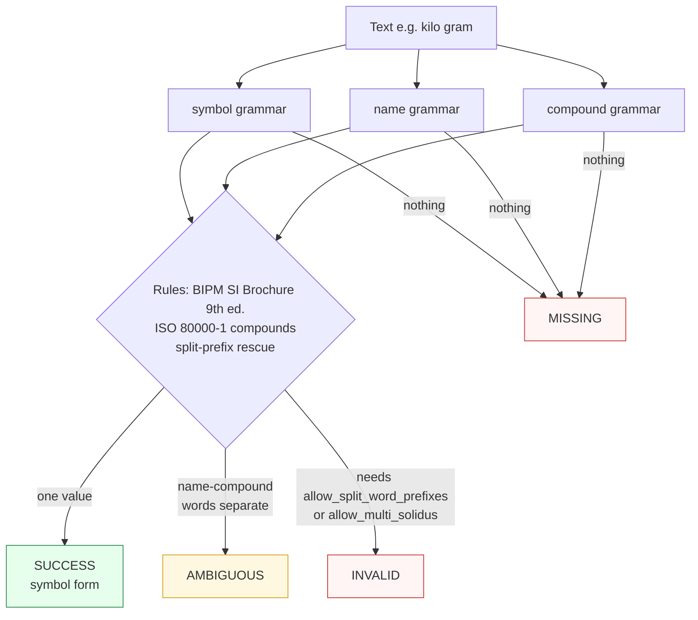

# SI Unit

Canonicalizes **one SI unit expression** per call — a symbol, a name, or a product/quotient compound — to its canonical symbol.

> **In plain language:** give it `"Kilogram"`, `"megahertz"`, or `"m/s²"` and it hands back `"kg"`, `"MHz"`, or `"m/s2"` if the SI Brochure or ISO 80000 says that expression is a valid unit. Quantities like `"25°C"` are not its domain (the number is not an SI unit).

---

## What it recognizes — and what it does not

| Recognizes | Does not recognize |
|------------|--------------------|
| Symbols (`kg`, `Pa`, `kΩ`, `m/s²`) | Quantities / magnitudes (`25°C`, `5 kg`) — `MISSING`; identity-only, no amounts |
| Names (`Kilogram`, `megahertz`) — case-insensitive, hyphen-tolerant | Name-compounds (`metre per second`) — words recognized separately → `AMBIGUOUS` |
| Prefixed symbols and names (`MHz`, `kPa`) | Symbol-prefix spacing (`k g`) — `INVALID`, never accepted |
| Product/quotient compounds (`m/s²`, `kg·m/s²`, `kPa`) | Multi-solidus without flag (`kg/m/s`) — `INVALID` unless `allow_multi_solidus=True` |
| Spoken word-prefix forms (`kilo gram`) — only when `allow_split_word_prefixes=True` | `kilo gram` without that flag — `INVALID` |

---

## Canonical output

Single format — the canonical symbol form.

| `output_format` | Renders |
|-----------------|---------|
| *(only)* `symbol` / `None` / `"default"` | canonical symbol (`kg`, `MHz`, `m/s2`) |

```python
from paxman.capabilities import SIUnit
import paxman

paxman.register_all_shipped()
paxman.canonicalize("Kilogram", SIUnit.create_contract()).canonicalized_value  # "kg"
paxman.canonicalize("megahertz", SIUnit.create_contract()).canonicalized_value  # "MHz"
paxman.canonicalize("m/s²", SIUnit.create_contract()).canonicalized_value  # "m/s2"
```

---

## Contract

```python
contract = SIUnit.create_contract(
    allow_split_word_prefixes=False,  # bool, default False — "kilo gram" → "kg" when True
    allow_multi_solidus=False,  # bool, default False — preserve "kg/m/s" when True
    output_format=None,  # "symbol" (only format)
    # plus every common field: excluded_rules / pinned_rules / year / extra_grammars
)
```

- With `allow_split_word_prefixes=False` (default), `kilo gram` is recognized as `INVALID` — it is not a valid SI identity. Symbol-prefix spacing like `k g` is always `INVALID`; there is no flag for it.
- With `allow_multi_solidus=False` (default) per ISO 80000-1 §6.6.2, more than one top-level solidus is `INVALID`. Set `True` to preserve the legacy accept-multi-solidus behavior.

---

## Statuses

| Input | Contract | Status | Value / why |
|-------|----------|--------|-------------|
| `Kilogram` | defaults | `SUCCESS` | → `kg` |
| `m/s²` | defaults | `SUCCESS` | compound → `m/s2` |
| `metre per second` | defaults | `AMBIGUOUS` | words recognized separately, competing groupings |
| `25°C` | any | `MISSING` | quantity, not an identity-only unit |
| `kilo gram` | defaults | `INVALID` | needs `allow_split_word_prefixes` |
| `kilo gram` | `allow_split_word_prefixes=True` | `SUCCESS` | → `kg` |
| `k g` | any | `INVALID` | symbol-prefix spacing always rejected |
| `kg/m/s` | defaults | `INVALID` | multi-solidus without flag |
| `kg/m/s` | `allow_multi_solidus=True` | `SUCCESS` | preserved |



---

## Notebook snippet

```python
import paxman
from paxman.capabilities import SIUnit
from paxman.core.domain import Resolution

paxman.register_all_shipped()
c = SIUnit.create_contract()
c_spoken = SIUnit.create_contract(allow_split_word_prefixes=True)
c_multi = SIUnit.create_contract(allow_multi_solidus=True)

for text in [
    "Kilogram",
    "m/s²",
    "metre per second",
    "kilo gram",
    "k g",
    "kg/m/s",
    "25°C",
]:
    for label, cc in [("default", c), ("spoken", c_spoken), ("multi", c_multi)]:
        r = paxman.canonicalize(text, cc)
        val = r.canonicalized_value if r.status == Resolution.SUCCESS else "—"
        print(f"{text!r:18} [{label:8}] → {r.status.value:10} {val!r}")
```

---

## Provenance

- **BIPM SI Brochure (9th ed.)** — base units, derived units, non-SI units accepted for use, prefixes, names.
- **ISO 80000-1** — compound expressions.

See also: [Execution Result](../concepts/execution-result.md), [Candidates & Ambiguity](../concepts/candidates-and-ambiguity.md), [Segmentation](../../recipes/segmentation.md).
