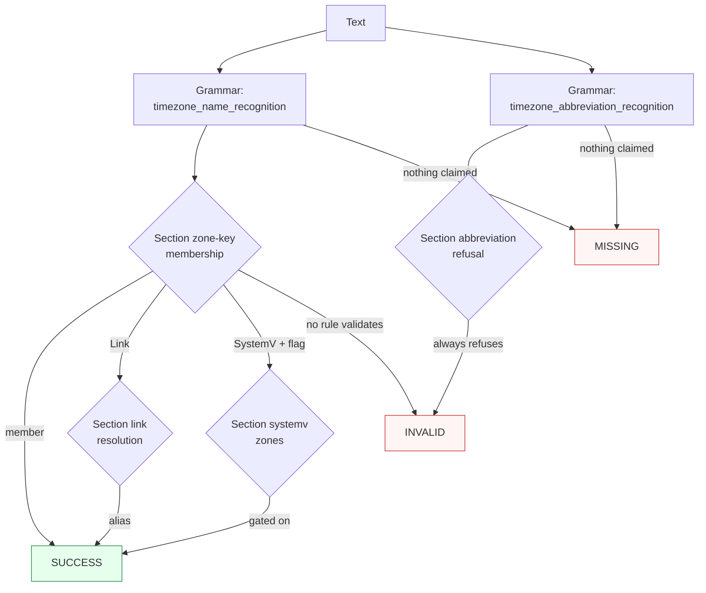

Canonicalizes **one IANA time zone mention** per call — a zone key (`America/New_York`), a legacy Link (`US/Eastern`), a fixed zone (`UTC`, `Etc/GMT+5`), or a POSIX SystemV name (`EST5EDT`, gated) — to the case-exact IANA key.

> **In plain language:** give it `America/New_York`, `US/Eastern`, `america/new_york`, or `Etc/GMT+5` and it hands back the canonical IANA key (`US/Eastern` → `America/New_York`) per the vendored IANA Time Zone Database 2026d snapshot. Bare abbreviations (`EST`, `IST`, `CST`) are recognized but refused — never silently resolved — because one abbreviation names many zones and no timestamp is available to disambiguate.

---

## What it recognizes — and what it does not

| Recognizes | Does not recognize |
|------------|--------------------|
| Canonical keys (`America/New_York`, case folds up: `america/new_york`, `AMERICA/NEW_YORK`) | Unknown keys (`America/Narnia`) → `MISSING` (lexicon over the curated subset claims nothing unlisted) |
| Legacy Links (`US/Eastern`, `Asia/Calcutta`, `Australia/ACT` — resolve to canonical) | Windows names (`Eastern Standard Time`, territory-sensitive CLDR mapping, deferred) → `MISSING` |
| Fixed zones (`UTC`, `Etc/UTC`, `Etc/GMT`, `Etc/GMT+5` — sign kept as authored, never reinterpreted) | Bare abbreviations, carved (`EST`, `MST`, `HST`, `CET`) → `INVALID` (refused, never resolved) |
| POSIX SystemV names (`EST5EDT`, `CST6CDT`, `MST7MDT`, `PST8PDT` — claimed for shape; `INVALID` unless `include_systemv=True`) | Bare abbreviations, ambiguous (`IST`, `CST`, `PST`) → `INVALID` (refused, never a silent pick) |
| Embedded mentions (`visit US/Eastern tomorrow` — span covers the key only) | Unlisted abbreviations and prose (`XYZ`, `JST`, `hello world`, `Zulu`) → `MISSING` |
| | Glued runs and paths (`XUS/Eastern`, `US/EasternX`, `/usr/share/zoneinfo/America/New_York`) → `MISSING` (slash-aware boundary) |

**Abbreviation law:** identifier equivalence is not lexical abbreviation equivalence. Short-caps `backward` Links (`EST` → `America/Panama`, `MST` → `America/Phoenix`, `HST` → `Pacific/Honolulu`, `CET` → `Europe/Brussels`) are carved out of the name lexicon into the abbreviation family, so the bare token reads as an abbreviation and refuses. The seeker writes the canonical key.

---

## Canonical output

Default `output_format` is `"iana"` (identity — the canonical value IS the default format).

| `output_format` | Renders | Example |
|-----------------|---------|---------|
| *(default)* `iana` / `None` / `"default"` | Case-exact IANA zone key | `America/New_York` |

Any other value raises `ContractError` — including `abbreviation` and `link`, never offered per ADR-0011 (rendering an abbreviation is a lossy projection; choosing which alias to render is arbitrary policy, not canonicalization).

```python
from paxman.capabilities import Timezone
import paxman

paxman.register_all_shipped()
print(paxman.canonicalize("America/New_York", Timezone.create_contract()).canonicalized_value)
print(paxman.canonicalize("US/Eastern", Timezone.create_contract()).canonicalized_value)
print(paxman.canonicalize("america/new_york", Timezone.create_contract()).canonicalized_value)
print(paxman.canonicalize("Asia/Calcutta", Timezone.create_contract()).canonicalized_value)
print(paxman.canonicalize("EST5EDT", Timezone.create_contract(include_systemv=True)).canonicalized_value)
```

---

## Contract

```python
contract = Timezone.create_contract(
    output_format=None,  # "iana" (default); None/"default"/"iana" all resolve to "iana"
    include_systemv=False,  # True admits the POSIX SystemV Zones (EST5EDT and kin)
    # plus every common field: suppress_common_words / excluded_rules / pinned_rules / year / extra_grammars
)
```

- Two grammars: `timezone_name_recognition` (case-folded lexicon over identifier keys, Links, fixed zones, SystemV names) and `timezone_abbreviation_recognition` (UPPER-exact lexicon over carved + ambiguous abbreviations, `WORD` guards).
- Four rules: `Section zone-key-membership`, `Section link-resolution`, `Section systemv-zones` (gated on `include_systemv` via `requires_features`; dropped rule → `INVALID`), `Section abbreviation-refusal` (always refuses).
- `year` filters by `publication_year`; e.g., `year=2020` drops the tzdb-2026 rules → `America/New_York` becomes `INVALID`.
- `suppress_common_words` is a no-op here: no Timezone matcher is suppressible.
- Deterministic by construction: same input + contract + vendored 2026d snapshot → same output. No clock, no DST-transition evaluation, no environment tzdata — membership and Link resolution only.

---

## Statuses

| Input | Contract | Status | Value / why |
|-------|----------|--------|-------------|
| `America/New_York` | defaults | `SUCCESS` | `"America/New_York"` |
| `america/new_york` | defaults | `SUCCESS` | `"America/New_York"` (fold restores canonical case) |
| `US/Eastern` | defaults | `SUCCESS` | `"America/New_York"` (Link resolution) |
| `Asia/Calcutta` | defaults | `SUCCESS` | `"Asia/Kolkata"` (Link resolution) |
| `Etc/GMT+5` | defaults | `SUCCESS` | `"Etc/GMT+5"` (fixed zone; POSIX sign kept as authored, never flipped) |
| `EST5EDT` | defaults | `INVALID` | claimed for shape, rule gated off |
| `EST5EDT` | `include_systemv=True` | `SUCCESS` | `"EST5EDT"` (fixed-rule zone, valid key) |
| `EST` / `MST` / `HST` / `CET` | any | `INVALID` | carved Links read as abbreviations, refused |
| `IST` / `CST` / `PST` | any | `INVALID` | ambiguous abbreviations, refused — never a silent pick |
| `arrive CET tomorrow` | defaults | `INVALID` | bare abbreviation refused everywhere |
| `XYZ` / `JST` / `hello world` / `Zulu` | any | `MISSING` | nothing claimed (JST out of the v1 curated subset by design) |
| `America/Narnia` | any | `MISSING` | unlisted key is unclaimable under the lexicon-over-subset design |
| `Eastern Standard Time` | any | `MISSING` | Windows namespace deferred entirely |
| `XUS/Eastern` / zoneinfo paths | any | `MISSING` | slash-aware boundary forbids mid-path extraction |
| `US/Eastern then America/Chicago` | any | raises `MultipleMentionsError` | two distinct zones fail fast (`single_value=True`) |
| `EST then CET` | defaults | `INVALID` | refused mentions do not compete, so no `MultipleMentionsError` |
| `America/New_York` | `year=2020` | `INVALID` | rules are 2026, dropped |
| `America/New_York` | `output_format="abbreviation"` | raises `ContractError` | lossy projection, never offered |



---

## Notebook snippet — normalize a mixed column

```python
import paxman
from paxman.capabilities import Timezone
from paxman.core.domain import Resolution
from paxman.core.errors import ContractError

paxman.register_all_shipped()
contract = Timezone.create_contract()

rows = [
    "America/New_York",
    "US/Eastern",
    "america/new_york",
    "Asia/Calcutta",
    "Etc/GMT+5",
    "EST5EDT",
    "EST",
    "IST",
    "XYZ",
    "America/Narnia",
    "Eastern Standard Time",
]

for text in rows:
    r = paxman.canonicalize(text, contract)
    val = r.canonicalized_value if r.status == Resolution.SUCCESS else "—"
    rule = r.candidates[0].validation_rule if r.candidates else "—"
    print(f"{text!r:28} → {r.status.value:10} {val!r:24} ({rule})")

print(paxman.canonicalize("EST5EDT", Timezone.create_contract(include_systemv=True)).canonicalized_value)
try:
    Timezone.create_contract(output_format="abbreviation")
except ContractError as e:
    print(f"abbreviation → ContractError: {e}")
```

---

## Provenance

- **IANA Time Zone Database** 2026d (registry; zone-key membership, Link targets, SystemV Zones) — `Section zone-key-membership` (zone1970.tab col 3 + backward Links + etcetera, vendored File-Date), `Section link-resolution` (backward Link TARGET LINK-NAME lines, vendored File-Date 2026d), `Section systemv-zones` (backward SystemV Zones EST5EDT/CST6CDT/MST7MDT/PST8PDT, vendored File-Date 2026d)
- **IANA Time Zone Database** 2026d via theory.html (registry; abbreviation ambiguity plus backward short-caps carve set) — `Section abbreviation-refusal` (theory.html abbreviation ambiguity: IST/CST/PST + backward short-caps Links carve set, vendored File-Date 2026d)

Each candidate's `validation_rule` carries the section, and `candidate.provenance[0].publication_year` the year.

See also: [UtcOffset](./utcoffset/), [Execution Result](../concepts/execution-result/), [Provenance](../concepts/provenance/), [Segmentation](https://github.com/nexusnv/paxman-python/blob/main/docs/recipes/segmentation.md).
