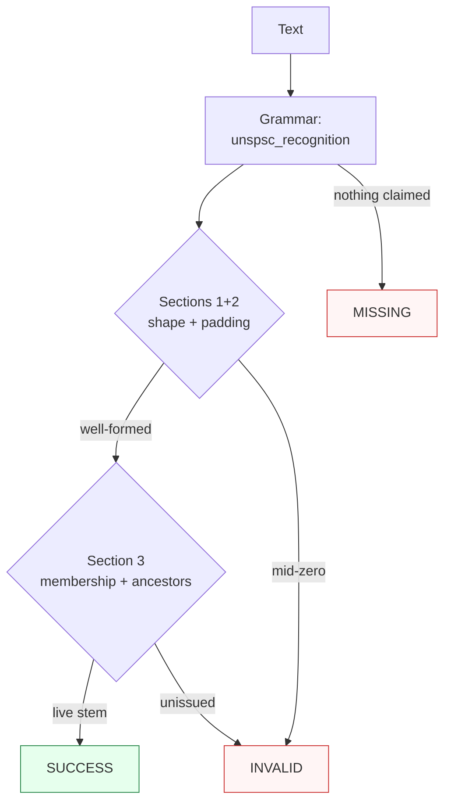

Canonicalizes **one UNSPSC mention** per call — a bare 8-digit code (`44103103`), a zero-padded parent (`43000000`, `43210000`, `43211500`), a 6-digit class alias (`441217`), a `UNSPSC`-labelled mention, a `UNSPSC000.` MDM system ID, or a 10-digit code with a business-function suffix — to the 8-digit wire stem.

> **In plain language:** give it `UNSPSC 44103103`, `44103103`, `UNSPSC000.44103103`, or `441217` and it hands back `44103103` / `44121700` when the stem is a live row of the pinned UNGM-export snapshot. A well-formed but unissued stem is `INVALID`, never a guess; shapes outside the recognized spellings are `MISSING`.

---

## What it recognizes — and what it does not

| Recognizes | Does not recognize |
|------------|--------------------|
| Bare 8-digit commodity (`44103103` printer/facsimile toner, `43211503` notebook computers, `10101501` cats, `25101703` ambulances) | 7/9/11-digit runs (`4410310`, `441031031`) → `MISSING` (length guard) |
| Zero-padded parents (`43000000` segment, `43210000` family, `43211500` class — distinct codes, not prefixes) | Truncated prose prefixes (`43`, `4321`) → `MISSING` (real codes are `43000000`, `43210000`) |
| 6-digit class alias (`441217` → `44121700`, SAP/California lane) | Dotted/hyphenated grouping (`43.21.15.03`, `43-21-15-03`, `44103103-14`) → `MISSING` (digits-only wire) |
| `UNSPSC` label (`UNSPSC 44103103`, `UNSPSC: 44103103`, `UNSPSC #43211507`, lowercase, `Code` word) | Space-grouped pairs (`43 21 15 03`, prose display only) → `MISSING` |
| MDM system IDs (`UNSPSC000.44103103` — Stibo STEP lane) | Float tail as code (`44103103.0` matches `44103103`; `.0` stays outside the span) |
| 10-digit + business-function suffix (`4410310314` — suffix informative only) | Bare suffixes (`14`, `retail` without the 8-digit stem) → `MISSING` |
| CSV lanes (`unspsc,43211509` — comma is a field separator) | Glued surroundings (`X44103103`, `44103103Y`) → `MISSING` (word boundary) |
| Embedded mentions (`Printers (44103103) approved`) | Prose without an 8-digit shape → `MISSING` |

---

## Canonical output

Default `output_format` is `"unspsc"` (8-digit zero-padded wire stem).

| `output_format` | Renders | Example |
|-----------------|---------|---------|
| *(default)* `unspsc` / `None` / `"default"` | 8-digit stem | `44103103` |
| `labeled` | `UNSPSC` prefix | `UNSPSC 44103103` |
| `native` | Spelling-preserving (6-digit stays 6-digit, 10-digit keeps its suffix) | `441217` / `4410310314` |

Any other value raises `ContractError`. Every offered format re-enters under the default contract (ADR-0010 fixed point). The pair-hyphenated display (`43-21-15-03`) is deliberately unoffered — hyphens never re-enter by design.

```python
from paxman.capabilities import UNSPSC
import paxman

paxman.register_all_shipped()
print(paxman.canonicalize("UNSPSC 44103103", UNSPSC.create_contract()).canonicalized_value)
print(paxman.canonicalize("441217", UNSPSC.create_contract()).canonicalized_value)
print(paxman.canonicalize("UNSPSC000.44103103", UNSPSC.create_contract()).canonicalized_value)
print(paxman.canonicalize("44103103", UNSPSC.create_contract(output_format="labeled")).canonicalized_value)
```

---

## Contract

```python
contract = UNSPSC.create_contract(
    output_format=None,  # "unspsc" (default); None/"default"/"unspsc" all resolve to it
    include_business_function=True,  # gate the BFI-suffix rule (dropped rule removes the suffix candidate, not the verdict)
    # plus every common field: suppress_common_words / excluded_rules / pinned_rules / year / extra_grammars
)
```

- One grammar: `unspsc_recognition` (6/8/10 lanes + fused label, longest-first).
- Four rules: `Section 1-hierarchy-structure` + `Section 2-level-padding` (UNGM structure; both PARSER, always-active), `Section 3-codeset-membership` (UNDP codeset snapshot; LOOKUP_TABLE, always-active), `Section 4-business-function-suffix` (UNECE guidelines; PARSER, gated by `include_business_function`).
- Deterministic by snapshot: same input + contract + library snapshot → same output. The snapshot pins the UNGM live export of 2026-09-30 (13,490 live stems); a code moved or inactivated after that export resolves `INVALID` under the pinned snapshot, not silently `SUCCESS`.

---

## Statuses

| Input | Contract | Status | Value / why |
|-------|----------|--------|-------------|
| `44103103` / `UNSPSC 44103103` / `UNSPSC000.44103103` | defaults | `SUCCESS` | `"44103103"` (presentation-only dedup) |
| `441217` | defaults | `SUCCESS` | `"44121700"` (alias pads `+"00"`) |
| `4410310314` | defaults | `SUCCESS` | `"44103103"` (suffix trace-only) |
| `43000000` / `43210000` / `43211500` | defaults | `SUCCESS` | parents are codes in their own right |
| `43001503` / `00101501` | defaults | `INVALID` | mid-zero padding breaks the lattice |
| `44103199` / `99999999` | defaults | `INVALID` | well-formed but unissued |
| `11101803` (Wikidata-cited platinum) | defaults | `INVALID` | absent from the pinned snapshot by design — not a claim about the full UNDP codeset |
| `57110000` (synthesized ancestor) | defaults | `INVALID` | serves the ancestor walk only, never stem membership |
| `4410310314` | `include_business_function=False` | `SUCCESS` | `"44103103"` (suffix candidate dropped; stem still validates — ISBN range-validation precedent) |
| `43 21 15 03` / `43.21.15.03` / `43` | defaults | `MISSING` | no grammar claims these shapes |
| two distinct codes | defaults | raises `MultipleMentionsError` | un-segmented multi-entity input (`single_value=True`) |
| `44103103` | `output_format="segmented"` | raises `ContractError` | never offered |



**Sibling note:** an 8-digit string may also match the GTIN-8 shape — each side resolves under its own contract (UNSPSC `SUCCESS` is codeset membership, GTIN `SUCCESS` is a Mod-10 check digit). There is no cross-capability arbitration; route by authority.

---

## Notebook snippet — normalize a mixed column

```python
import paxman
from paxman.capabilities import UNSPSC
from paxman.core.domain import Resolution

paxman.register_all_shipped()
contract = UNSPSC.create_contract()

rows = [
    "UNSPSC 44103103",
    "44103103",
    "UNSPSC000.44103103",
    "441217",
    "4410310314",
    "43000000",
    "43 21 15 03",
    "44103199",
    "not a code",
]

for text in rows:
    r = paxman.canonicalize(text, contract)
    val = r.canonicalized_value if r.status == Resolution.SUCCESS else "—"
    rule = r.candidates[0].validation_rule if r.candidates else "—"
    print(f"{text!r:28} → {r.status.value:10} {val!r:14} ({rule})")
```

---

## Provenance

- **United Nations Development Programme, UNSPSC Code Structure (UNGM Help Center)** (specification, 2025-07-08; four-level positional definition) — `Section 1-hierarchy-structure`, `Section 2-level-padding`
- **United Nations Development Programme, UNSPSC Codeset (UNGM live export 2026-09-30)** (registry, 13,490 live stems; partial — UNDP v26.0801 XLSX gated) — `Section 3-codeset-membership`
- **United Nations Economic Commission for Europe, Classification Guidelines (Business Function Identifiers)** (specification, v2.04; suffix informative-only, no value table cited) — `Section 4-business-function-suffix`

Each candidate's `validation_rule` carries the section, and `candidate.provenance[0].publication_year` the year.

See also: [GTIN](./gtin/), [ISBN](./isbn/), [Execution Result](../concepts/execution-result/), [Provenance](../concepts/provenance/).
