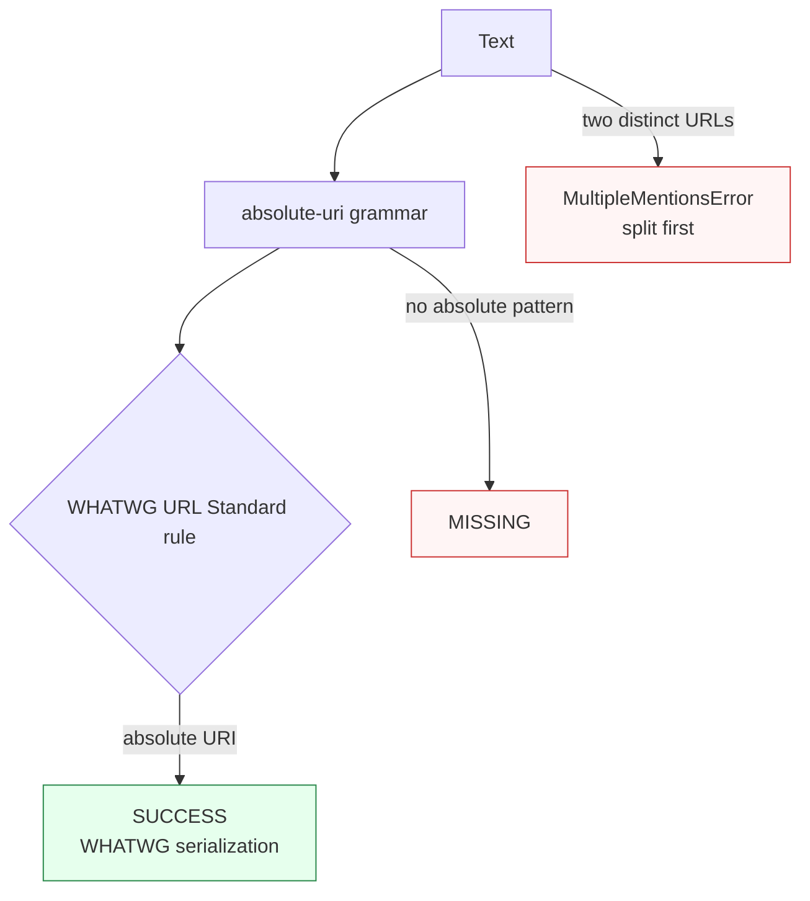

Canonicalizes **one absolute URI / IRI** per call per the **WHATWG URL Standard** (plus UTS #46 IDNA for internationalized hosts), preserving percent-encoding byte-for-byte.

> **In plain language:** give it `"HTTPS://Example.COM:443/path/../other"` and it hands back `"https://example.com/other"` — scheme and host lowercased, default port removed, dot segments resolved. Opaque schemes like `mailto:` are left verbatim.

---

## What it recognizes — and what it does not

| Recognizes | Does not recognize |
|------------|--------------------|
| Absolute URIs/IRIs with a scheme (`https://example.com`, `mailto:user@example.com`) | Relative references (`/path/../other`, `?q=1`, `#frag`) — `MISSING` |
| Internationalized hosts (`http://münchen.de`) — IDNA via UTS #46 | Plain domains without a scheme — not an *absolute URI* |
| Any absolute URI including opaque (non-special) schemes | |

---

## Canonical output

Single format — the WHATWG URL serialization (identity formatter). Characteristic normalizations:

- Scheme and host lowercased.
- Default port removed (`https://example.com:443` → `https://example.com`).
- Dot segments resolved (`/path/../other` → `/other`).
- Internationalized hosts mapped via UTS #46 (`münchen.de` → `xn--mnchen-3ya.de`).
- Percent-encoding preserved byte-for-byte.
- Opaque schemes (`mailto:`, etc.) returned verbatim.

| `output_format` | Renders |
|-----------------|---------|
| *(only)* `url` / `None` / `"default"` | WHATWG serialization |

```python
from paxman.capabilities import URL
import paxman

paxman.register_all_shipped()
paxman.canonicalize(
    "HTTPS://Example.COM:443/path/../other", URL.create_contract()
).canonicalized_value  # "https://example.com/other"
paxman.canonicalize(
    "mailto:user@example.com", URL.create_contract()
).canonicalized_value  # "mailto:user@example.com" (opaque → verbatim)
paxman.canonicalize(
    "http://münchen.de", URL.create_contract()
).canonicalized_value  # "http://xn--mnchen-3ya.de/"
```

---

## Contract

```python
contract = URL.create_contract(
    output_format=None,  # "url" (only format)
    # plus every common field: excluded_rules / pinned_rules / year / extra_grammars
)
```

URL has no capability-specific flags in the current release — every recognized URL is validated by the single WHATWG URL Standard rule.

---

## Statuses

| Input | Status | Why |
|-------|--------|-----|
| `https://example.com/other` | `SUCCESS` | WHATWG-serialized |
| `HTTPS://Example.COM:443/path/../other` | `SUCCESS` | → `https://example.com/other` (lowercased, port removed, dot resolved) |
| `http://münchen.de` | `SUCCESS` | IDN → `http://xn--mnchen-3ya.de/` |
| `not a url` | `MISSING` | no absolute-URI pattern |
| `//example.com/path` (relative) | `MISSING` | no scheme, not absolute |
| Two distinct URLs in one call | raises `MultipleMentionsError` | split first |



---

## Notebook snippet

```python
import paxman
from paxman.capabilities import URL

paxman.register_all_shipped()
contract = URL.create_contract()

rows = [
    "HTTPS://Example.COM:443/path/../other",
    "mailto:user@example.com",
    "http://münchen.de",
    "not a url",
    "/relative/path",
]

for text in rows:
    r = paxman.canonicalize(text, contract)
    val = r.canonicalized_value or "—"
    print(f"{text!r:45} → {r.status.value:10} {val!r} span={r.span}")
```

---

## Provenance

- **WHATWG URL Standard** — absolute-URI / IRI validation and serialization.
- **UTS #46 / IDNA** — mapping of internationalized hosts.

See also: [Execution Result](../concepts/execution-result.md), [Provenance](../concepts/provenance.md), [Segmentation](https://github.com/nexusnv/paxman-python/blob/main/docs/recipes/segmentation.md).
