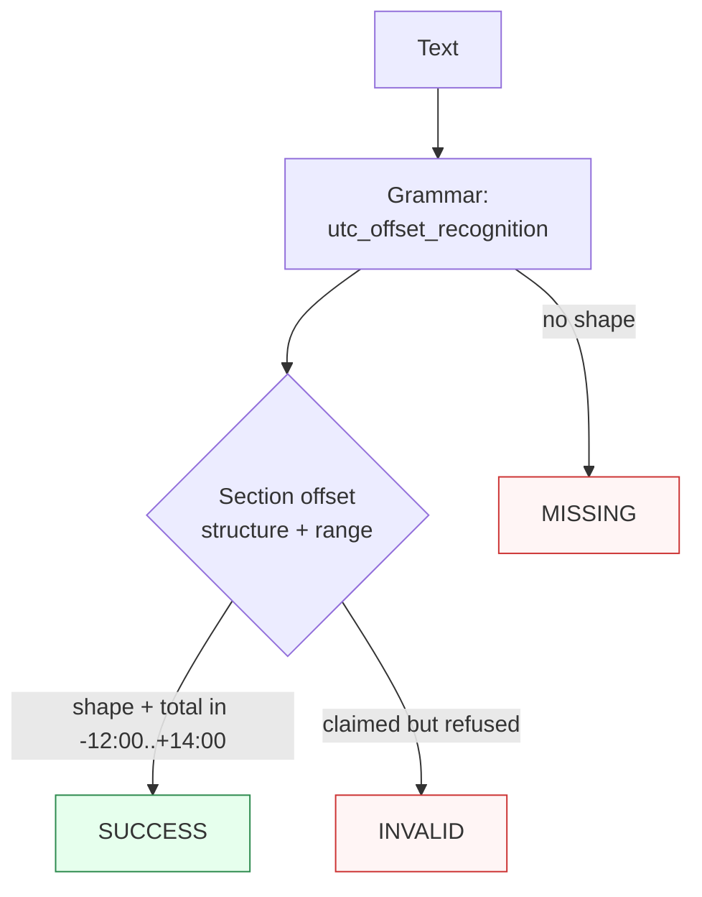

Canonicalizes **one UTC offset mention** per call — a human-notation numeric offset (`UTC+5`, `+0530`, `+05:30`, `Z`) — to canonical extended `+HH:MM`.

> **In plain language:** give it `UTC+5`, `GMT-05:30`, `+0530`, or `Z` and it hands back `+05:00`, `-05:30`, `+05:30`, or `+00:00` per ISO 8601-1:2019 offset representations (RFC 3339 timestamp-compatible subset for `±HH:MM` and `Z`). The range is the real-world total-minutes bound `-12:00..+14:00` (Baker Island to Kiritimati); `-00:00` is refused because it states ignorance of the offset, not zero.

---

## What it recognizes — and what it does not

| Recognizes | Does not recognize |
|------------|--------------------|
| Prefixed offsets (`UTC+5`, `utc+5`, `GMT+5`, `GMT-05:30`, `UTC+05:30` — human semantics, never POSIX sign-flipped) | Out-of-range prefixed shapes (`UTC+15:00`) → `MISSING` (grammar `\|HH\| ≤ 14` guard never claims them) |
| Bare offsets (`+05`, `+0530`, `+05:30`, `-08:00` — reduced, basic, extended forms) | Bare `+15:00` → `MISSING` (same grammar guard) |
| `Z` / `z` designator (→ `+00:00`) | Claimed-but-impossible totals (`+14:30`, `-12:30` — inside the shape guard, past the signed total-minutes bound) → `INVALID` |
| Embedded mentions (`meeting at +05:30 tomorrow` — span covers the offset only) | Unknown offset (`-00:00`, any accepted form) → `INVALID` (ignorance, not zero) |
| | Zone keys (`Etc/GMT+5` — slash-aware lookbehind forbids mid-key extraction; belongs to Timezone) → `MISSING` |
| | Military prose (`Zulu`) → `MISSING` (not the `Z` designator) |

**POSIX-sign callout:** `GMT+5` renders `+05:00` — documented human notation. POSIX would read `GMT+5` as UTC−05:00; the grammar is explicitly human-semantics and never sign-flips. Whole-hour `Etc/GMT±X` keys stay in Timezone with their sign kept as authored.

---

## Canonical output

Default `output_format` is `"extended"` (identity — `normalize()` returns `+HH:MM`).

| `output_format` | Renders | Example |
|-----------------|---------|---------|
| *(default)* `extended` / `None` / `"default"` | Signed zero-padded `+HH:MM` | `+05:30` |
| `basic` | Presentation-only re-encoding, colon stripped (re-enters: parses back to the same extended canonical) | `+0530` |

Any other value raises `ContractError` — including `abbreviation`, removed-by-design outputs that would project away the numeric value.

```python
from paxman.capabilities import UtcOffset
import paxman

paxman.register_all_shipped()
print(paxman.canonicalize("UTC+5", UtcOffset.create_contract()).canonicalized_value)
print(paxman.canonicalize("+0530", UtcOffset.create_contract()).canonicalized_value)
print(paxman.canonicalize("Z", UtcOffset.create_contract()).canonicalized_value)
print(paxman.canonicalize("GMT-05:30", UtcOffset.create_contract()).canonicalized_value)
print(paxman.canonicalize("+05:30", UtcOffset.create_contract(output_format="basic")).canonicalized_value)
```

---

## Contract

```python
contract = UtcOffset.create_contract(
    output_format=None,  # "extended" (default), "basic" (presentation-only re-encoding)
    # plus every common field: suppress_common_words / excluded_rules / pinned_rules / year / extra_grammars
)
```

- One grammar (`utc_offset_recognition`: human-notation regex with slash-aware lookbehind and right word guard), one rule (`Section offset-structure`).
- `year` filters by `publication_year`; e.g., `year=2010` drops the ISO 8601-1:2019 rule → `UTC+5` becomes `INVALID` (`year=2020` keeps it — the rule is 2019).
- `suppress_common_words` is a no-op here: the offset matcher is not suppressible.
- Deterministic by construction: same input + contract + library snapshot → same output. No clock, no zone lookup — shape plus total-minutes arithmetic only.

---

## Statuses

| Input | Contract | Status | Value / why |
|-------|----------|--------|-------------|
| `UTC+5` | defaults | `SUCCESS` | `"+05:00"` (zero-pad, human semantics) |
| `GMT-05:30` | defaults | `SUCCESS` | `"-05:30"` |
| `+0530` | defaults | `SUCCESS` | `"+05:30"` (basic form recognized) |
| `+05:30` | defaults | `SUCCESS` | `"+05:30"` |
| `Z` / `z` | defaults | `SUCCESS` | `"+00:00"` (zero designator) |
| `+14:00` / `-12:00` | defaults | `SUCCESS` | range endpoints hold (Kiritimati / Baker Island) |
| `+0530` | `output_format="basic"` | `SUCCESS` | `"+0530"` (re-encoding; re-enters to the same extended canonical) |
| `-00:00` | any | `INVALID` | unknown-offset states ignorance — a different entity from zero |
| `+14:30` / `-12:30` | any | `INVALID` | claimed shape past the signed total-minutes bound |
| `+15:00` / `UTC+15:00` | any | `MISSING` | grammar range guard never claims them |
| `+05:60` / `+05:6` / `UTC+5:60` | any | `MISSING` | malformed minutes never claimed — right edge forbids `:`/`+`/`-` continuations, so no truncated `+05:00` `SUCCESS` (#162) |
| `Etc/GMT+5` | any | `MISSING` | slash-glued guard rejects mid-key extraction |
| `Zulu` | any | `MISSING` | military prose, not the designator |
| `+05:30 and -08:00` | any | raises `MultipleMentionsError` | two distinct offsets fail fast (`single_value=True`) |
| `UTC+5` | `year=2010` | `INVALID` | rule is 2019, dropped |
| `UTC+5` | `output_format="abbreviation"` | raises `ContractError` | only `basic` is offered |

A single grammar plus a single deterministic rule yields at most one value per mention, so `AMBIGUOUS` is unreachable for this capability (two *distinct* mentions raise instead).



---

## Notebook snippet — normalize a mixed column

```python
import paxman
from paxman.capabilities import UtcOffset
from paxman.core.domain import Resolution
from paxman.core.errors import ContractError

paxman.register_all_shipped()
contract = UtcOffset.create_contract()

rows = [
    "UTC+5",
    "GMT-05:30",
    "+0530",
    "+05:30",
    "Z",
    "+14:00",
    "-12:00",
    "-00:00",
    "+14:30",
    "+15:00",
    "UTC+15:00",
    "Etc/GMT+5",
    "Zulu",
]

for text in rows:
    r = paxman.canonicalize(text, contract)
    val = r.canonicalized_value if r.status == Resolution.SUCCESS else "—"
    rule = r.candidates[0].validation_rule if r.candidates else "—"
    print(f"{text!r:28} → {r.status.value:10} {val!r:24} ({rule})")

print(paxman.canonicalize("+05:30", UtcOffset.create_contract(output_format="basic")).canonicalized_value)
try:
    UtcOffset.create_contract(output_format="abbreviation")
except ContractError as e:
    print(f"abbreviation → ContractError: {e}")
```

---

## Provenance

- **ISO 8601-1** 2019 (specification; offset representations and real-world range, normalized to `+HH:MM`) — `Section offset-structure` (ISO 8601-1:2019 Section 3 offset representations; RFC 3339 Section 5.6 time-numoffset +-HH:MM, Z)

Each candidate's `validation_rule` carries the section, and `candidate.provenance[0].publication_year` the year.

See also: [Timezone](./timezone/), [Execution Result](../concepts/execution-result/), [Provenance](../concepts/provenance/), [Segmentation](https://github.com/nexusnv/paxman-python/blob/main/docs/recipes/segmentation.md).
