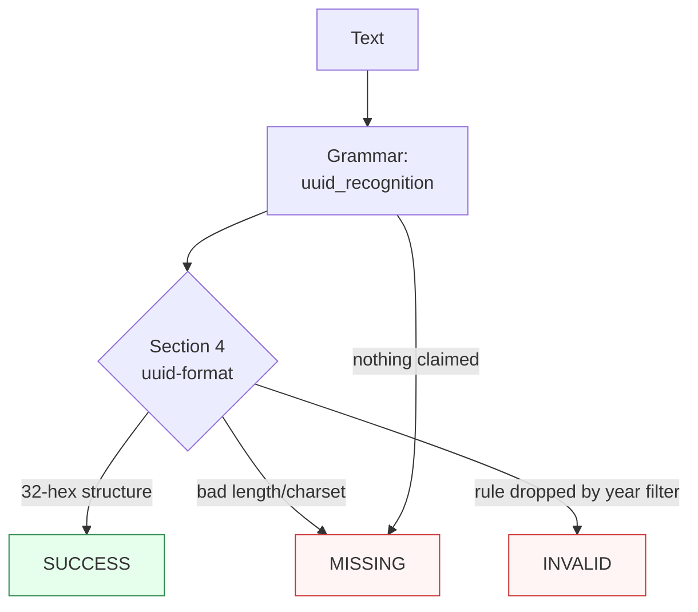

Canonicalizes **one UUID mention** per call — hyphenated (`6ba7b810-9dad-11d1-80b4-00c04fd430c8`), bare 32-hex, `{braced}`, or `urn:uuid:`-prefixed — to the lowercase hyphenated form.

> **In plain language:** give it any documented spelling of a 128-bit UUID and it hands back the canonical lowercase `8-4-4-4-12` form per IETF RFC 9562. There is no check digit and no registry: structure (length + hex charset) is the whole validation. Nil (`000…0`) and Max (`fff…f`) sentinels are valid values.

---

## What it recognizes — and what it does not

| Recognizes | Does not recognize |
|------------|--------------------|
| Hyphenated, any case (`6ba7b810-…`, `6BA7B810-…` — folds to lowercase) | Wrong length (31/33-hex, 37-char dashed) → `MISSING` (length guard) |
| Bare 32-hex (`6ba7b8109dad…`, DB/API dumps) | Non-hex letters (`…g…`) → `MISSING` (ASCII hex only, no autocorrection) |
| Braced (`{6ba7b810-…}`, Python/Microsoft output) | Integer dumps (`32980073…`) → `MISSING` (Money/Phone territory) |
| URN-prefixed (`urn:uuid:6ba7b810-…`, any case) | Label-prefixed prose (`UUID: …`, `GUID: …`) → `MISSING` (deferred to `extra_grammars`) |
| Nil / Max sentinels | Glued runs (`x6ba7b810-…`) → `MISSING` (word boundary) |
| Embedded mentions (`request 6ba7b810-… done` — span covers the id, carrier included) | Space/dot-grouped spellings → `MISSING` (unattested) |

**Version/variant law:** the version nibble and variant bits are informative, never gates — RFC 9562 constrains minting (§5) separately from storage (§4). A `0` or `9`–`F` version digit still reads `SUCCESS`.

---

## Canonical output

Default `output_format` is `"hyphenated"` (lowercase `8-4-4-4-12`).

| `output_format` | Renders | Example |
|-----------------|---------|---------|
| *(default)* `hyphenated` / `None` / `"default"` | Lowercase hyphenated | `6ba7b810-9dad-11d1-80b4-00c04fd430c8` |
| `compact` | 32-char lowercase hex | `6ba7b8109dad11d180b400c04fd430c8` |
| `braced` | Hyphenated in `{}` | `{6ba7b810-9dad-11d1-80b4-00c04fd430c8}` |
| `urn` | RFC 9562 URN | `urn:uuid:6ba7b810-9dad-11d1-80b4-00c04fd430c8` |

Any other value raises `ContractError`. Every offered format re-enters under the default contract (ADR-0010 fixed point).

```python
from paxman.capabilities import UUID
import paxman

paxman.register_all_shipped()
print(paxman.canonicalize("6BA7B810-9DAD-11D1-80B4-00C04FD430C8", UUID.create_contract()).canonicalized_value)
print(paxman.canonicalize("{6ba7b810-9dad-11d1-80b4-00c04fd430c8}", UUID.create_contract()).canonicalized_value)
print(paxman.canonicalize("urn:uuid:6ba7b810-9dad-11d1-80b4-00c04fd430c8", UUID.create_contract()).canonicalized_value)
print(paxman.canonicalize("6ba7b8109dad11d180b400c04fd430c8", UUID.create_contract()).canonicalized_value)
```

---

## Contract

```python
contract = UUID.create_contract(
    output_format=None,  # "hyphenated" (default); None/"default"/"hyphenated" all resolve to it
    # plus every common field: suppress_common_words / excluded_rules / pinned_rules / year / extra_grammars
)
```

- One grammar: `uuid_recognition` (regex over hyphenated/bare/braced/URN carriers, case-folded).
- One rule: `Section 4-uuid-format` (RFC 9562 §4 structure; PARSER, always-active — no registry flag exists).
- `year` filters by `publication_year`; e.g., `year=2020` drops the 2024 rule → `6ba7b810-…` becomes `INVALID`.
- Deterministic by construction: same input + contract + vendored snapshot → same output. No clock, no registry lookup.

---

## Statuses

| Input | Contract | Status | Value / why |
|-------|----------|--------|-------------|
| `6ba7b810-9dad-11d1-80b4-00c04fd430c8` | defaults | `SUCCESS` | `"6ba7b810-9dad-11d1-80b4-00c04fd430c8"` |
| `6BA7B810-…` / mixed case | defaults | `SUCCESS` | fold restores lowercase |
| `6ba7b8109dad…` (32-hex) | defaults | `SUCCESS` | bare branch regroups |
| `{6ba7b810-…}` / `urn:uuid:6ba7b810-…` | defaults | `SUCCESS` | carriers stripped, span includes carrier |
| `00000000-0000-0000-0000-000000000000` | defaults | `SUCCESS` | Nil sentinel is a value |
| `ffffffff-ffff-ffff-ffff-ffffffffffff` | defaults | `SUCCESS` | Max sentinel is a value |
| version `0`/`9` nibble | defaults | `SUCCESS` | informative, never gates |
| 31/33-hex, bad charset, prose | defaults | `MISSING` | nothing claimed |
| two distinct ids | defaults | raises `MultipleMentionsError` | un-segmented multi-entity input (`single_value=True`) |
| `6ba7b810-…` | `year=2020` | `INVALID` | rule is 2024, dropped |
| `6ba7b810-…` | `output_format="upper"` | raises `ContractError` | never offered |



**Sibling note:** a bare 32-hex run starting with two letters + two digits also matches the IBAN shape — each side resolves under its own contract (UUID `SUCCESS`, IBAN `INVALID` unless MOD 97 passes). The `urn:uuid:` form is URI-shaped; URL-side behavior belongs to the URL guide.

---

## Notebook snippet — normalize a mixed column

```python
import paxman
from paxman.capabilities import UUID
from paxman.core.domain import Resolution

paxman.register_all_shipped()
contract = UUID.create_contract()

rows = [
    "6ba7b810-9dad-11d1-80b4-00c04fd430c8",
    "6BA7B810-9DAD-11D1-80B4-00C04FD430C8",
    "6ba7b8109dad11d180b400c04fd430c8",
    "{6ba7b810-9dad-11d1-80b4-00c04fd430c8}",
    "urn:uuid:6ba7b810-9dad-11d1-80b4-00c04fd430c8",
    "00000000-0000-0000-0000-000000000000",
    "not a uuid",
]

for text in rows:
    r = paxman.canonicalize(text, contract)
    val = r.canonicalized_value if r.status == Resolution.SUCCESS else "—"
    rule = r.candidates[0].validation_rule if r.candidates else "—"
    print(f"{text!r:46} → {r.status.value:10} {val!r:40} ({rule})")
```

---

## Provenance

- **IETF RFC 9562** (specification; 128-bit format, hex-and-dash ABNF, version/variant layouts, Nil/Max sentinels) — `Section 4-uuid-format` (vendored File-Date May 2024)

Each candidate's `validation_rule` carries the section, and `candidate.provenance[0].publication_year` the year.

See also: [ORCID](./orcid/), [MacAddress](./mac_address/), [Execution Result](../concepts/execution-result/), [Provenance](../concepts/provenance/).
