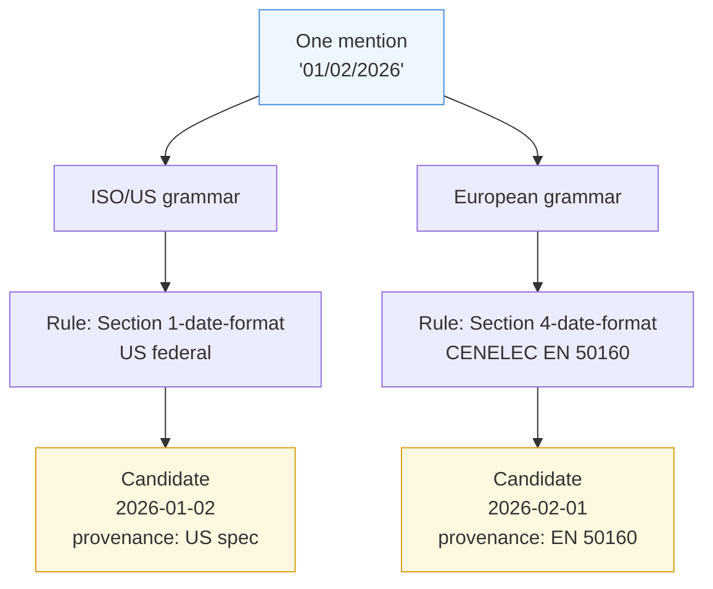
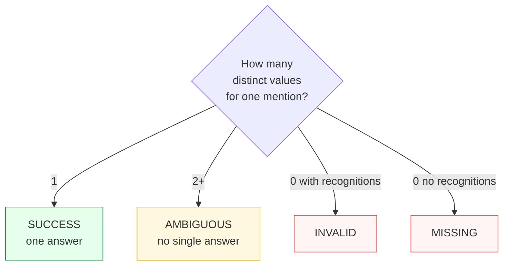

One input can legitimately mean two different things. Paxman does not guess — it shows you the disagreement. This page explains what a **candidate** is, how `AMBIGUOUS` differs from other statuses, and what to do about it.

---

## What a candidate is

A **candidate** is one validated answer: a canonical string plus the evidence that produced it.

```python
candidate.value  # e.g. "2026-01-02"
candidate.recognition_rule  # which grammar spotted it
candidate.validation_rule  # which rule (spec section) validated it
candidate.span  # where in the input it sat
candidate.provenance  # which authority vouches for it
```

Candidates are deduplicated by `(value, recognition_rule, validation_rule)`. If two rules happen to converge on the same string, they collapse to one distinct value — that is agreement, not ambiguity (see [Execution Result](execution-result.md)).



---

## When ambiguity happens

`AMBIGUOUS` means: **one mention, two or more distinct canonical values**, each validated by a different specification.



Concrete examples:

| Input | Capability | What happens | Status |
|-------|------------|--------------|--------|
| `01/02/2026` | Date | US reads `2026-01-02`, European reads `2026-02-01` | `AMBIGUOUS` |
| `metre per second` | SI Unit | Word form is not a compound — words recognized separately, rules disagree on grouping | `AMBIGUOUS` |
| `2026-01-15` | Date | Only ISO grammar's reading validates | `SUCCESS` |

`AMBIGUOUS` is a **domain signal**, not a failure. The input is real; the specs genuinely conflict. Contrast with:

- `MISSING` — no grammar matched at all (the text does not look like this entity).
- `INVALID` — a grammar matched but no spec accepted it (looks like the entity but is malformed).
- `MultipleMentionsError` — two **separate** mentions with different values in one call (see the [Segmentation Recipe](https://github.com/nexusnv/paxman-python/blob/main/docs/recipes/segmentation.md)). That raises an exception rather than returning a status, because it signals you need to split the input first.

---

## How to handle `AMBIGUOUS`

You have three tools, all through the contract (see [Contracts](contracts.md)):

### 1. Pin to a specific spec

If you know which interpretation you want, narrow the rules:

```python
from paxman.capabilities import Date

# Only the US reading
contract = Date.create_contract(pinned_rules=["Section 4.3.1-calendar-date-us"])
result = paxman.canonicalize("01/02/2026", contract)
# may become SUCCESS, or INVALID if no pinned rule validates
```

Use `pinned_rules` when you want to enforce a single authority. Note that `pinned_rules` overrides `excluded_rules` and that `year` still filters after pinning.

### 2. Filter by time

```python
contract = Date.create_contract(year=2019)  # only rules published ≤ 2019
```

### 3. Surface the disagreement to the user or log

Often the right behavior is to surface the candidates, not to suppress them:

```python
from paxman.core.domain import Resolution

result = paxman.canonicalize("01/02/2026", Date.create_contract())
if result.status == Resolution.AMBIGUOUS:
    for c in result.candidates:
        p = c.provenance[0]
        print(
            f"  {c.value!r} via {c.validation_rule} ({p.authority}: {p.specification_name}) span={c.span}"
        )
```

Output:

```text
  '2026-01-02' via Section X ... (Authority A: Spec A) span=(0, 10)
  '2026-02-01' via Section Y ... (Authority B: Spec B) span=(0, 10)
```

That evidence is the provenance story for each reading (see [Provenance](provenance.md)) — it is what lets you or your user decide, rather than Paxman deciding silently.

### Notebook pattern — keep ambiguous rows for review

```python
import paxman
from paxman.capabilities import Date
from paxman.core.domain import Resolution

paxman.register_all_shipped()
contract = Date.create_contract()

rows = ["2026-01-15", "01/02/2026", "not a date"]
for text in rows:
    r = paxman.canonicalize(text, contract)
    if r.status == Resolution.SUCCESS:
        print(f"{text!r:15} → {r.canonicalized_value}")
    elif r.status == Resolution.AMBIGUOUS:
        vals = sorted({c.value for c in r.candidates})
        print(f"{text!r:15} → AMBIGUOUS {vals}  (candidates={len(r.candidates)})")
    else:
        print(f"{text!r:15} → {r.status.value}")
```

---

## In plain language

Candidates are like second opinions from different experts looking at the same X-ray. If both experts agree, you have one answer. If they disagree and both are credible, the honest report is *these experts disagree, here is why* — not a silent pick. `AMBIGUOUS` is that honest report, and `candidates` is the list of opinions with their citations so you can decide.

Next: [Errors →](errors.md) — what raises an exception instead of returning a status.
