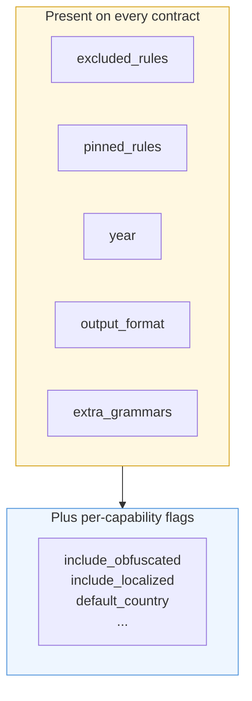
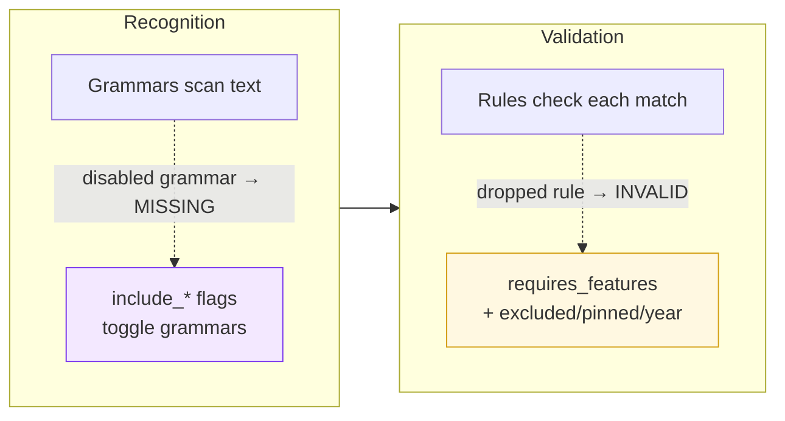

A **contract** is the configuration object you pass alongside your text to `paxman.canonicalize()`. It answers three questions: *which capability to use, which patterns should count, and how the answer should look*. Every capability provides the same contract surface so you only learn it once.

---

## What a contract is

You never construct a contract by hand. Each capability exposes a typed factory:

```python
from paxman.capabilities import Email, Country

email_contract = Email.create_contract()
country_contract = Country.create_contract(include_localized=True)
```

The returned object is a frozen dataclass — you can inspect it, but not mutate it. Pass it straight to `canonicalize()`:

```python
result = paxman.canonicalize("Alemania", country_contract)
```

The contract's `capability_name` field (set automatically) is how the engine selects the matching capability — see [Capabilities](capabilities.md).

---

## The unanimous surface

Every contract — no matter the capability — carries the same common fields. This is intentional: the shape is homogeneous so tooling, notebooks, and future capabilities all behave the same way.



| Field | Type | Default | What it does |
|-------|------|---------|--------------|
| `capability_name` | `str` | set by factory | Which capability this contract selects. You never set it — the factory does. |
| `excluded_rules` | `tuple[str, ...]` | `()` | Rule names to skip during validation. |
| `pinned_rules` | `tuple[str, ...] \| None` | `None` | If set, **only** these rules run (overrides `excluded_rules`). `()` pins to nothing. |
| `year` | `int \| None` | `None` | Temporal filter — only rules published in or before this year run. |
| `output_format` | `str \| None` | `None` → default | How the canonical value is rendered (see below). |
| `extra_grammars` | `tuple[str, ...]` | `()` | Community grammar names to opt in (advanced — see extending docs in a later round). |

**Precedence:** when `pinned_rules` is non-`None` it wins over `excluded_rules`; `year` is applied after either pinning or exclusion.

### `output_format` — always optional

`output_format` is the **only** presentation knob and it is always optional:

- `None`, `"default"`, and the capability's `DEFAULT_OUTPUT_FORMAT` all resolve to the default rendering.
- Any value in `OFFERED_OUTPUT_FORMATS` resolves to itself (e.g. `"hyphenated"` for ISBN, `"rfc3966"` for Phone).
- Anything else raises `ContractError`.

Validation of the canonical value is never affected by `output_format` — formatting happens after validation.

---

## Per-capability flags

Beyond the common fields, each contract adds flags that make sense for its domain. You will discover them through the factory's signature and your editor's autocomplete; the table below summarizes the current release.

| Capability | Flag | Type | Default | Meaning |
|------------|------|------|---------|---------|
| Email | `include_obfuscated` | `bool` | `False` | Recognize `user at domain dot com` style addresses |
| Email | `include_localhost` | `bool` | `True` | Recognize `admin@localhost` |
| Country | `include_localized` | `bool` | `False` | Recognize CLDR multilingual names (e.g. `Alemania` → `DE`) |
| Country | `include_historical` | `bool` | `False` | Recognize deprecated/historical names (e.g. `Burma` → `BU`) |
| IP | `include_ipv6` | `bool` | `True` | Recognize IPv6 addresses |
| ISBN | `include_isbn10` | `bool` | `True` | Recognize legacy ISBN-10 |
| ISBN | `include_range_validation` | `bool` | `False` | Enable registrant-range provenance |
| Currency | `default_currency` | `str \| None` | `None` | Resolve shared bare symbols (`$`) to this code when it is one of that symbol's candidates |
| Money | `dollar_sign_currency` | `str \| None` | `None` | Resolve bare `$` amounts to this code |
| Money | `precision` | `str` | `"strict"` | Over-precision handling: `strict` / `truncate` / `round` |
| Phone | `default_country` | `str \| None` | `None` | Resolve national numbers as if dialed in this country (`"US"`) |
| SI Unit | `allow_split_word_prefixes` | `bool` | `False` | Merge `kilo gram` → `kg` |
| SI Unit | `allow_multi_solidus` | `bool` | `False` | Preserve `kg/m/s` instead of rejecting it |
| Date | `two_digit_base_year` | `int \| None` | `None` | Base year for 2-digit year expansion |
| Date / ISBN / Phone / … | `output_format` | `str` | capability default | See capability-specific offered formats |

> This table reflects the **current release**. As new capabilities are added, each will document its own flags in the same way — the common fields above stay the same.

---

## How flags map to the pipeline

A useful mental model: the two groups of flags gate the two groups of pipeline stages (see [Pipeline](pipeline.md)).



- **Input-shape flags** (`include_*`) toggle **grammars** — a disabled grammar simply never sees the input, so the status becomes `MISSING` rather than `INVALID`.
- **Authority flags** (`requires_features` on rules, plus `excluded_rules`/`pinned_rules`/`year`) gate **rules** — a dropped rule means the match was recognized but not accepted, so the status becomes `INVALID`.

You never branch inside a rule's logic based on `include_*` — the flag's presence or absence decides whether the rule runs at all.

---

## Common recipes

### Narrow to specific specs

```python
from paxman.capabilities import Email

# Only RFC 5322, no localhost
contract = Email.create_contract(pinned_rules=["Section 3.4.1-addr-spec"])
```

### Exclude one spec

```python
contract = Email.create_contract(excluded_rules=["Section 6.3-localhost"])
```

### Time-travel to an older spec set

```python
from paxman.capabilities import Date

contract = Date.create_contract(year=2019)  # only rules published ≤ 2019
```

### Choose a rendering

```python
from paxman.capabilities import Phone, ISBN

Phone.create_contract(output_format="rfc3966")  # tel:+15551234567
ISBN.create_contract(output_format="hyphenated")  # 978-0-11-000222-4
Phone.create_contract(output_format="national")  # national form
ISBN.create_contract(output_format="isbn13")  # bare digits (default)
# None / "default" also resolve to the default for any capability
```

Any non-offered value raises `ContractError` — you get a fast, typed failure instead of a silently wrong rendering.

---

## In plain language

Think of a contract as a work order you hand to a department. It says: *here is the kind of job (capability), here are the tools you may use (which grammars and rules), and here is how I want the answer formatted (output_format)*. The department may have extra switches that only make sense for its work (e.g. Country's "also accept historical names"), but the top of the form — excluded/pinned rules, year, output format — looks the same in every department.

Next: [Pipeline →](pipeline.md) — what Paxman does with that work order.
