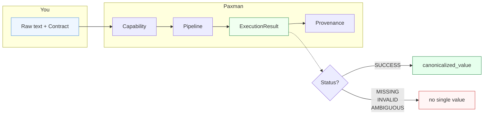
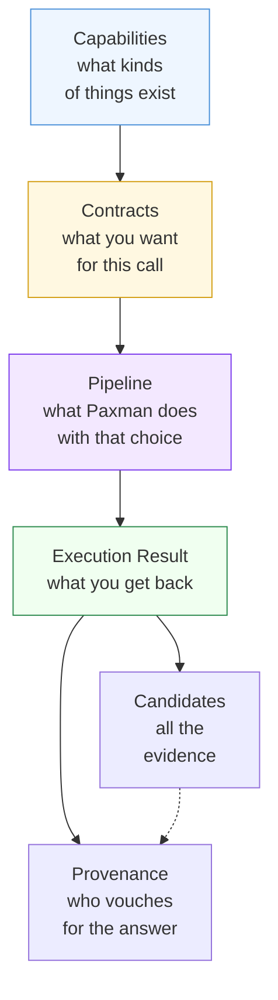

If you understand the seven ideas below, you understand Paxman. This page is the hub — start here, then dive into whichever concept you need.

---

## The big picture in one diagram

You provide **text + a contract** that selects a **capability**. Paxman runs its **pipeline** and returns an **execution result** whose status tells you whether there is a single canonical answer, and whose **provenance** tells you which specification vouches for it.

---

## The seven concepts

| Concept | One-line summary | When you need it |
|---------|-----------------|------------------|
| [Capabilities](capabilities/) | A capability is one kind of identifier Paxman knows how to canonicalize (email, country, URL, …). The set grows over time. | Choosing what to import, deciding whether Paxman covers your data |
| [Contracts](contracts/) | A contract configures a capability — which patterns to look for, which specs to enforce, how to render the answer. | Enabling optional formats, pinning to a spec version, selecting an output form |
| [Pipeline](pipeline/) | The three stages inside `canonicalize()`: recognition → validation → resolution. | Understanding why an input is `MISSING` vs `INVALID` vs `AMBIGUOUS` |
| [Execution Result](execution-result/) | The object you get back: `status`, `canonicalized_value`, `candidates`, `span`, `version_stamp`. | Reading answers in code or a notebook |
| [Provenance](provenance/) | The authority citation attached to every validated value — which spec, which version, which section. | Auditing, citing sources, comparing Paxman against another system |
| [Candidates & Ambiguity](candidates-and-ambiguity/) | Why one input can produce multiple valid answers and how Paxman surfaces that without guessing. | Handling `AMBIGUOUS` in your application |
| [Errors](errors/) | What raises an exception (setup, caller misuse, or pipeline failure) vs what returns a status (domain answer). | Debugging setup and contract mistakes |

---

## How they fit together

1. You pick a **capability** (e.g. Email) — this determines which patterns Paxman knows.
2. You build a **contract** for that capability — this narrows which patterns and specs are active for this call.
3. Paxman runs the **pipeline** (recognition, validation, resolution) using that contract.
4. You receive an **execution result** whose `status` is either `SUCCESS` (one canonical value), `MISSING`, `INVALID`, or `AMBIGUOUS`.
5. On `SUCCESS` that value carries **provenance**; in every case you can inspect **candidates** to see what the specs said.

---

## Reading order

- **New to Paxman?** Read in order: Capabilities → Contracts → Pipeline → Execution Result. Skim Provenance, Candidates, and Errors as needed.
- **Cleaning data in a notebook?** Jump to [Pipeline](pipeline/) (to predict outcomes) and [Execution Result](execution-result/) (to handle statuses), then [Candidates & Ambiguity](candidates-and-ambiguity/) if you hit `AMBIGUOUS`.
- **Integrating into an app?** Read [Contracts](contracts/) and [Errors](errors/) carefully — they cover the knobs and the failure modes you need to handle.

> **A note on the capability list:** the set of capabilities grows across releases. This hub lists examples from the current release; never treat a count in these docs as final. Check `paxman.capabilities` or the latest release notes for the current set.

Next: [Capabilities →](capabilities/)
