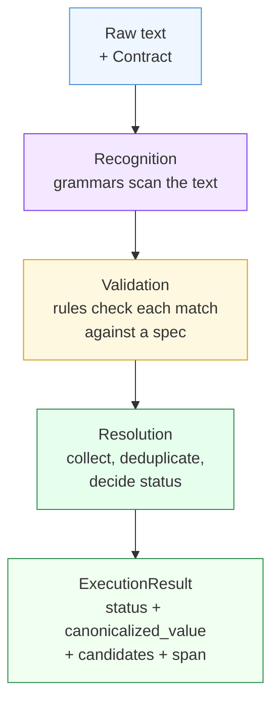
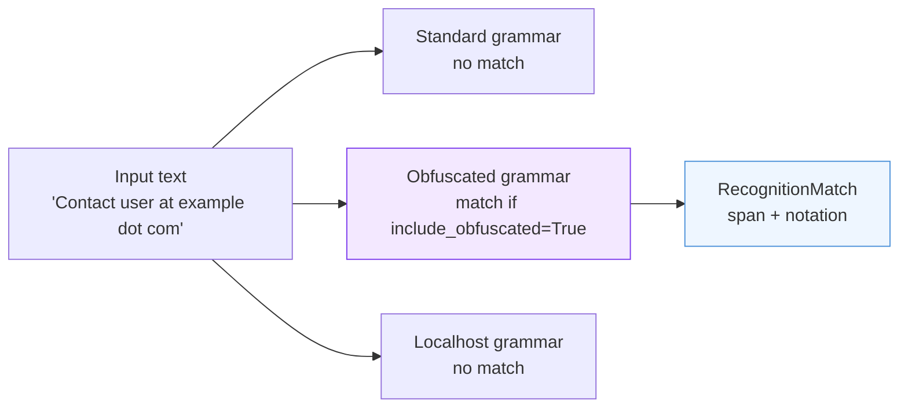
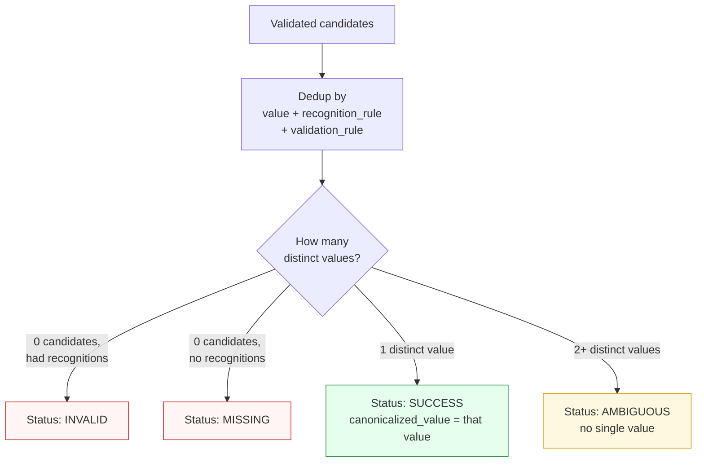
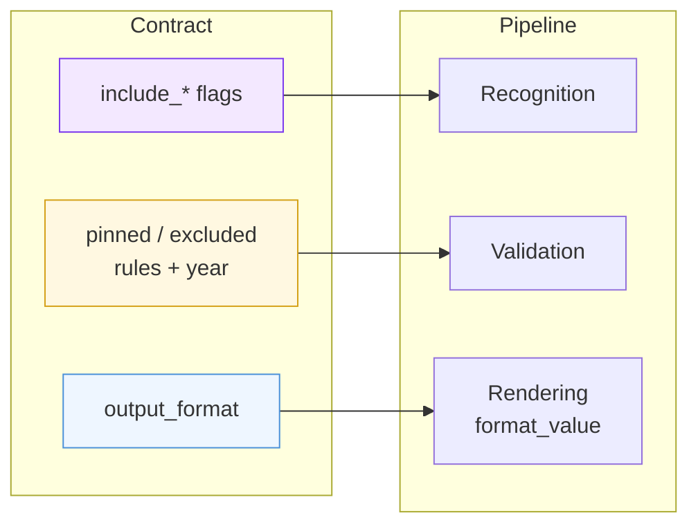

Every `paxman.canonicalize(text, contract)` call runs the same deterministic pipeline. Understanding its three stages — **recognition → validation → resolution** — explains every status you will ever see.

---

## The three stages at a glance



- **Recognition** asks: *does this text even look like something this capability handles?* It finds patterns and notes exactly where they sit in the input (`span`).
- **Validation** asks: *does that pattern actually mean what it looks like, according to a real specification?* It checks each match against one or more specs and, when it passes, produces a canonical value and a provenance citation.
- **Resolution** asks: *given all the validated answers, what is the single result?* It deduplicates and decides the outcome.

No stage does another stage's job. That separation is what makes results predictable and debuggable.

---

## Stage 1 — Recognition

Grammars scan your input for syntactic patterns. Each grammar is focused — e.g. for Email there are grammars for standard addresses, for `user at domain dot com` style obfuscation, and for `localhost` addresses. For Date there is one grammar with four candidates (iso8601, slash_iso, US, European) via CandidatesMatcher.

Key properties:

- Grammars return **span-bearing matches** — a half-open `[start, end)` range plus the exact substring (`raw_text`) it covers. This is how Paxman later tells you *where* the entity sat.
- Recognition is **syntax only** — it never judges correctness. `"not-an-email@"` would not match; `"user@example.com"` would, even if a later validation step will reject it.
- Overlapping matches from the **same** grammar are deduplicated by "longer wins" — a match fully contained in a longer one from the same grammar is dropped. Overlapping matches from **different** grammars are kept — that cross-grammar disagreement is meaningful (see [Candidates & Ambiguity](candidates-and-ambiguity/)).
- Which grammars run is decided by your contract's **input-shape flags** (`include_*`) and by `active_grammars`. A disabled grammar never scans — the pipeline behaves as if it does not exist.



If this stage finds **nothing**, the final status is `MISSING` (without further stages running). That is why `include_obfuscated=False` on the input above returns `MISSING` — the only grammar that could have matched was not active.

---

## Stage 2 — Validation

Each recognition is checked against **rules** — each rule represents one section of one authoritative publication. For example, an Email match may be checked against RFC 5322's addr-spec section and RFC 6761's localhost section.

```mermaid
flowchart TB
    M[Recognized match] --> R1{Rule: RFC 5322<br>addr-spec}
    M --> R2{Rule: RFC 6761<br>localhost}
    R1 -->|matches| C1[Candidate:<br>user@example.com<br>provenance: IETF / RFC 5322]
    R2 -->|no match| X1[dropped]
    M --> R3{Other rules...}

    style C1 fill:#e6ffed,stroke:#2d8a4e
    style X1 fill:#fff5f5,stroke:#cc3333
```

- A rule's `matches()` answers *does this notation satisfy my spec?*; if yes, `normalize()` produces the canonical string and `provenance` says which spec vouches for it.
- A rule declares `target_semantics` — which grammars' output it is willing to judge. A match only meets the rules whose target includes its grammar's semantics.
- Which rules run is controlled by your contract's **authority gating**: `excluded_rules` / `pinned_rules`, `year` (temporal filter), and `requires_features` (a rule that needs `include_localized=True` stays dormant otherwise — see [Contracts](contracts/)).
- `output_format` **never affects validation** — it only affects the final rendering step after validation succeeds.

If recognition produced matches but **no rule accepts any of them**, the final status is `INVALID` — *recognized, but no specification validates it*. Example: `Alemania` with the Country capability and `include_localized=False` is recognized by the name grammar but no rule claims it, so it is `INVALID` rather than `MISSING`.

---

## Stage 3 — Resolution

All validated candidates are collected, deduplicated, and judged:



- **Deduplication** collapses identical `(value, recognition_rule, validation_rule)` triples. Different provenance that happens to produce the same string does not create ambiguity — one value, one status.
- **Status decision** (see [Execution Result](execution-result/)):
  - `MISSING` vs `INVALID` depends precisely on whether recognition found *anything* — the pipeline remembers `had_recognitions`.
  - `SUCCESS` means exactly one distinct canonical value survived.
  - `AMBIGUOUS` means one logical mention produced two or more distinct values (e.g. `"01/02/2026"` → US `2026-01-02` vs European `2026-02-01`). This is a genuine spec conflict, not an input with two mentions.
- **Single-mention invariant:** Paxman resolves one entity per call. If recognition found two *non-overlapping* mentions that resolve to different values (e.g. two email addresses with different canonical values), the engine fails fast with `MultipleMentionsError` instead of returning a misleading aggregate. See the [Segmentation Recipe](https://github.com/nexusnv/paxman-python/blob/main/docs/recipes/segmentation.md).

The single canonical value on `SUCCESS` is then passed through the capability's `format_value` with your contract's `output_format`, and the top-level `ExecutionResult.span` is set to the span of the resolved candidate.

---

## How the contract shapes the pipeline



- Toggling an `include_*` flag that gates a grammar changes whether input is `MISSING` (grammar off, nothing recognized) or proceeds to validation.
- Pinning or excluding a rule, or setting `year`, changes whether a recognized match becomes `INVALID` (no rule accepted it) or `SUCCESS`.
- Changing `output_format` never changes `MISSING`/`INVALID`/`AMBIGUOUS` — it only changes how the value *looks* on `SUCCESS`.

---

## Determinism

Given the same text, the same contract, and the same installed library version, the pipeline produces the **same result every time** — no randomness, no network, no wall-clock dependence. Provenance records even carry the spec's `publication_year`, so temporal filtering by `year` is itself reproducible, and `version_stamp` on the result records exactly which build produced it.

---

## In plain language

Imagine a mail room with three desks. The first desk checks *does this envelope look like mail?* and marks where it sits on the table. The second desk checks *does the address follow postal rules?* and looks up the authoritative rulebook to confirm and stamp it. The third desk looks at all stamped answers and decides: *no envelope, one valid stamped answer, conflicting stamps, or two separate envelopes in one slot — send back for splitting*. Your contract tells the room which desks are open and which rulebooks to consult.

Next: [Execution Result →](execution-result/) — how to read what the pipeline gave you.
