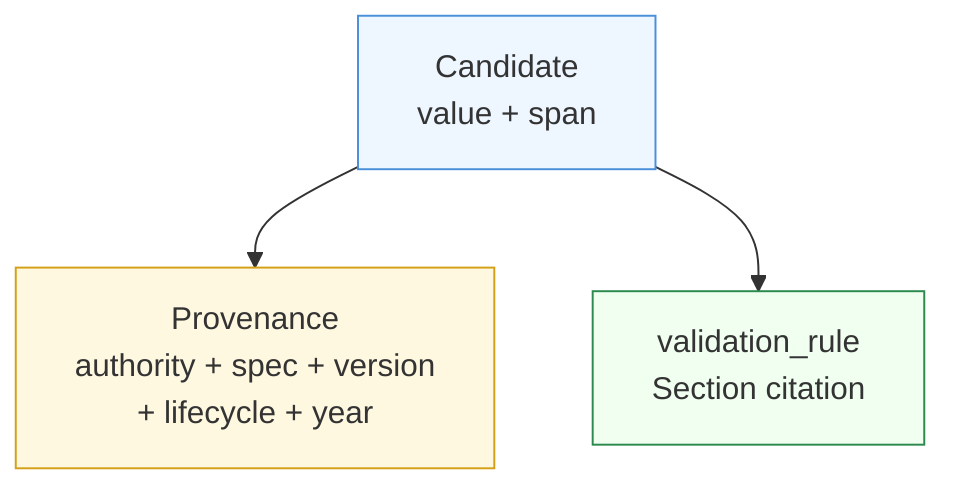

Every validated value in Paxman carries **provenance** — a citation of the authoritative specification that vouches for it. Provenance is what makes a canonicalization result citable, auditable, and comparable, rather than a guess.

---

## What provenance looks like

```python
import paxman
from paxman.capabilities import Email

paxman.register_all_shipped()
contract = Email.create_contract()
result = paxman.canonicalize("user@example.com", contract)

for c in result.candidates:
    for p in c.provenance:
        print(p.authority, p.specification_name, p.version, c.validation_rule)
        # IETF  RFC 5322  2008  Section 3.4.1-addr-spec
```

A `Provenance` object has six fields:

| Field | Meaning | Example |
|-------|---------|---------|
| `authority` | Who published the specification | `"IETF"`, `"ISO"`, `"BIPM"`, `"WHATWG"` |
| `specification_name` | Which specification | `"RFC 5322"`, `"ISO 3166-1"`, `"BIPM SI Brochure"` |
| `kind` | Category of the source | `"specification"`, `"standard"` |
| `reference_url` | Canonical URL or identifier for the spec | `"https://www.rfc-editor.org/rfc/rfc5322"` |
| `version` | Spec version, if any | `"2008"`, `"2019"`, or `None` |
| `lifecycle` | Publication lifecycle stage | `"active"`, `"deprecated"` |
| `publication_year` | Year the cited section was published | `2008` |

The seventh piece of information — **which section** of the spec — lives on the rule that produced the candidate as `validation_rule` (e.g. `"Section 3.4.1-addr-spec"`), not on provenance itself. Together they form a complete citation: *"this value was validated by IETF RFC 5322, Section 3.4.1, publication year 2008."*



---

## Why it matters

- **Auditing** — you can log not just *what* was canonicalized but *by which spec version*, so downstream reviewers know whether `BU` for `Burma` came from ISO 3166-3 (historical) or ISO 3166-1 (active).
- **Comparison** — two systems that both claim `"US"` for `"United States"` are directly comparable by spec and year.
- **Temporal control** — `contract.year` filters by `publication_year`, and `version_stamp` records which Paxman build produced the answer, so you can reproduce or explain a result even after specs evolve.
- **Citing in research** — a methods section can cite the exact spec citation rather than saying "Paxman normalized it."

```python
# Example: collect provenance for a methods section
for c in result.candidates:
    p = c.provenance[0]
    print(
        f"Validated by {p.authority} {p.specification_name} "
        f"({p.version or 'unversioned'}), {c.validation_rule}, "
        f"publication_year={p.publication_year}"
    )
```

---

## Provenance on every candidate, not just success

- On `SUCCESS`, `result.candidates` contains one or more candidates that all agree on `value` — each still carries its own provenance, so you see which spec(s) converged.
- On `AMBIGUOUS`, `candidates` shows the competing provenances that disagree — this is precisely the evidence you need to resolve the ambiguity (see [Candidates & Ambiguity](candidates-and-ambiguity.md)).
- On `MISSING` / `INVALID`, `candidates` is empty — no spec validated the input, so there is nothing to cite. That emptiness is itself informative (see [Execution Result](execution-result.md)).

---

## In plain language

Provenance is the footnote on the answer. Instead of "Paxman says `Alemania` is `DE`," provenance lets you say "Paxman says `Alemania` is `DE` per Unicode CLDR, validated under the CLDR localized-name rule, publication year 2025" — a claim you can check, cite, and reproduce.

Next: [Candidates & Ambiguity →](candidates-and-ambiguity.md) — when provenance disagrees and what to do about it.
