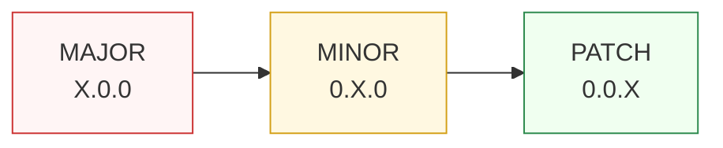
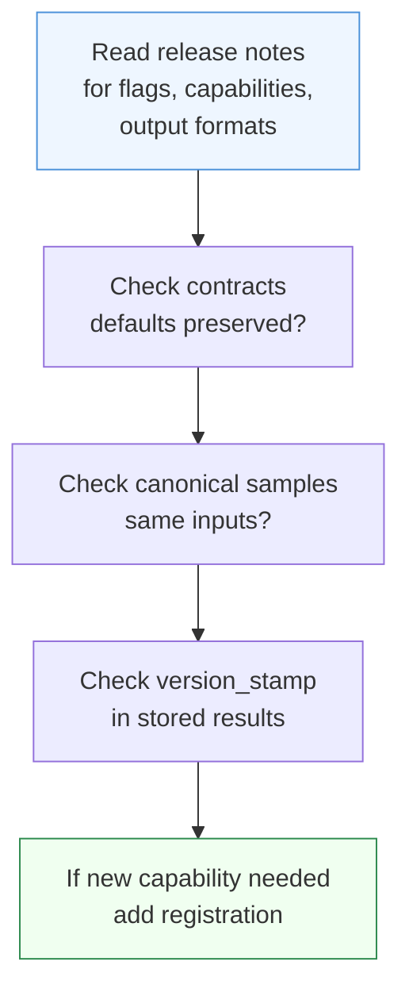

# Migration — Staying Current

Paxman follows **Semantic Versioning**. The capability set, the contract surface, and the data tables grow across releases — your code should be ready to move forward without surprise.

> **In plain language:** small releases add things; breaking releases can change things. This page tells you which is which and what to do when you upgrade.

---

## Versioning



| Version bump | Meaning for your code | Example |
|--------------|----------------------|---------|
| **PATCH** (`0.0.X`) | Contract compatibility preserved. Docs and internal fixes; authority data corrections may change recognition, status, or `canonicalized_value` when specs evolve — re-run golden samples even on PATCH. | `0.1.0` → `0.1.1` may update CLDR/IDNA tables |
| **MINOR** (`0.X.0`) | Contract compatibility preserved (existing contracts still validate). Data-driven results may change when authority tables grow — pin `paxman` version and use `contract.year` (filters `publication_year <= year`) where point-in-time reproducibility matters, store `version_stamp`, and re-run golden samples. | `0.1.x` → `0.2.0` adds capabilities and data |
| **MAJOR** (`X.0.0`) | Breaking contract or flag semantics. Read the release notes — names, defaults, or canonical forms may change. | `0.x` → `1.0.0` |

Contract compatibility (which contracts are accepted) is stable across PATCH and MINOR; result stability (which `status`/`canonicalized_value` you get) depends on data and is not promised when spec tables change. `year` filters rules by `publication_year <= year`; only `pinned_rules` and `excluded_rules` identify rules. Provenance and spec-version changes alone do not imply a MAJOR bump.

Determinism is per-installed-build: the `version_stamp.paxman_version` on every `ExecutionResult` records exactly which build produced the answer, so you can audit what changed across an upgrade.

---

## What can appear in a minor release

You do **not** need to change code for these — they are additive and backward compatible:

- New capabilities (the set of importable names under `paxman.capabilities` grows — never treat a current count as final).
- New contract flags of the form `include_*`, `allow_*`, or `default_*` (always optional, defaults preserve shipped behavior).
- New offered `output_format` alternatives (the default rendering stays the same; pin `output_format` if you rely on a specific rendering).
- Expanded authority tables (e.g. new CLDR entries, additional URL IDNA mappings) where the spec itself grew.

Keep your registration future-proof by preferring the explicit form when you care about the surface:

```python
# Future-proof — only the capabilities you name
paxman.register_capability(Email())
paxman.register_capability(Date())

# Convenience — everything shipped in this build
paxman.register_all_shipped()  # convenient, but the set it registers grows over time
```

Either approach is supported; pick explicit when you want the upgrade to be a conscious decision, and bootstrap when you want the new capabilities automatically.

---

## What signals a careful upgrade

These are **major-bump** signals — check the release notes and review the checklist below:

- A `DEFAULT_OUTPUT_FORMAT` or `OFFERED_OUTPUT_FORMATS` change — the string behind `canonicalized_value` for the same input may differ even though `status` stays `SUCCESS`.
- A rule's provenance year or spec version changes — `contract.year` boundaries move and `include_historical` vs active coverage may shift.
- A capability renamed, merged, or removed.

---

## Upgrade checklist (copy-paste)

When moving to a new `MINOR`, glance; when moving to a new `MAJOR`, work through it:



1. **Read the release notes** — skim new capabilities, new contract flags, and any new `output_format` values. Decide whether a new capability belongs in your registration.
2. **Review contracts** — new optional flags default to shipped-preserving values. Verify that rule names in `pinned_rules` and `excluded_rules` still exist (a stale name raises `ContractError`), and separately confirm that `year` (filters `publication_year <= year`) still expresses the temporal window you intend — `year` is not a rule name.
3. **Pin output if it matters** — if your downstream expects a specific rendering (e.g. `Phone` `rfc3966`), construct the contract with `output_format="rfc3966"` rather than relying on the current default.
4. **Re-run your golden samples** — keep a small file of `(text, contract) → canonicalized_value` samples for the capabilities you use, assert them in CI, and compare after the upgrade. Determinism means a change is intentional, not noise.
5. **Log or store `version_stamp`** — for audit trails, persist `result.version_stamp.paxman_version` alongside `canonicalized_value` so you can explain which build produced which answer.
6. **Segmentation review** — if you added a new capability or flag, confirm the caller-owned split-then-canonicalize loop (see [Segmentation](../recipes/segmentation.md)) still routes each piece to the right capability/contract.

Minimal golden-sample harness:

```python
import paxman
from paxman.capabilities import Email, Country
from paxman.core.domain import Resolution

paxman.register_all_shipped()

checks = [
    ("user@Example.COM", Email.create_contract(), "user@example.com"),
    ("United States", Country.create_contract(), "US"),
]

for text, contract, expected in checks:
    r = paxman.canonicalize(text, contract)
    assert r.status == Resolution.SUCCESS and r.canonicalized_value == expected, (
        text,
        r,
    )
```

---

## Temporal filtering and data drift

Spec tables (CLDR, ISBN Range Message, URL IDNA) are regenerated from snapshots and live inside the library. When a spec evolves (new country names, new currency symbols, new IDNA mappings), the release notes will note it. Use `contract.year` to pin to specs published up to a given year when reproducibility against a point-in-time authority matters; combine it with a pinned `paxman` version in your environment for full reproducibility.

See [Contracts](concepts/contracts.md) for `year` filtering, [Provenance](concepts/provenance.md) for `publication_year` on each citation, and [Execution Result](concepts/execution-result.md) for `version_stamp`.

---

## See also

- [API Reference](api-reference.md) — registration, contracts, and statuses
- [Concepts — Pipeline](concepts/pipeline.md) — why statuses are stable (recognition → validation → resolution)
- [Extending](extending.md) — keeping community grammars/rules compatible across upgrades
- [Segmentation](../recipes/segmentation.md) — caller-owned splitting for multi-entity text
