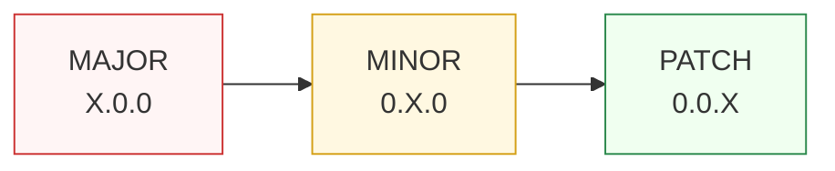
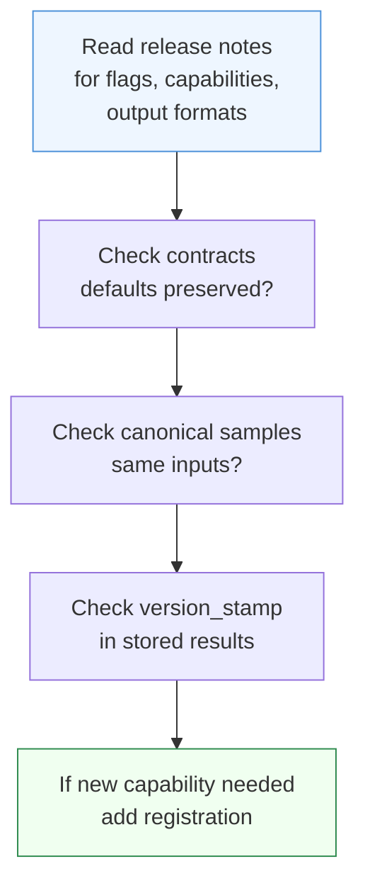

Paxman follows **Semantic Versioning**. The capability set, the contract surface, and the data tables grow across releases — your code should be ready to move forward without surprise.

> **In plain language:** small releases add things; breaking releases can change things. This page tells you which is which and what to do when you upgrade.

---

## Versioning



| Version bump | Meaning for your code | Example |
|--------------|----------------------|---------|
| **PATCH** (`0.0.X`) | Contract compatibility preserved. Docs and internal fixes; authority data corrections may change recognition, status, or `canonicalized_value` when specs evolve — re-run golden samples even on PATCH. | `0.1.0` → `0.1.1` may update CLDR/IDNA tables |
| **MINOR** (`0.X.0`) | Contract compatibility preserved (existing contracts still validate). Data-driven results may change when authority tables grow — pin `paxman` version and use `contract.year` (filters `publication_year <= year`) where point-in-time reproducibility matters, store `version_stamp`, and re-run golden samples. | `0.1.x` → `0.2.0` adds capabilities and data |
| **MAJOR** (`X.0.0`) | Breaking contract or flag semantics. Read the release notes — names, defaults, or canonical forms may change. | `0.x` → `1.0.0` |

Contract compatibility (which contracts are accepted) is stable across PATCH and MINOR; result stability (which `status`/`canonicalized_value` you get) depends on data and is not promised when spec tables change. `year` filters rules by `publication_year <= year`; only `pinned_rules` and `excluded_rules` identify rules. Provenance and spec-version changes alone do not imply a MAJOR bump.

Determinism is per-installed-build: the `version_stamp.paxman_version` on every `ExecutionResult` records exactly which build produced the answer, so you can audit what changed across an upgrade. Since 0.2.0, `version_stamp.recognition_revision` (hash of the compiled matcher set + snapshot SHAs, per ADR-0009 §13) is the same-snapshot diff signal — if `recognition_revision` changes, recognition behavior changed for at least one capability even when `paxman_version` is unchanged (e.g., a lexicon token table update).

---

## 0.3.2 — ISBN/ISSN audit + kernel label fix (patch, non-breaking)

**Scope:** patch `0.3.1` → `0.3.2` — contract compatibility preserved, no new capability, no flag change. Two audit truncation guards plus one kernel span fix; docs now cover ISSN as a first-class page.

**What changed:**

| Area | Before (`0.3.1`) | After (`0.3.2`) |
|------|-------------------|-----------------|
| **ISBN truncated hyphen continuation** (`1 0-306-40615-2`, cut `978-…` groups) | matched a truncated prefix | rejected → `MISSING` (trailing `(?![-]\d)` guard, both grammars) |
| **ISSN truncated hyphen-digit** (`0317-8471-2`) | matched truncated `0317-8471` | rejected → `MISSING` (same guard class) |
| **IBAN bare-colon label** (`IBAN:AA0000000000000` after other text) | span covered core only `(31, 46)` — new/legacy parity gap | span absorbs label `(26, 46, 'IBAN:AA0000000000000')`, matching legacy |
| **`ISBN` helpers** | `_find_length` duplicated in capability + rule | single `find_registrant_length` in `rules/data/range_message.py` (+ alias) — no behavior change |
| **Docs** | no `docs/user/capabilities/issn.md` | ISSN user page added; ISBN recognition-vs-validation table clarified |

**Why this is correct:** truncated prefixes are not valid identifiers (ISO 2108 / ISO 3297 check structure), so `MISSING` beats a truncated `SUCCESS`; the IBAN label belongs to the mention per the frozen legacy reference. `normalize()` now honors "Rules never raise" on direct calls for the touched ISBN rules.

**How to detect:** `result.version_stamp.paxman_version` `0.3.2` vs `0.3.1`; `recognition_revision` bumps for the new trailing guards and the LabelMatcher scan change.

---

## 0.3.1 — IP audit fixes (patch, non-breaking)

**Scope:** patch `0.3.0` → `0.3.1` — contract compatibility preserved, no new capability, no flag change. One grammar completeness fix plus defensive hardening; docs now surface the new behavior.

**What changed:**

| Area | Before (`0.3.0`) | After (`0.3.1`) |
|------|-------------------|-----------------|
| **IPv6 mixed with embedded IPv4** (`::ffff:192.0.2.1`, `64:ff9b::192.0.2.1`, `::192.0.2.1`) | truncated to `::ffff:192` + second candidate `192.0.2.1` → `AMBIGUOUS ['::ffff:192','192.0.2.1']` (truncated value) | single IPv6 candidate `::ffff:192.0.2.1` (plus trailing `192.0.2.1` via IPv4 `\b`) → `AMBIGUOUS ['::ffff:192.0.2.1','192.0.2.1']` — prefer the IPv6 value (overlap documented, cross-grammar dedup deferred without ADR) |
| **IPv4 leading-zero** (`010.020.030.040`) | recognized and normalized to `10.20.30.40` (already) — now documented | same, documented in `docs/user/capabilities/ip.md` and `README.md` |
| **`IPNotation`** | `@dataclass(frozen=True)` | `@dataclass(frozen=True, slots=True)` + field docs — no behavior change |
| **`normalize()`** | raised `ValueError`/`AddressValueError` on `999.999.999.999` / `not-an-ip` | `try/except ValueError` → returns input unchanged (never raises) |
| **Provenance URLs** | `https://tools.ietf.org/html/rfc791` | `https://datatracker.ietf.org/doc/html/rfc791` (same for RFC 5952) |
| **Docs** | IP page listed only compressed/expanded IPv6 | now lists mixed `LS32` (RFC 4291 §2.2), leading-zero, overlap and triple-colon notes |

**Why this is correct:** 0.3.0 under-recognized Las32 mixed addresses that `ipaddress.IPv6Address` already accepts and RFC 4291 defines; 0.3.1 aligns recognition with the validated spec. The overlapping `192.0.2.1` candidate remains until an engine cross-grammar dedup policy exists — callers should pick the IPv6 value (see `docs/user/capabilities/ip.md` overlap note). `normalize()` now honors "Rules never raise" even on direct calls.

**How to detect:** `result.version_stamp.paxman_version` `0.3.1` vs `0.3.0`; `recognition_revision` also bumps for the new mixed branches.

**Migration snippet:**

```python
from paxman.api.bootstrap import register_all_shipped
from paxman.api import canonicalize
from paxman.capabilities.IP.contract import IPContract

register_all_shipped()
r = canonicalize("::ffff:192.0.2.1", IPContract())
# 0.3.0: AMBIGUOUS ['::ffff:192', '192.0.2.1']  (truncated)
# 0.3.1: AMBIGUOUS ['::ffff:192.0.2.1', '192.0.2.1']  (correct, prefer IPv6)
assert r.status.value == "ambiguous"
assert r.candidates[0].value == "::ffff:192.0.2.1"
```

---

## 0.2.0 — Recognition Kernel (breaking, scoped)

**Scope:** This is a *pre-1.0* minor bump (0.1.0 → 0.2.0) with one intentional breaking change: the F1 correctness fix for whole-input vocabulary matching (ADR-0009). All other inputs are byte-identical under the parity gate.

**What changed:** Country `name_recognition` moved from whole-input lookup to an in-text word-anchored trie on the `CountryNameFold` view. Short-code grammars (`alpha2`) now honestly compete with the name grammar instead of silently winning when the name was invisible.

| Input class | Before (0.1.x pipeline) | After (0.2.0 kernel) |
|---|---|---|
| Exact name, whole input (`"United States"`) | `SUCCESS "US"` | `SUCCESS "US"` — unchanged |
| Name embedded in prose (`"Ship to United States please"`) | `SUCCESS "TO"` — **wrong** (Tonga) | `MultipleMentionsError` under a `single_value` contract; both mentions via `paxman.scan()` |
| Short code as ordinary word (`"to"` in prose) | recognized and validated as alpha-2 — silent win | recognized; competes with the name mention — no silent win |
| All other inputs | — | byte-identical (parity gate) |

**Migration snippet:**

```python
# Exact value — unchanged:
import paxman
from paxman.capabilities.Country import Country

paxman.register_all_shipped()
contract = Country.create_contract()
paxman.canonicalize("United States", contract)  # SUCCESS "US"

# Prose with embedded values — the new honest paths:
from paxman.core.errors import MultipleMentionsError

try:
    result = paxman.canonicalize("Ship to United States please", contract)
except MultipleMentionsError:
    # scan() shares one ScanContext substrate across all contracts in the batch
    mentions = paxman.scan("Ship to United States please", [contract])
    # mentions.mentions["country"] == [
    #   Mention(span=(5, 7), grammar="alpha2_recognition", notation=...),
    #   Mention(span=(8, 21), grammar="name_recognition", notation=...),
    # ]
    # Segment first — docs/recipes/segmentation.md remains valid
    for m in mentions.mentions["country"]:
        print(m.span, m.grammar, m.notation)

# Or segment-first (recipe) — `paxman.scan` is preferred; no direct
# `normalize_name` import is needed.
```

**How to detect the change:** Compare `result.version_stamp.recognition_revision` across builds. The F1 migration changes the compiled matcher set, so `recognition_revision` changes even if you stay on the same `paxman_version` snapshot. Store both `paxman_version` and `recognition_revision` for audit trails.

**Why this is correct:** 0.1.x returned a confident, provenance-backed, wrong answer on ordinary prose (`"Ship to United States please"` → Tonga). 0.2.0 surfaces the competition honestly; `scan()` turns the caller-owned split-then-canonicalize loop into an API (see `docs/recipes/segmentation.md` and `paxman scan --help`).

**Other 0.2.0 additions (non-breaking):**

- `paxman.scan(text, contracts)` batch API + `Mention`/`ScanResult` model + `paxman scan` CLI (one substrate pass, see `docs/user/api-reference.md`).
- `ScanContext` lazy views, `MatcherSpec`/`LexiconMatcher` trie (SIUnit 2.4–6.5× win at 650/820 tokens), `BoundarySpec` presets, `AnchorSet` T0 prefilter.
- Snapshot rails (`paxman/shared_data/*_snapshot.json` + `tools/regenerate_*` + CI drift gate) and derived recognition keys (BIC country codes, Language IANA subset) per ADR-0009 §14.

### 0.2.0 — Two-array offset maps (A4 Rev.4, breaking in spans only)

Pre-0.2.0 the recognition kernel used a single-array D3 invariant
`offsets[s] -> offsets[e]` with a `len(text)` sentinel. When a
normalizer dropped source characters (CountryNameFold strips
punctuation, StripSeparators drops ` ()-.`, IDNAFold drops tabs) the
translated end absorbed the dropped tail: `"United States."`
recognized as `(0, 14)` with `raw_text == "United States."`.
ADR-0009 Rev.4 amends D3 to two arrays:

`View.original_span(s, e) -> (starts[s], ends[e-1])` when mapped,
`(s, e)` when `None`; empty `(0, 0)`. Each normalizer now returns
`(subject, starts, ends)` with `len(starts)==len(ends)==len(subject)`
and `0 <= starts[i] < ends[i] <= len(text)`.

Visible change (Option 1, word-boundary-aligned mentions):

| Input | Before | After |
|---|---|---|
| `"United States."` name mention | `(0, 14)` `raw_text="United States."` | `(0, 13)` `raw_text="United States"` |
| `"United States of America,"` | `(0, 25)` includes trailing `,` | `(0, 24)` trimmed |
| `"+1 (555) 123-4567"` via `StripSeparators` | `ends[-1]==len(text)` sentinel | `ends` per-char `s+1`, `original_span(0,n)==(0,17)` exact |
| All length-preserving views (`CaseFold` etc.) | `None` | `None, None` — zero-cost unchanged |

Whole-input canonical values are unchanged (rules normalize);
only `span`/`raw_text` presentation shifts, and `scan()` mentions no
longer carry trailing dropped punctuation. `raw_text == text[start:end]`
is now an engine invariant enforced for every emitted match.

Migrate: if you stored `span` for later slicing, re-derive it from the
new `ExecutionResult.span`/`Mention.span`; do not add `+1` for dropped
chars. Golden samples that asserted `(0, 14)` for `"United States."`
should assert `(0, 13)`.

## 0.4.0 — Whole-input suppression exemption (A0, #122)

Calling `canonicalize()` with a contract asserts the kind — "a canonical
value is derivable from this input" — so suppressing the whole input
contradicted the asserted intent (`MISSING` indistinguishable from
`canonicalize("")`). Under `suppress_common_words=True`, a suppressible
word-bounded hit that covers the entire trimmed input is now **never
suppressed** (ADR-0009 Rev.5, §16 amendment). Embedded mentions stay
suppressed — `scan()` prose behavior is unchanged.

**Behavior change** (only under `suppress_common_words=True`; flag-off
results are byte-identical):

| Input | Contract | Before (0.2.0–0.3.x) | After (0.4.0) |
|---|---|---|---|
| `to` / `TO` / `  to  ` | Country, suppress on | `MISSING` | `SUCCESS "TO"` |
| `ALL` | Currency, suppress on | `MISSING` | `SUCCESS "ALL"` |
| `en` | Language, suppress on | `MISSING` | `SUCCESS "en"` |
| `in/` | Country, suppress on | `MISSING` | `MISSING` (only the whole input is exempt), `suppressed_count=1` |
| `to and usa` | Country, suppress on | `SUCCESS "US"` | unchanged (embedded `to`/`and` *and* the α3 `usa` hit stay suppressed — `usa` ∈ `COMMON_WORDS`; survival is via the non-suppressible `name_recognition` hit at the same span) |
| `cd` | SIUnit, suppress on | `SUCCESS "cd"` | unchanged (no SIUnit matcher is `suppressible`) |

This supersedes the whole-input row of the 0.2.0 suppression note below
(`canonicalize("to", … suppress on)` → `MISSING` no longer holds); the
rest of that note (table, matchers, scan guidance) still applies.

**New `ExecutionResult` signal** — `suppressed_count: int = 0` and
`suppressed_spans: tuple[tuple[int, int], ...] = ()`, populated whenever
suppression fires (on `MISSING` *and* `INVALID`, not just `MISSING`;
`0`/`()` when the flag is off), so `MISSING` + `suppressed_count == 1`
("recognized but suppressed") is distinguishable from `MISSING` +
`suppressed_count == 0` ("nothing recognized"):

```python
result = paxman.canonicalize("in/", Country.create_contract(suppress_common_words=True))
assert result.status == Resolution.MISSING
assert result.suppressed_count == 1
assert result.suppressed_spans == ((0, 2),)
```

**A1 rejected:** the `x→0` fallback (keep the unsuppressed set when
suppression would leave zero mentions, e.g. `"to and is"`) is evaluated
and rejected in #122 — suppression-to-`MISSING` there is the desired
noise reduction, now observable via the signal instead of silent.

Migrate: if you worked around whole-input suppression (flag-off
contracts for bare codes, special-casing `MISSING` for `to`/`ALL`/`en`),
you can drop the workaround and pass the suppression contract straight
through — whole-input canonical values now re-enter as fixed points
under suppression (ADR-0010 property suite, #123 cross-link). See
ADR-0009 Rev.5.

### 0.2.0 — Common-word suppression for scan (B1, ADR-0009 §16)

ADR-0009 §16 was deferred as non-binding; it now ships off by default as the
suppression table for usable `scan()` on prose (R7: ~80% of prose `scan()`
hits were short-code noise like `to`→Tonga). The change is **additive and
off-by-default — byte-identical for every existing caller**.

**Contract:** `CapabilityContract.suppress_common_words: bool = False`
(after `extra_grammars`; frozen no-slots). Every capability's
`create_contract(..., suppress_common_words: bool = False)` forwards it.
Default `False` preserves existing `canonicalize()` / `scan()` results;
`True` removes word-bounded short-code recognitions whose lowercased span
is in the curated table — never canonicalizing, only suppressing
recognition (provenance-neutral by construction).

**Table:** `paxman/core/grammar/data/common_words.py:COMMON_WORDS`
`frozenset[str]` curated via
`Google 1000 (https://github.com/first20hours/google-10000-english,
google-10000-english.txt first 1000 lines) ∩ (ISO 3166 α2/α3 + ISO 4217 +
ISO 639-1/2/3)` lowercased, reviewable, frozen with `assert
len(COMMON_WORDS)==67` and `assert "USD" not in COMMON_WORDS`. USD is
deliberately not suppressed (not in Google 1000); currency `scan()` keeps
`USD` while `to`/`in` etc. are removed for country/currency/language
code shapes.

**Matchers:** short-code matchers marked `suppressible=True` (declaration,
not per-grammar code): Country `alpha2_recognition` / `alpha3_recognition`
/ `numeric_recognition`, Currency `code_recognition`, Language
`language_code_recognition`. Boundary is already word-bounded
(`BoundarySpec.WORD` / `WORD_SIGN` — required), so suppression only fires
on word-bounded hits.

**Engine:** `paxman/core/grammar/engine_loop.py` insertion between
`view.original_span` and `emit`: when `contract.suppress_common_words`
and `matcher.suppressible` and `text[o_s:o_e].lower() in COMMON_WORDS`
→ `continue` (skip emit).

**Scan vs canonicalize:**
- `scan("Ship to the United States of America, total 45.50 USD, weight 3.5 kg", [Country.create_contract(suppress_common_words=True)])`
  keeps only the name mention `United States of America` for the short-code
  shapes (plus numeric/already-word-bounded non-common-word hits); with the
  flag off the full current snapshot is preserved. `Currency` scan keeps `USD`
  in both modes.
- `canonicalize("to", Country.create_contract(suppress_common_words=False))`
  → `SUCCESS "TO"` (Tonga correct for bare code); with the flag on →
  `MISSING` (suppressed recognition, never validated).

**CLI:** `paxman scan` keeps default contracts (flag off) but now accepts
`--suppress-common-words` — thin `create_contract(suppress_common_words=True)`
construction only (see `paxman scan --help`). API remains the seam for
`canonicalize()`.

**ADR:** Rev.4 §16 "deferred, non-binding" is superseded — the table ships in
0.2.0 off by default. `recognition_revision` bumps for the new matcher marker
(one-time, pre-release).

Migrate: no change required. Opt in only for `scan()` on prose where Tonga
noise matters; keep bare-code `canonicalize()` contracts flag-off.

---

## What can appear in a minor release

You do **not** need to change code for these — they are additive and backward compatible:

- New capabilities (the set of importable names under `paxman.capabilities` grows — never treat a current count as final).
- New contract flags of the form `include_*`, `allow_*`, or `default_*` (always optional, defaults preserve shipped behavior).
- New offered `output_format` alternatives (the default rendering stays the same; pin `output_format` if you rely on a specific rendering).
- Expanded authority tables (e.g. new CLDR entries, additional URL IDNA mappings) where the spec itself grew.

Keep your registration future-proof by preferring the explicit form when you care about the surface:

```python
# Future-proof — only the capabilities you name
paxman.register_capability(Email())
paxman.register_capability(Date())

# Convenience — everything shipped in this build
paxman.register_all_shipped()  # convenient, but the set it registers grows over time
```

Either approach is supported; pick explicit when you want the upgrade to be a conscious decision, and bootstrap when you want the new capabilities automatically.

---

## What signals a careful upgrade

These are **major-bump** signals — check the release notes and review the checklist below:

- A `DEFAULT_OUTPUT_FORMAT` or `OFFERED_OUTPUT_FORMATS` change — the string behind `canonicalized_value` for the same input may differ even though `status` stays `SUCCESS`.
- A rule's provenance year or spec version changes — `contract.year` boundaries move and `include_historical` vs active coverage may shift.
- A capability renamed, merged, or removed.

---

## Upgrade checklist (copy-paste)

When moving to a new `MINOR`, glance; when moving to a new `MAJOR`, work through it:



1. **Read the release notes** — skim new capabilities, new contract flags, and any new `output_format` values. Decide whether a new capability belongs in your registration.
2. **Review contracts** — new optional flags default to shipped-preserving values. Verify that rule names in `pinned_rules` and `excluded_rules` still exist (a stale name raises `ContractError`), and separately confirm that `year` (filters `publication_year <= year`) still expresses the temporal window you intend — `year` is not a rule name.
3. **Pin output if it matters** — if your downstream expects a specific rendering (e.g. `Phone` `rfc3966`), construct the contract with `output_format="rfc3966"` rather than relying on the current default.
4. **Re-run your golden samples** — keep a small file of `(text, contract) → canonicalized_value` samples for the capabilities you use, assert them in CI, and compare after the upgrade. Determinism means a change is intentional, not noise.
5. **Log or store `version_stamp`** — for audit trails, persist `result.version_stamp.paxman_version` alongside `canonicalized_value` so you can explain which build produced which answer.
6. **Segmentation review** — if you added a new capability or flag, confirm the caller-owned split-then-canonicalize loop (see [Segmentation](https://github.com/nexusnv/paxman-python/blob/main/docs/recipes/segmentation.md)) still routes each piece to the right capability/contract.

Re-entry: a `SUCCESS` canonical value `V` is safe to feed back as `canonicalize(V, C)` → `SUCCESS V` for any `output_format` under the same **default** contract (ADR-0010, #123); custom `pinned_rules`/`excluded_rules`/`year`, or `suppress_common_words=True` for whole-input common words until the A0 exemption lands, make `MISSING`/`INVALID` possible and are conditional (#122).

Minimal golden-sample harness:

```python
import paxman
from paxman.capabilities import Email, Country
from paxman.core.domain import Resolution

paxman.register_all_shipped()

checks = [
    ("user@Example.COM", Email.create_contract(), "user@example.com"),
    ("United States", Country.create_contract(), "US"),
]

for text, contract, expected in checks:
    r = paxman.canonicalize(text, contract)
    assert r.status == Resolution.SUCCESS and r.canonicalized_value == expected, (
        text,
        r,
    )
```

---

## Temporal filtering and data drift

Spec tables (CLDR, ISBN Range Message, URL IDNA) are regenerated from snapshots and live inside the library. When a spec evolves (new country names, new currency symbols, new IDNA mappings), the release notes will note it. Use `contract.year` to pin to specs published up to a given year when reproducibility against a point-in-time authority matters; combine it with a pinned `paxman` version in your environment for full reproducibility.

See [Contracts](concepts/contracts/) for `year` filtering, [Provenance](concepts/provenance/) for `publication_year` on each citation, and [Execution Result](concepts/execution-result/) for `version_stamp`.

---

## See also

- [API Reference](api-reference/) — registration, contracts, and statuses
- [Concepts — Pipeline](concepts/pipeline/) — why statuses are stable (recognition → validation → resolution)
- [Extending](extending/) — keeping community grammars/rules compatible across upgrades
- [Segmentation](https://github.com/nexusnv/paxman-python/blob/main/docs/recipes/segmentation.md) — caller-owned splitting for multi-entity text
