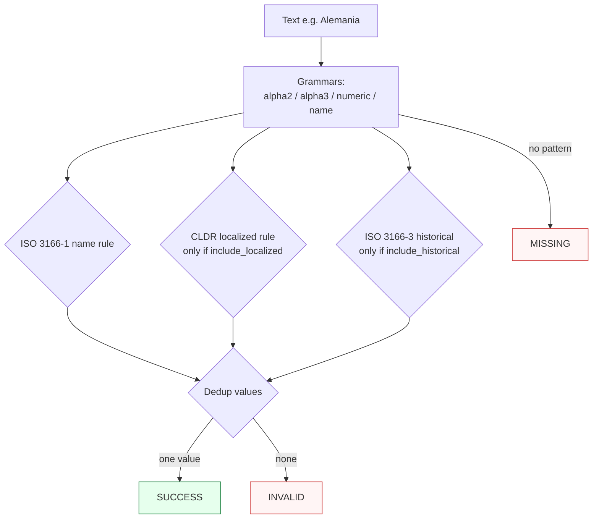

Canonicalizes **one country mention** per call — a code or a name — to a canonical code.

> **In plain language:** give it `"US"`, `"United States"`, `"DE"`, or `"Alemania"` and it hands back the ISO alpha-2 code if a real spec says that name means that country. Multilingual and historical names are off by default so results are predictable; turn them on when you need them.

***

## What it recognizes — and what it does not

| Recognizes (current release — growing) | Does not recognize |
|----------------------------------------|--------------------|
| ISO 3166-1 alpha-2 (`US`, `DE`), alpha-3 (`USA`), numeric (`840`) | Ad-hoc abbreviations without a spec (`'Murica`) |
| Country names in English (`United States`, `Germany`) | Regions or subdivisions (`California`, `Bavaria`) — countries only |
| CLDR localized names (`Alemania` → `DE`) — only when `include_localized=True` | Localized names when the flag is off — recognized but `INVALID` (no authority claims them) |
| Historical/deprecated names (`Burma`) — only when `include_historical=True`, via ISO 3166-3 | Historical names when the flag is off — `INVALID` |

***

## Canonical output

Default `output_format` is `"alpha2"`.

| `output_format` | Renders | Example for United States |
|-----------------|---------|---------------------------|
| *(default)* `alpha2` / `None` / `"default"` | ISO 3166-1 alpha-2 | `US` |
| `alpha3` | ISO 3166-1 alpha-3 | `USA` |
| `numeric` | ISO 3166-1 numeric | `840` |
| `name` | English short name | `United States` |

Any other value raises `ContractError`.

```python
from paxman.capabilities import Country
import paxman

paxman.register_all_shipped()
paxman.canonicalize(
    "United States", Country.create_contract()
).canonicalized_value  # "US"
paxman.canonicalize(
    "United States", Country.create_contract(output_format="alpha3")
).canonicalized_value  # "USA"
paxman.canonicalize(
    "United States", Country.create_contract(output_format="numeric")
).canonicalized_value  # "840"
paxman.canonicalize(
    "US", Country.create_contract(output_format="name")
).canonicalized_value  # "United States"
```

***

## Contract

```python
contract = Country.create_contract(
    include_localized=False,  # bool, default False — CLDR multilingual names
    include_historical=False,  # bool, default False — ISO 3166-3 deprecated names
    output_format=None,  # "alpha2" (default), "alpha3", "numeric", "name"
    # plus every common field: excluded_rules / pinned_rules / year / extra_grammars
)
```

* `include_localized` gates the CLDR localized-name rule; when `False`, `Alemania` is recognized but **no rule validates it** → `INVALID`.
* `include_historical` gates ISO 3166-3; a historical name that validates returns the **historical entity's own former code** (e.g. `Burma` → `BU`), not a successor state's code.

Historical names can also be viewed as excluding the current ISO 3166-1 name rules and pinning to the 3166-3 rule — the contract controls which specs are consulted (see [Contracts](../concepts/contracts/)).

***

## Statuses

| Input | Contract | Status | Value / why |
|-------|----------|--------|-------------|
| `US` | defaults | `SUCCESS` | `"US"` |
| `United States` | defaults | `SUCCESS` | name → `"US"` |
| `Alemania` | defaults | `INVALID` | recognized (name grammar) but no rule accepts it without `include_localized` |
| `Alemania` | `include_localized=True` | `SUCCESS` | → `"DE"` with CLDR provenance |
| `Burma` | defaults | `INVALID` | needs `include_historical` |
| `Burma` | `include_historical=True` | `SUCCESS` | → `"BU"` (historical entity's own code) |
| `ZZ` | any | `INVALID` or `MISSING` | no spec claims it |
| `hello world` | any | `MISSING` | no country pattern |
| `US and DE` (two different mentions) | any | raises `MultipleMentionsError` | split first |



***

## Notebook snippet — normalize a mixed column

```python
import paxman
from paxman.capabilities import Country
from paxman.core.domain import Resolution
from paxman.core.errors import CapabilityError, ContractError, MultipleMentionsError

paxman.register_all_shipped()
contract = Country.create_contract(include_localized=True)
contract_hist = Country.create_contract(include_localized=True, include_historical=True)

rows = ["US", "United States", "Alemania", "Burma", "not a country", "US and DE"]

for text in rows:
    for label, c in [("default+localized", contract), ("+historical", contract_hist)]:
        try:
            r = paxman.canonicalize(text, c)
        except (MultipleMentionsError, CapabilityError, ContractError) as e:
            print(f"{text!r:20} [{label}] → exception {type(e).__name__}: {e}")
            continue
        val = r.canonicalized_value if r.status == Resolution.SUCCESS else "—"
        prov = r.candidates[0].provenance[0].specification_name if r.candidates else "—"
        print(f"{text!r:20} [{label:18}] → {r.status.value:10} {val!r:8} ({prov})")
```

***

## Provenance

* **ISO 3166-1** (alpha-2 / alpha-3 / numeric / English names)
* **ISO 3166-3** (historical, when enabled)
* **CLDR** (Unicode localized names, when enabled)

Each candidate's `validation_rule` carries the section, and `candidate.provenance[0].publication_year` the year.

See also: [Execution Result](../concepts/execution-result/), [Provenance](../concepts/provenance/), [Segmentation](https://github.com/nexusnv/paxman-python/blob/main/docs/recipes/segmentation.md).
