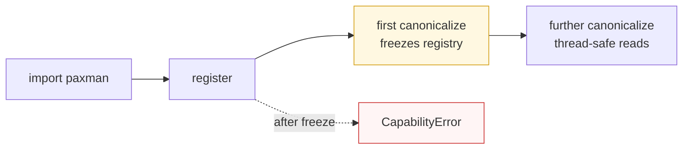

This page is the concise reference for the public Python surface you import. For the mental model behind these types, see [Concepts](concepts/).

---

## Installation and imports

```python
import paxman
from paxman.capabilities import (
    Country,
    Currency,
    Date,
    Email,
    IP,
    ISBN,
    Money,
    Phone,
    SIUnit,
    URL,
)
from paxman.core.domain import Resolution
from paxman.core.errors import (
    PaxmanError,
    CapabilityError,
    ContractError,
    MultipleMentionsError,
    RecognitionError,
    ValidationError,
)
```

Paxman has no runtime dependencies. `import paxman` is side-effect free — nothing runs until you register and call `canonicalize()`.

---

## Registration

Registration tells the engine which capabilities exist. It must complete from **one thread before the first `canonicalize()` call**; afterwards the registry freezes and reads are safe from any thread.



| Function | Signature | What it does |
|----------|-----------|--------------|
| `paxman.register_all_shipped()` | `() -> None` | Registers every capability shipped in this release. Idempotent by name. |
| `paxman.register_capability(cap)` | `(cap: Capability) -> None` | Registers one capability instance, e.g. `Email()`. Fails if the name already exists or the registry is frozen. |
| `paxman.register_grammar(name, cls)` | `(capability_name: str, grammar_cls: type[Grammar]) -> None` | Registers a community grammar (see [Extending](extending/)). Must happen before the first call. |
| `paxman.register_rule(name, cls)` | `(capability_name: str, rule_cls: type[Rule]) -> None` | Registers a community rule. Must happen before the first call. |

```python
# Quick exploration — everything
paxman.register_all_shipped()

# Explicit — only what you depend on
paxman.register_capability(Email())
paxman.register_capability(Date())
```

---

## `paxman.canonicalize()`

The sole entry point.

```python
def canonicalize(text: str, contract: CapabilityContract) -> ExecutionResult
```

| Parameter | Type | Description |
|-----------|------|-------------|
| `text` | `str` | Raw input. One presumed mention per call (see [Segmentation](https://github.com/nexusnv/paxman-python/blob/main/docs/recipes/segmentation.md)). |
| `contract` | `CapabilityContract` | Created via `SomeCapability.create_contract(...)`. Carries `capability_name` so no separate name argument is needed. |

**Returns** `ExecutionResult` — always, for every domain outcome including missing or invalid input. Domain outcomes are statuses, not exceptions.

**Raises**

| Exception | Cause |
|-----------|-------|
| `CapabilityError` | No capability matches `contract.capability_name`, duplicate name, or registry frozen |
| `ContractError` | Malformed contract (unknown `pinned_rules`, unknown `output_format`, unknown semantics, missing required feature) |
| `MultipleMentionsError` | Two or more non-overlapping mentions resolved to different values — caller must split first |
| `RecognitionError` | Grammar raised or returned a malformed match (`rule`, `original_error`) |
| `ValidationError` | Rule raised inside `matches()`/`normalize()` (`rule`, `original_error`) |

`MISSING` / `INVALID` / `AMBIGUOUS` do **not** raise — they are `ExecutionResult.status` values (see [Execution Result](concepts/execution-result/) and [Candidates & Ambiguity](concepts/candidates-and-ambiguity/)).

---

## `paxman.scan()`

Batch scan — one `ScanContext` substrate pass, per-capability `Mention` records.

```python
def scan(text: str, contracts: Sequence[CapabilityContract]) -> ScanResult
```

| Parameter | Type | Description |
|-----------|------|-------------|
| `text` | `str` | Input text to scan (may contain many mentions). |
| `contracts` | `Sequence[CapabilityContract]` | One contract per capability to scan; each carries its `suppress_common_words` and other flags. |

**Returns** `ScanResult` — per-capability `mentions` dict sharing one substrate.

**Raises**

| Exception | Cause |
|-----------|-------|
| `TypeError` | `text` is not `str` or `contracts` is not a `Sequence` |
| `CapabilityError` | A contract names an unregistered capability |

The scan shares one `ScanContext` (word spans and lazy views) across all contracts, so querying many capabilities costs one substrate build. Suppression (`suppress_common_words`) is honored per-contract: a `Country` contract with `suppress_common_words=True` drops word-bounded hits like `to` → `TO` (Tonga) via `COMMON_WORDS` (67), while the same text scanned with `False` keeps them. For the honest F1 path on prose, `scan()` is the preferred successor to `MultipleMentionsError` on `canonicalize()` — see `docs/user/migration.md` and `docs/recipes/segmentation.md`.

```python
import paxman
from paxman.capabilities.Country import Country
from paxman.core.errors import MultipleMentionsError

paxman.register_all_shipped()
contract = Country.create_contract()

# Prose with embedded values — the new honest path:
try:
    result = paxman.canonicalize("Ship to United States please", contract)
except MultipleMentionsError:
    # scan() shares one ScanContext substrate across all contracts in the batch
    mentions = paxman.scan("Ship to United States please", [contract])
    # mentions.mentions["country"] == [
    #   Mention(span=(5, 7), grammar="alpha2_recognition", notation=...),
    #   Mention(span=(8, 21), grammar="name_recognition", notation=...),
    # ]
    for m in mentions.mentions["country"]:
        print(m.span, m.grammar, m.notation)
```

See [Segmentation](https://github.com/nexusnv/paxman-python/blob/main/docs/recipes/segmentation.md) for when to use `scan()` vs caller-owned split-then-canonicalize.

---

## Contracts — `SomeCapability.create_contract()`

Every capability exposes a **keyword-only** factory. Common parameters come first, capability-specific ones after.

```python
contract = Email.create_contract(
    # common — every capability
    excluded_rules=(),  # Sequence[str]
    pinned_rules=None,  # Sequence[str] | None — when not None, only these run
    year=None,  # int | None — only rules with publication_year <= year
    output_format=None,  # str | None — None / "default" / default / offered, else ContractError
    extra_grammars=(),  # tuple[str, ...] — opt-in community grammars
    suppress_common_words=False,  # bool — suppress word-bounded short-code hits in COMMON_WORDS (67)
    # capability-specific — varies by capability
    include_obfuscated=False,  # example: Email only
)
```

The contract is a **frozen dataclass** — construct it, pass it, inspect it, but do not mutate it. See [Contracts](concepts/contracts/) for the full common-plus-specific table.

### `output_format` policy (identical for every capability)

- `None`, `"default"`, and the capability's `DEFAULT_OUTPUT_FORMAT` all resolve to the default.
- Any value in `OFFERED_OUTPUT_FORMATS` resolves to itself.
- Anything else raises `ContractError` immediately. Validation never consults `output_format`.

Current defaults and offered alternatives:

| Capability | Default (`DEFAULT_OUTPUT_FORMAT`) | Offered (`OFFERED_OUTPUT_FORMATS`) |
|------------|-----------------------------------|-------------------------------------|
| Country | `alpha2` | `alpha3`, `numeric`, `name` |
| Currency | `code` | *(none — single format)* |
| Date | `ISO` | `US` |
| Email | `email` | *(none)* |
| IP | `ip` | *(none)* |
| ISBN | `isbn13` | `hyphenated` |
| Money | `code_amount` | `compact` |
| Phone | `e164` | `rfc3966`, `national` |
| SI Unit | `symbol` | *(none)* |
| URL | `url` | *(none)* |

> The set of capabilities — and their offered formats — grows over time. Treat this table as the current release, not a closed list.

### Capability-specific flag summary (current release)

| Capability | Flag | Type | Default | Purpose |
|------------|------|------|---------|---------|
| Email | `include_obfuscated` | `bool` | `False` | `user at domain dot com` |
| Email | `include_localhost` | `bool` | `True` | `admin@localhost` |
| Country | `include_localized` | `bool` | `False` | CLDR multilingual names |
| Country | `include_historical` | `bool` | `False` | Deprecated names |
| Currency | `default_currency` | `str \| None` | `None` | Resolve shared bare symbol (`$`) to this alpha-3 code |
| IP | `include_ipv6` | `bool` | `True` | IPv6 |
| ISBN | `include_isbn10` | `bool` | `True` | Legacy ISBN-10 |
| ISBN | `include_range_validation` | `bool` | `False` | Registrant-range provenance |
| Money | `dollar_sign_currency` | `str \| None` | `None` | Resolve bare `$` amount to this alpha-3 code |
| Money | `precision` | `str` | `"strict"` | `strict` / `truncate` / `round` for over-precision amounts |
| Phone | `default_country` | `str \| None` | `None` | Interpret national numbers as if in this alpha-2 country |
| SI Unit | `allow_split_word_prefixes` | `bool` | `False` | `kilo gram` → `kg` |
| SI Unit | `allow_multi_solidus` | `bool` | `False` | `kg/m/s` preserved |
| Date | `two_digit_base_year` | `int \| None` | `None` | Base for 2-digit year expansion |
| common | `suppress_common_words` | `bool` | `False` | suppress word-bounded short-code hits in `COMMON_WORDS` (67) |

Validation: `default_currency` / `dollar_sign_currency` must be uppercase alpha-3; `default_country` must be uppercase alpha-2; `precision` must be one of the three values — otherwise `ContractError` at construction time.

---

## Execution result

```python
@dataclass(frozen=True)
class ExecutionResult:
    status: Resolution  # MISSING | INVALID | SUCCESS | AMBIGUOUS
    canonicalized_value: str | None  # str on SUCCESS, None otherwise
    candidates: tuple[Candidate, ...]  # all validated evidence, deduplicated
    contract: CapabilityContract  # the contract you passed in
    version_stamp: VersionStamp  # .paxman_version
    span: tuple[int, int] | None  # [start, end) of resolved value on SUCCESS, else None
```

```python
@dataclass(frozen=True)
class Candidate:
    value: str
    recognition_rule: str  # grammar name, e.g. "standard_recognition"
    validation_rule: str  # rule name, e.g. "Section 3.4.1-addr-spec"
    span: tuple[int, int] | None  # half-open [start, end) in the input
    provenance: tuple[
        Provenance, ...
    ]  # one or more authority citations (read-only property)


@dataclass(frozen=True)
class Provenance:
    authority: str  # "IETF", "ISO", "BIPM", "WHATWG", "CLDR", ...
    specification_name: str  # "RFC 5322", "ISO 3166-1", ...
    kind: str  # "specification" / "standard" / ...
    reference_url: str
    version: str | None
    lifecycle: str  # "active" / "deprecated" / ...
    publication_year: int


@dataclass(frozen=True)
class VersionStamp:
    paxman_version: str
    recognition_revision: str  # kernel recognition revision (default "0")


class Resolution(Enum):
    MISSING = "missing"
    INVALID = "invalid"
    SUCCESS = "success"
    AMBIGUOUS = "ambiguous"
```

**Reading the result** (see also [Execution Result](concepts/execution-result/)):

```python
from paxman.core.domain import Resolution

if result.status == Resolution.SUCCESS:
    value = result.canonicalized_value  # str, span is set
else:
    # MISSING / INVALID / AMBIGUOUS — no single value, span is None
    # inspect result.candidates and their provenance/spans
    ...
```

`span` semantics: on `SUCCESS` it is the span of the single resolved value; on `AMBIGUOUS` use each `candidate.span`; on `MISSING`/`INVALID` it is `None` and `candidates` is empty.

---

## Errors

All exceptions inherit from `PaxmanError`. See [Errors](concepts/errors/) for handling patterns.

| Exception | Signal type | Typical cause |
|-----------|-------------|---------------|
| `CapabilityError` | setup | Unknown capability, duplicate name, registry already frozen |
| `ContractError` | setup | Bad `pinned_rules`, bad `output_format`, unknown semantics, missing required feature, bad `default_currency`/`default_country`/`precision` |
| `MultipleMentionsError` | usage | Two separate mentions with different values in one call — split first |
| `RecognitionError` | internal bug | Grammar raised or returned a bad span/raw_text. Fields: `rule`, `original_error` (`None` on structural failure) |
| `ValidationError` | internal bug | Rule raised inside `matches()`/`normalize()`. Fields: `rule`, `original_error` |

Statuses vs exceptions: statuses are domain answers returned inside `ExecutionResult`; exceptions mean the call was not valid to attempt. Catch exceptions at setup and at the outer edge of a batch loop; branch on statuses in normal flow.

---

## Quick lookup — choose the right capability

| Kind of text you have | Capability to use | Factory |
|-----------------------|-------------------|---------|
| Email addresses | Email | `Email.create_contract(...)` |
| Dates | Date | `Date.create_contract(...)` |
| Country codes or names | Country | `Country.create_contract(...)` |
| Currency codes / symbols / names (no amount) | Currency | `Currency.create_contract(...)` |
| IP addresses | IP | `IP.create_contract(...)` |
| ISBNs | ISBN | `ISBN.create_contract(...)` |
| Money amounts with currency | Money | `Money.create_contract(...)` |
| Phone numbers | Phone | `Phone.create_contract(...)` |
| SI unit expressions | SI Unit | `SIUnit.create_contract(...)` |
| Absolute URLs / IRIs | URL | `URL.create_contract(...)` |

New capabilities appear in minor releases — check `paxman.capabilities` for the current set. Each per-capability guide under [Capabilities](capabilities/) details its recognized forms, output formats, contract flags, and provenance.
