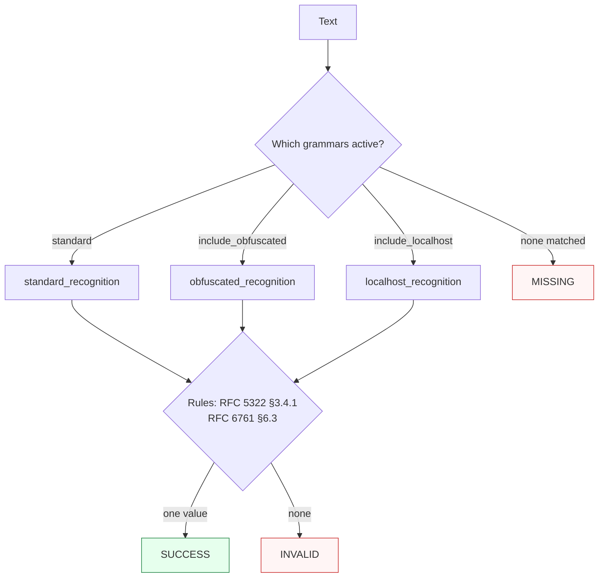

Canonicalizes **one email address** per call — standard, obfuscated, or localhost — to a lowercased `addr-spec`.

> **In plain language:** give it something that looks like an email address and it hands back the single correct lowercase address if a real specification says it is valid, plus a citation of that specification. If it does not look like an email, or no spec accepts it, it tells you so without raising an exception.

---

## What it recognizes — and what it does not

| Recognizes | Does not recognize |
|------------|--------------------|
| Standard `user@example.com` (case-insensitive) | Display-name forms like `Bob <bob@example.com>` — pass the addr-spec part |
| Obfuscated `user at example dot com` (only when `include_obfuscated=True`) | Arbitrary prose that happens to mention a domain without address structure |
| `admin@localhost` (only when `include_localhost=True`, the default) | |

Grammars are syntax-only; whether the match is *valid* is decided by the rules (see [Pipeline](../concepts/pipeline/)).

---

## Canonical output

Default `output_format` is `"email"` — a single format, always a lowercased `addr-spec`.

```python
from paxman.capabilities import Email
import paxman

paxman.register_all_shipped()
contract = Email.create_contract()
paxman.canonicalize(
    "USER@Example.COM", contract
).canonicalized_value  # "user@example.com"
```

There are no offered alternatives for Email — `None`, `"default"`, and `"email"` all resolve to the same rendering; any other value raises `ContractError`.

---

## Contract

```python
contract = Email.create_contract(
    include_obfuscated=False,  # bool, default False — recognize "user at example dot com"
    include_localhost=True,  # bool, default True  — recognize admin@localhost
    # plus every common field: excluded_rules / pinned_rules / year / output_format / extra_grammars
)
```

- Toggling `include_obfuscated` or `include_localhost` changes **which grammars run**. When the relevant grammar is off, the corresponding input is `MISSING` (never seen), not `INVALID`.
- Use `excluded_rules` / `pinned_rules` / `year` to control **which rules validate** — a recognized input that no rule accepts becomes `INVALID`.
- `output_format` is ignored beyond validation; it only shapes the rendered string.

See [Contracts](../concepts/contracts/) and the [API Reference](../api-reference/#contracts--somecapabilitycreate_contract) for the full policy.

---

## Statuses

| Input | Contract tweak | Status | Value / why |
|-------|---------------|--------|-------------|
| `user@example.com` | defaults | `SUCCESS` | `"user@example.com"` |
| `USER@Example.COM` | defaults | `SUCCESS` | lowercased to `"user@example.com"` |
| `user at example dot com` | defaults (`include_obfuscated=False`) | `MISSING` | grammar not active — nothing seen |
| `user at example dot com` | `include_obfuscated=True` | `SUCCESS` | `"user@example.com"` |
| `admin@localhost` | defaults | `SUCCESS` | localhost path via RFC 6761 |
| `admin@localhost` | `include_localhost=False` | `MISSING` | grammar not active |
| `admin@localhost` | `excluded_rules=["Section 6.3-localhost"]` | `INVALID` | recognized but no rule accepts it |
| `@@` | any | `MISSING` | no email pattern at all |
| `alice@example.com and bob@example.org` | any | raises `MultipleMentionsError` | two distinct mentions — split first (see [Segmentation](https://github.com/nexusnv/paxman-python/blob/main/docs/recipes/segmentation.md)) |



---

## Notebook snippet — clean a column

```python
import paxman
from paxman.capabilities import Email
from paxman.core.domain import Resolution

paxman.register_all_shipped()
contract = Email.create_contract(include_obfuscated=True, include_localhost=True)

rows = [
    "user@Example.COM",
    "user at example dot com",
    "admin@localhost",
    "not an email",
    "alice@example.com and bob@example.org",
]

for text in rows:
    try:
        r = paxman.canonicalize(text, contract)
    except Exception as e:
        print(f"{text!r:35} → exception {type(e).__name__}: {e}")
        continue
    tag = r.status.value
    val = r.canonicalized_value if r.status == Resolution.SUCCESS else "—"
    print(f"{text!r:35} → {tag:10} {val!r}")
```

---

## Provenance

Validated values carry provenance from:

- **IETF RFC 5322** — Internet Message Format, Section 3.4.1 `addr-spec`
- **IETF RFC 6761** — Special-Use Domain Names, Section 6.3 (localhost)

Inspect `candidate.provenance` and `candidate.validation_rule` for the exact citation:

```python
for c in result.candidates:
    p = c.provenance[0]
    print(
        c.value,
        "via",
        c.validation_rule,
        f"({p.authority}: {p.specification_name}, {p.publication_year})",
    )
```

---

## Span

On `SUCCESS`, `result.span` is the exact `[start, end)` of the email in the original input — useful for highlighting in UIs or logging. On `MISSING` / `INVALID` it is `None`; on `AMBIGUOUS` (rare for Email) use each `candidate.span`.

See also: [Execution Result](../concepts/execution-result/), [Provenance](../concepts/provenance/), [Segmentation](https://github.com/nexusnv/paxman-python/blob/main/docs/recipes/segmentation.md).
