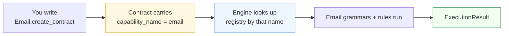
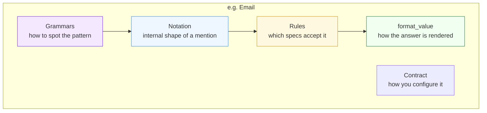

A **capability** is one kind of identifier Paxman knows how to canonicalize. Each capability is a self-contained package — its own patterns, its own specifications, its own rendering — that plugs into the shared pipeline.

You pick a capability by picking a contract (see [Contracts](contracts/)). The two are paired: `Email.create_contract()` selects the Email capability, `Country.create_contract()` selects Country, and so on.

---

## How selection works



1. Each capability has a lowercase name (e.g. `"email"`, `"country"`, `"url"`).
2. Its contract carries that name in `capability_name`.
3. `paxman.canonicalize(text, contract)` looks up the capability by that name in the registry.
4. Only that capability's grammars and rules run — others stay unloaded.

This keeps imports cheap: `from paxman.capabilities import Email` loads only Email, not every capability.

---

## What a capability contains



- **Notation** — internal shape (not part of the public API).
- **Grammars** — recognizers that scan your text and emit span-bearing matches. Pure syntax — no spec judgment.
- **Rules** — validators that check each match against an authoritative spec (RFC, ISO standard, etc.) and produce a canonical value plus provenance.
- **Contract** — the user-facing configuration (see [Contracts](contracts/)).
- **`format_value`** — the sole rendering step, controlled by `output_format` on the contract.

You never interact with notations, grammars, or rules directly — you configure them through the contract and read their outcome in the result.

---

## Capabilities available today

The set below reflects the **current release** and is intentionally not presented as a final count. New capabilities are added in minor releases — always check `paxman.capabilities` or the release notes for the latest list.

| Capability | What it canonicalizes | Key formats it recognizes | Canonical form you get back |
|------------|----------------------|---------------------------|-----------------------------|
| **Country** | Country codes and names | alpha-2, alpha-3, numeric, names; optional localized (CLDR) and historical names | alpha-2 code (`"US"`), or other form via `output_format` |
| **Currency** | Currency identifiers (no amounts) | ISO 4217 alpha-3 codes, CLDR symbols and display names | uppercase alpha-3 code (`"USD"`) |
| **Date** | Calendar dates | ISO 8601, slash-ISO, US, European | ISO `YYYY-MM-DD` by default |
| **Email** | Email addresses | standard, obfuscated (`user at domain dot com`), localhost | lowercased `addr-spec` |
| **IP** | IP addresses | IPv4, IPv6 (optionally disabled) | normalized address (IPv6 per RFC 5952) |
| **ISBN** | ISBN identifiers | ISBN-13 and ISBN-10 (legacy → ISBN-13) | bare 13-digit form or `hyphenated` |
| **Money** | Money amounts with currency | codes, symbols, or names adjacent to an amount | `CODE amount` padded to minor units |
| **Phone** | Phone numbers | E.164, tel-URI, 00-prefix international, NANP national | E.164 (`+15551234567`) or other via `output_format` |
| **SI Unit** | SI unit expressions | symbols, names, product/quotient compounds | canonical symbol form (`"kg"`, `"m/s2"`) |
| **URL** | Absolute URIs / IRIs | absolute URIs (WHATWG URL Standard) | WHATWG serialization (lowercased host, etc.) |

> This table is an overview. Each capability's contract documents its specific flags (e.g. `include_localized` for Country, `default_country` for Phone). See [Contracts](contracts/) and the [README](https://github.com/nexusnv/paxman-python#readme) examples for per-capability details; each row is expanded into its own guide under [Capabilities](../capabilities/).

---

## Registering capabilities

Before the first `canonicalize()` call, register:

```python
import paxman
from paxman.capabilities import Email, Country

# Option A — everything shipped in this release
paxman.register_all_shipped()

# Option B — explicit, dependency-clear
paxman.register_capability(Email())
paxman.register_capability(Country())
```

- Registration must complete from **a single thread** before the first call.
- After the first call the registry **freezes** — further `register_*` calls raise `CapabilityError`. Reads from any thread are then safe.

---

## In plain language

Think of a capability like a department that handles one kind of paperwork. The Country department knows passports and country codes; the Email department knows addresses. You hand your paper to the right department by handing it a contract stamped with that department's name. Only that department looks at it. Other departments never see it.

Next: [Contracts →](contracts/) — how to configure what the chosen capability does.
