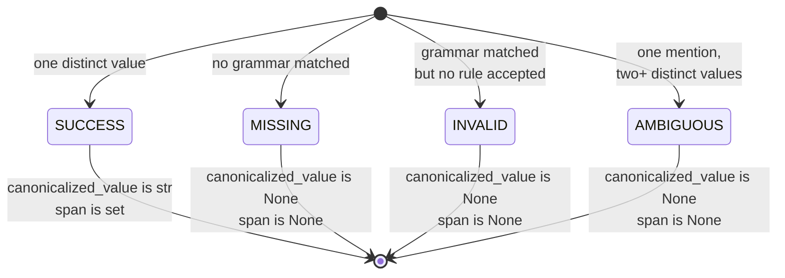

`paxman.canonicalize()` always returns the same object shape — an `ExecutionResult` — whether the answer is a clean success, a missing input, an invalid value, or a genuine ambiguity. Learn to read it once, and you can handle every capability the same way.

---

## The shape

```python
result.status  # Resolution enum
result.canonicalized_value  # str | None
result.candidates  # tuple[Candidate, ...]
result.span  # tuple[int, int] | None
result.version_stamp  # VersionStamp — which Paxman build produced this
result.contract  # the contract you passed in, echoed back
```

For each `Candidate`:

```python
candidate.value  # canonical string this candidate proposes
candidate.recognition_rule  # grammar name that spotted it (e.g. "standard_recognition")
candidate.validation_rule  # rule name that validated it (e.g. "Section 3.4.1-addr-spec")
candidate.span  # (start, end) of this candidate's match in the input, or None
candidate.provenance  # tuple[Provenance, ...] — the spec(s) that vouched for it
```

`version_stamp` is currently `VersionStamp(paxman_version="…")`; it records the installed build so results are auditable. `contract` is echoed back for logging and debugging.

---

## The four statuses



| Status | What it means | `canonicalized_value` | `span` | `candidates` |
|--------|---------------|-----------------------|--------|--------------|
| `MISSING` | Nothing in the input looked like this kind of entity | `None` | `None` | empty |
| `INVALID` | Looked like it, but no authority validated it | `None` | `None` | empty |
| `SUCCESS` | Exactly one canonical value, validated | `str` | `(start, end)` of that value | one or more agreeing candidates |
| `AMBIGUOUS` | One mention, two or more authorities that disagree | `None` | `None` | two+ disagreeing candidates |

`MISSING` vs `INVALID` is not a wording choice — it is a pipeline signal (see [Pipeline](pipeline/)): `MISSING` means recognition found nothing; `INVALID` means recognition found something but validation rejected it. That tells you whether to try a different recognition flag or a different validation rule.

**Python tip — always branch on `status`, not truthiness:**

```python
from paxman.core.domain import Resolution

if result.status == Resolution.SUCCESS:
    use(result.canonicalized_value)  # str
elif result.status == Resolution.MISSING:
    # input does not contain this entity — skip or report
    ...
elif result.status == Resolution.INVALID:
    # looks like the entity but malformed — flag for review
    ...
elif result.status == Resolution.AMBIGUOUS:
    # one mention, conflicting specs — narrow contract or ask user
    inspect(result.candidates)
```

`canonicalized_value` is `None` for every non-`SUCCESS` case by construction — check `status`, not whether the value is truthy.

---

## `span` — where the answer sat

`span` is a half-open `[start, end)` character range into the original text you passed to `canonicalize()`. It obeys `len(raw_text) == end - start`.

```python
import paxman
from paxman.capabilities import Email

paxman.register_all_shipped()
contract = Email.create_contract()
result = paxman.canonicalize("Contact user@Example.com for info", contract)

print(result.canonicalized_value)  # "user@example.com"
print(result.span)  # (8, 24)
print("Contact user@Example.com for info"[8:24])  # "user@Example.com"
```

- On `SUCCESS`, `result.span` is the resolved span selected for the single canonical value — inspect each `candidate.span` when you need all evidence locations.
- On `MISSING`, `INVALID`, and `AMBIGUOUS`, `result.span` is `None` — there is no single resolved mention to point to. For `AMBIGUOUS`, locate each competing mention via `candidate.span` on the individual candidates.

This makes highlighting in UIs, logging, and downstream span-aware processing straightforward.

---

## `candidates` — the full evidence

`candidates` holds every validated `(value, recognition_rule, validation_rule, provenance, span)` tuple the pipeline produced, after deduplication by `(value, recognition_rule, validation_rule)`.

- On `SUCCESS` with one agreeing value, `candidates` may still contain **multiple entries** that converged on that same string via different grammars or specs. That convergence is useful: it shows the answer is robust across rule/authorities.
- On `AMBIGUOUS`, `candidates` shows the disagreement — two or more distinct `value`s with their respective specs.
- On `MISSING` / `INVALID`, `candidates` is empty.

```python
for c in result.candidates:
    prov = c.provenance[0]
    print(
        f"{c.value!r:20} via {c.validation_rule}  "
        f"({prov.authority}: {prov.specification_name})  "
        f"span={c.span}"
    )
```

---

## Notebook-friendly pattern

```python
import paxman
from paxman.capabilities import Country
from paxman.core.domain import Resolution

paxman.register_all_shipped()
contract = Country.create_contract(include_localized=True)

rows = ["United States", "Alemania", "not a country", "01/02/2026"]

for text in rows:
    # Use the capability that matches the column — example uses Country for the first three,
    # so "01/02/2026" will be MISSING here (it contains no country pattern).
    r = paxman.canonicalize(text, contract)
    tag = r.status.value
    val = r.canonicalized_value if r.status == Resolution.SUCCESS else "—"
    print(f"{text!r:20} {tag:10} {val!r:15} span={r.span}")
```

Check `status` first, use `canonicalized_value` only on `SUCCESS`, and fall back to `candidates` or `span` when you need to explain or highlight the outcome.

---

## In plain language

The execution result is like a lab report. It says *what the verdict was* (SUCCESS/MISSING/INVALID/AMBIGUOUS), *what the cleaned-up value is if there is one*, *where in the original text it was found*, and *which rulebooks were consulted*. You always get the same report format — only the verdict changes.

Next: [Provenance →](provenance/) — who vouches for the answer and how to cite it.
