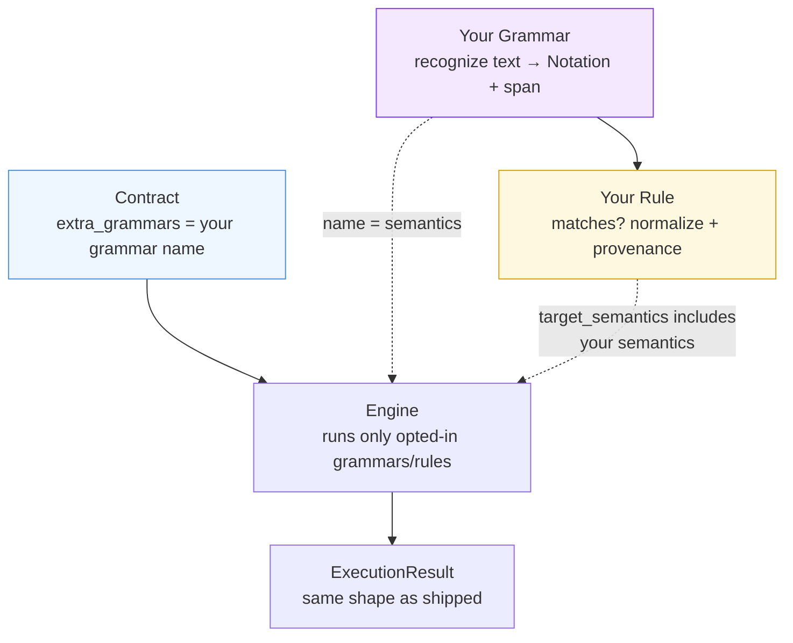
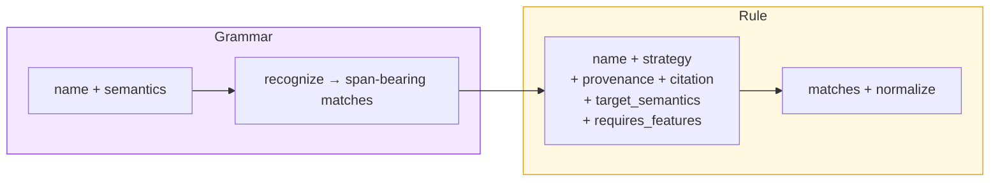

Paxman ships with capabilities that already cover their domain, but every capability is **closed for modification yet open for extension**: you can add new recognition and validation without forking the library. A new grammar finds a new form; a new rule says which spec accepts it.

> **In plain language:** if Paxman handles `2024-01-01` but your data also contains `2024.01.01`, you teach it to spot the dot form and which spec says that dot form is valid — without changing Paxman's own papers.

---

## When to extend vs when not to

| Extend | Don't extend — use a contract flag instead |
|--------|---------------------------------------------|
| Your data has a **new syntactic form** not yet recognized (e.g. `YYYY.MM.DD` for Date) | An existing form is off by default — turn it on (e.g. `include_localized` for Country, `include_obfuscated` for Email) |
| A **different authority** should validate an already-recognized form | Exclude or pin `pinned_rules` to the authority you want |

If a flag already exists for your case, prefer it — extension is for genuinely new shapes or specs.

---

## The seam in one diagram



---

## Minimal example — dot dates for the Date capability

Suppose your pipeline sees `2024.01.01` alongside the shipped ISO forms. The shipped Date capability does not include it, so it comes back `MISSING`. You add a grammar + rule and opt a contract in.

```python
import re
from datetime import datetime

import paxman
from paxman.capabilities import Date
from paxman.capabilities.Date.notation import DateNotation
from paxman.core.contract import Contract
from paxman.core.domain import Grammar, Provenance, RecognitionMatch, Rule, RuleStrategy

# 1. Register the shipped capability you are extending — before the first call
paxman.register_capability(Date())


# 2. Grammar — pure syntax, span-bearing, no spec judgment
class DotDateGrammar(Grammar[DateNotation]):
    name = "dot_date_recognition"
    semantics = "dot_date_recognition"
    _PATTERN = re.compile(r"\b(\d{4})\.(\d{2})\.(\d{2})\b")

    def recognize(self, text: str) -> list[RecognitionMatch[DateNotation]]:
        return [
            RecognitionMatch(
                notation=DateNotation(N1=m.group(1), N2=m.group(2), N3=m.group(3)),
                start=m.start(),
                end=m.end(),
                raw_text=m.group(0),
            )
            for m in self._PATTERN.finditer(text)
        ]


# 3. Rule — validation + canonicalization + provenance
class DotDateRule(Rule[DateNotation]):
    name = "dot_date_rule"
    strategy = RuleStrategy.PARSER
    provenance = Provenance(
        authority="ISO",
        specification_name="ISO 8601",
        kind="specification",
        reference_url="https://www.iso.org/standard/70907.html",
        version="2019",
        lifecycle="active",
        publication_year=2019,
    )
    citation = "Section 4.3.1 (calendar date)"
    target_semantics = frozenset({"dot_date_recognition"})
    requires_features = frozenset()  # no contract flag needed for this rule

    def matches(self, notation: DateNotation, contract: Contract) -> bool:
        try:
            datetime(int(notation.N1), int(notation.N2), int(notation.N3))
            return True
        except ValueError:
            return False

    def normalize(self, notation: DateNotation, contract: Contract) -> str:
        return f"{int(notation.N1):04d}-{int(notation.N2):02d}-{int(notation.N3):02d}"


# 4. Register — also before the first call
paxman.register_grammar("date", DotDateGrammar)
paxman.register_rule("date", DotDateRule)

# 5. Opt in — every community grammar/rule is opt-in via the contract
contract = Date.create_contract(extra_grammars=("dot_date_recognition",))
result = paxman.canonicalize("2024.01.01", contract)
print(result.canonicalized_value)  # "2024-01-01"
```

That is the full lifecycle: **register before the first call** → **opt in via `extra_grammars`**. Without the opt-in, shipped behavior is unchanged; with it, the same `canonicalize()` seam returns the same `ExecutionResult` shape, now including your evidence.

---

## Rules of the seam

### Register before the first call — the registries freeze

```python
paxman.register_capability(Date())
paxman.register_grammar("date", DotDateGrammar)
paxman.register_rule("date", DotDateRule)

# First call freezes capability + extension registries together
contract = Date.create_contract(extra_grammars=("dot_date_recognition",))
paxman.canonicalize("2024.01.01", contract)

# Anything after the freeze raises CapabilityError
paxman.register_grammar("date", AnotherGrammar)  # error
```

Place all `register_*` calls in your application startup or notebook setup cell, before any `canonicalize()`.

### Opt-in only — nothing runs unless named

A community grammar runs **only** when named in `contract.extra_grammars`. A community rule runs **only** when the contract's `extra_grammars` resolve to one of its `target_semantics`. This keeps shipped behavior deterministic per contract — an unaware contract never sees community logic, and an aware contract sees exactly what it opted into.

```python
import paxman

# Dormant contract — dot dates not opted in, shipped behavior only
paxman.canonicalize("2024-01-01", Date.create_contract()).canonicalized_value
# "2024-01-01"

# Opted-in contract — dot dates participate
paxman.canonicalize(
    "2024.01.01", Date.create_contract(extra_grammars=("dot_date_recognition",))
).canonicalized_value
# "2024-01-01"
```

### Unknown names are silent for grammars, fail-fast for rules

- An unknown grammar name in `extra_grammars` is silently skipped for grammar activation — the contract still runs identically (deterministically); the name is kept as the semantics key for rule activation.
- A name that matches no grammar but does match a known semantics id still activates that semantics's rules; a rule that was opted in via an id no grammar claims fails fast with `ContractError`. A rule that was never opted in stays dormant regardless.

This errs on the side of predictable results over noisy warnings for grammar names, while keeping rule activation explicit.

### Names must be unique

A community grammar whose `name` collides with a shipped grammar name for that capability fails fast with `CapabilityError` at composition time.

### How `target_semantics` and `requires_features` interact

- `target_semantics` — which grammars' notations this rule judges (non-empty `frozenset[str]`). A rule only meets the recognitions from those grammars.
- `requires_features` — which contract flags must be `True` for this rule to run (e.g. `frozenset({"include_localized"})`). A rule only runs in addition to the `extra_grammars` opt-in when its required features are present and `True`; otherwise it is dropped and a recognized input that needed it becomes `INVALID`.

```python
class LocalizedCountryRule(Rule[CountryNotation]):
    target_semantics = frozenset({"name_recognition"})
    requires_features = frozenset(
        {"include_localized"}
    )  # only when contract.include_localized is True
```

---

## What grammars and rules must look like

The engine enforces metadata at import time — missing or mistyped fields raise `TypeError` immediately instead of producing wrong results later.

**Grammar** — subclass `Grammar[NotationT]`:

- `name: str` — snake_case, unique per capability.
- `semantics: str` — non-empty; the meaning id the grammar's notations carry. Use a new id for new meaning; reuse an existing capability's semantics id when two grammars share meaning (they then coalesce).
- `recognize(self, text: str) -> list[RecognitionMatch[NotationT]]` — span-bearing `[start, end)` + `raw_text`; never bare notations.

**Rule** — subclass `Rule[NotationT]`:

- `name` — e.g. `"Section 4.3.1-calendar-date"`, unique per capability.
- `strategy` — `RuleStrategy.REGEX` / `LOOKUP_TABLE` / `PARSER`.
- `provenance` — `Provenance(...)` — the authority citation.
- `citation` — e.g. `"Section 4.3.1 (calendar date)"`.
- `target_semantics: frozenset[str]` — non-empty.
- `requires_features: frozenset[str]` — may be empty.
- `matches(self, notation, contract) -> bool` and `normalize(self, notation, contract) -> str`.



---

## Practical recipe — keeping it tidy

```python
# app/startup.py — run once at startup, before any canonicalize()
import paxman
from paxman.capabilities import Date
from my_extension.dot_date import DotDateGrammar, DotDateRule

paxman.register_capability(Date())
paxman.register_grammar("date", DotDateGrammar)
paxman.register_rule("date", DotDateRule)

# app/processing.py — per call, opt in via contract
from paxman.capabilities import Date

contract_shipped = Date.create_contract()  # no dot dates
contract_with_dot = Date.create_contract(
    extra_grammars=("dot_date_recognition",)
)  # with dot dates

# Notebook — run the startup cell once, then create contracts per cell as above
```

For multi-entity text, combine this with the [Segmentation Recipe](https://github.com/nexusnv/paxman-python/blob/main/docs/recipes/segmentation.md) — segment first, then `canonicalize()` each piece with the opted-in contract.

---

## See also

- [Contracts](concepts/contracts/) — `extra_grammars` on every contract
- [API Reference](api-reference/#registration) — `register_grammar` / `register_rule`
- [Pipeline](concepts/pipeline/) — where grammars and rules run
- [Errors](concepts/errors/) — `CapabilityError` / `ContractError` for bad names or late registration
