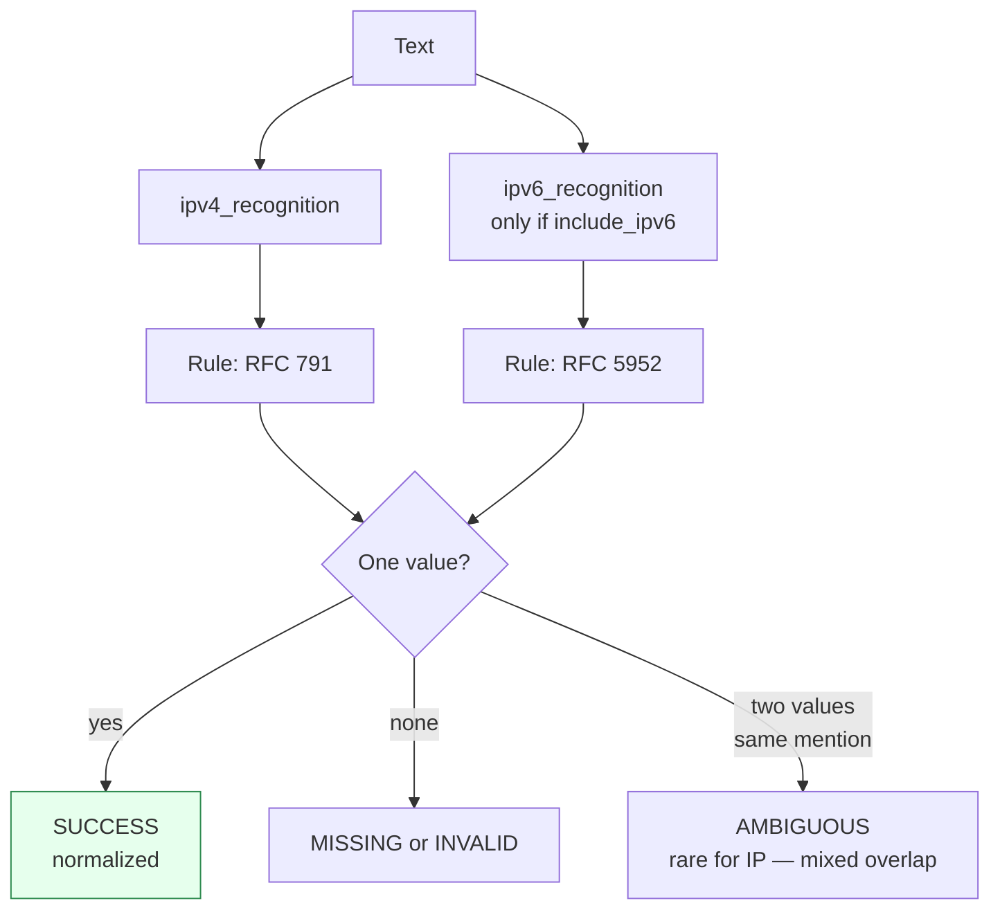

Canonicalizes **one IP address** per call to its normalized textual form.

> **In plain language:** give it `"192.168.1.1"` or `"2001:0db8:0000:0000:0000:0000:0000:0001"` and it hands back the normalized address if a spec says it is valid. IPv6 canonicalization follows RFC 5952 so the same address always looks the same. IPv6 mixed addresses with an embedded IPv4 (`::ffff:192.0.2.1`) and IPv4 leading-zero forms (`010.020.030.040` → `10.20.30.40`) are also handled.

---

## What it recognizes — and what it does not

| Recognizes | Does not recognize |
|------------|--------------------|
| IPv4 dotted-decimal (`192.168.1.1`), including leading-zero (`010.020.030.040` → `10.20.30.40`) | CIDR notation (`192.168.1.0/24`) — address only |
| IPv6 — full (`2001:0db8:85a3:0000:0000:8a2e:0370:7334`), compressed (`2001:db8::1`), loopback (`::1`) | Hostnames — use [URL](url/) |
| IPv6 mixed with embedded IPv4 (`::ffff:192.0.2.1`, `64:ff9b::192.0.2.1`, `::192.0.2.1`) per RFC 4291 §2.2 / RFC 5952 §5 | Zone identifiers (`fe80::1%eth0`) — `MISSING` (grammar does not consume `%`) |

> **Overlap note:** the trailing IPv4 inside a mixed address (`::ffff:192.0.2.1` contains `192.0.2.1`) is also emitted by the IPv4 grammar via its `\b` boundary. The engine keeps both candidates (cross-grammar containment dedup is not performed) so `canonicalize("::ffff:192.0.2.1")` yields `AMBIGUOUS ['::ffff:192.0.2.1','192.0.2.1']` — prefer the IPv6 value. See issue #113 B1. Triple-colon over-matches like `:::1` are intentionally broad and sanitized to `INVALID` (B2 deferred).

---

## Canonical output

Single format — the normalized address. IPv4 strips leading zeros per octet; IPv6 is rendered per **RFC 5952** (lowercase hex, `::` for the longest zero run, no leading zeros). Mixed addresses are normalized the same way (e.g. `::ffff:192.0.2.1` stays `::ffff:192.0.2.1`, while `64:ff9b::192.0.2.1` with a non-trivial embedded IPv4 may render the last 32 bits as hex per `ipaddress.IPv6Address`).

| `output_format` | Renders |
|-----------------|---------|
| *(only)* `ip` / `None` / `"default"` | normalized address string |

```python
from paxman.capabilities import IP
import paxman

paxman.register_all_shipped()
paxman.canonicalize(
    "192.168.1.1", IP.create_contract()
).canonicalized_value  # "192.168.1.1"
paxman.canonicalize(
    "2001:0db8:0000:0000:0000:0000:0000:0001", IP.create_contract()
).canonicalized_value  # "2001:db8::1"
paxman.canonicalize(
    "010.020.030.040", IP.create_contract()
).canonicalized_value  # "10.20.30.40"  (leading zeros stripped)
paxman.canonicalize(
    "::ffff:192.0.2.1", IP.create_contract()
).candidates[0].value  # "::ffff:192.0.2.1" (mixed, see overlap note)
```

---

## Contract

```python
contract = IP.create_contract(
    include_ipv6=True,  # bool, default True — recognize IPv6
    output_format=None,  # "ip" (only format)
    # plus every common field: excluded_rules / pinned_rules / year / extra_grammars
)
```

- With `include_ipv6=True` (the default) both grammars run. With `False`, only `ipv4_recognition` runs — an IPv6 address is then `MISSING` (never seen), not `INVALID`.

```python
paxman.canonicalize(
    "2001:db8::1", IP.create_contract(include_ipv6=False)
).status.value  # "missing"
paxman.canonicalize(
    "2001:db8::1", IP.create_contract()
).canonicalized_value  # "2001:db8::1"
```

---

## Statuses

| Input | Contract | Status | Why |
|-------|----------|--------|-----|
| `192.168.1.1` | any | `SUCCESS` | normalized IPv4 |
| `010.020.030.040` | any | `SUCCESS` | → `10.20.30.40` (leading zeros stripped, RFC 791 / RFC 1123) |
| `2001:db8::1` | defaults | `SUCCESS` | → `2001:db8::1` (RFC 5952) |
| `::ffff:192.0.2.1` | defaults | `AMBIGUOUS` | `['::ffff:192.0.2.1','192.0.2.1']` — overlapping IPv4 candidate (see note) |
| `2001:db8::1` | `include_ipv6=False` | `MISSING` | IPv6 grammar not active |
| `999.999.999.999` | any | `INVALID` | recognized shape but no spec accepts it |
| `:::1` | any | `INVALID` | over-broad syntax recognized, rejected by RFC 5952 |
| `hello` | any | `MISSING` | no IP pattern |
| `10.0.0.1 and 10.0.0.2` (two distinct values) | any | raises `MultipleMentionsError` | split first |



---

## Notebook snippet

```python
import paxman
from paxman.capabilities import IP
from paxman.core.domain import Resolution

paxman.register_all_shipped()
contract = IP.create_contract()

for text in [
    "192.168.1.1",
    "010.020.030.040",
    "2001:0db8:0000:0000:0000:0000:0000:0001",
    "::ffff:192.0.2.1",
    "999.999.999.999",
    "hello",
]:
    r = paxman.canonicalize(text, contract)
    print(f"{text!r:45} → {r.status.value:10} {r.canonicalized_value!r} candidates={[c.value for c in r.candidates]!r}")
```

---

## Provenance

- **RFC 791** — IPv4 address validation (dotted-decimal clarified by RFC 1123 §2.1).
- **RFC 4291 §2.2** — IPv6 addressing architecture, including the mixed embedded-IPv4 `LS32` form.
- **RFC 5952** — IPv6 text representation and canonical compression.

See also: [URL](url/), [Execution Result](../concepts/execution-result/), [Segmentation](https://github.com/nexusnv/paxman-python/blob/main/docs/recipes/segmentation.md).
