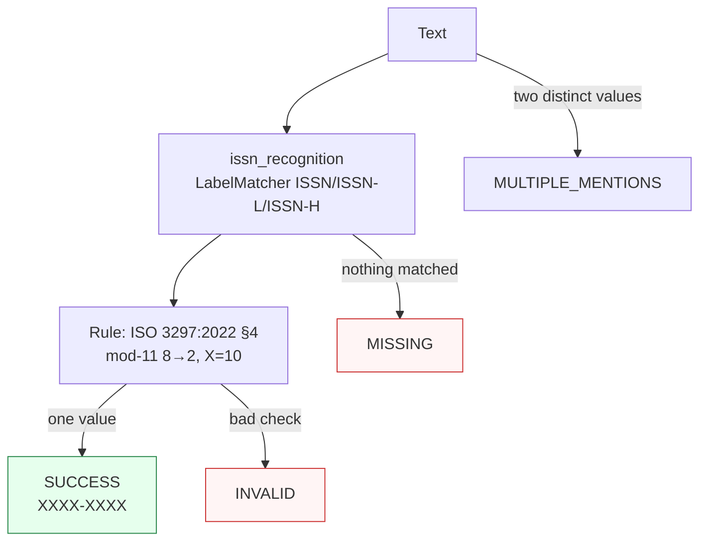

Canonicalizes **one ISSN identifier** per call to its hyphenated canonical form with mod-11 check-digit validation.

> **In plain language:** give it `"0317-8471"` or `"03178471"` or `"ISSN 0317-8471"` and it hands back `0317-8471` if the check digit is correct (`X` = 10). The hyphen is presentation — the underlying value is always hyphenated unless you ask for compact.

---

## What it recognizes — and what it does not

| Recognizes | Does not recognize |
|------------|--------------------|
| Bare hyphenated `0317-8471`, `0378-5955`, `1050-124X` | ISSN with wrong check digit — recognized but `INVALID` (e.g. `0378-5954` → `INVALID`) |
| Bare compact `03178471`, `1050124X` (no hyphen) | Space at hyphen position `0317 8471` → `MISSING` (strict `-?` only) |
| Label `ISSN 0317-8471`, `ISSN: 0317-8471`, `ISSN-L 0264-2875`, `ISSN-H 1365-201X` (case-insensitive, `x`→`X` folded) | Unicode dash `0317–8471` (en-dash U+2013 / em-dash) → `MISSING` (hyphen-minus U+002D only) |
| Glued `ISSN03178471` (no separator after label, `glued allow`) | `eISSN 0317-8471` / `pISSN 0378-5955` without hyphen → `MISSING` (informal prefixes not in ISSN Manual; hyphenated `e-ISSN 0317-8471` incidentally matches `ISSN 0317-8471` via substring) |
| Embedded in prose `see ISSN 0317-8471 (print)` | `1234 - 5679` (space-hyphen-space) → `MISSING` |
| `urn:issn:0317-8471` incidentally as `issn:0317-8471` (span excludes `urn:`) | `123456789` (9 digits) → `MISSING` via `BoundarySpec.WORD` |

> **Strict hyphen:** `-\?` at canonical position 4 only. Tolerant `1234 - 5679` (space around hyphen) and `1234 5679` are `MISSING` unless a `Pre` normalizer is added (memo §13#5, Oracle fix 3). **Hyphen-digit continuation** `0317-8471-2` is `MISSING` (trailing `(?![-]\d)` blocks prefix, WORD alone would have allowed it). **Label separator** is `[\s:-]*` with `glued allow` (vs IBAN `reject`); `ISSN03178471` matches, `IBANDE89...` is `MISSING` per ADR §9.7.

---

## Canonical output

Default `output_format` is `"hyphenated"` (`XXXX-XXXX`). Mirrors ISBN's presentational-only `output_format` invariant: rules never read it.

| `output_format` | Renders | Example for `0317-8471` |
|-----------------|---------|--------------------------|
| *(default)* `hyphenated` / `None` / `"default"` | hyphenated canonical | `0317-8471` |
| `compact` | bare 8 digits | `03178471` |
| `urn` | URN namespace | `urn:issn:0317-8471` |

`compact` strips hyphen, `urn` wraps `urn:issn:` (lowercase namespace, hyphen preserved, `X` uppercase). Formatting adds no provenance; the validating rule remains `Section 4-issn-check-digit` (`ISO 3297:2022`).

```python
from paxman.capabilities import ISSN
import paxman

paxman.register_all_shipped()
paxman.canonicalize("0317-8471", ISSN.create_contract()).canonicalized_value  # "0317-8471"
paxman.canonicalize("03178471", ISSN.create_contract()).canonicalized_value  # "0317-8471" (bare → hyphenated)
paxman.canonicalize("ISSN 0317-8471", ISSN.create_contract()).canonicalized_value  # "0317-8471"
paxman.canonicalize("0317-8471", ISSN.create_contract(output_format="compact")).canonicalized_value  # "03178471"
paxman.canonicalize("0317-8471", ISSN.create_contract(output_format="urn")).canonicalized_value  # "urn:issn:0317-8471"
paxman.canonicalize("1050-124x", ISSN.create_contract()).canonicalized_value  # "1050-124X" (x→X)
```

---

## Contract

```python
contract = ISSN.create_contract(
    output_format=None,  # "hyphenated" (default), "compact", "urn"
    # plus every common field: excluded_rules / pinned_rules / year / extra_grammars / suppress_common_words
)
```

- No `include_*` flags (single always-active grammar, `active_grammars=None` → engine runs every `get_grammars()` grammar in order). Other caps use `include_*` to gate grammars; ISSN does not.
- `year` filters rules by `publication_year` (`ISO 3297:2022` → 2022, so `year=2021` → `INVALID` per temporal filtering, even though check digit stable since earlier editions).
- `output_format` resolves via `CapabilityContract.__post_init__` (`None`/`"default"`/`"hyphenated"` → hyphenated, `ContractError` otherwise).

---

## Statuses

| Input | Contract | Status | Why |
|-------|----------|--------|-----|
| `0317-8471` | defaults | `SUCCESS` | bare hyphenated, mod-11 valid |
| `03178471` | defaults | `SUCCESS` | compact → hyphenated `0317-8471` |
| `ISSN 0317-8471` | defaults | `SUCCESS` | label with span (0,14) |
| `ISSN-L 0264-2875` | defaults | `SUCCESS` | linking ISSN, same check |
| `1050-124X` / `1050-124x` | defaults | `SUCCESS` | `X=10` (folded) |
| `0378-5954` (bad check) | any | `INVALID` | recognized but check fails (`5` expected) |
| `12X4-5679` / `X234-5679` | any | `MISSING` | `\d{4}` guard filters mid-X; rule also rejects |
| `0317-8471-2` | any | `MISSING` | hyphen-digit continuation blocked by `(?![-]\d)` |
| `call me at noon` | any | `MISSING` | no ISSN pattern |
| Two distinct ISSNs `0317-8471 0378-5955` | any | raises `MultipleMentionsError` | split first |



---

## Notebook snippet

```python
import paxman
from paxman.capabilities import ISSN
from paxman.core.domain import Resolution

paxman.register_all_shipped()
c = ISSN.create_contract()
c_compact = ISSN.create_contract(output_format="compact")
c_urn = ISSN.create_contract(output_format="urn")

for text in ["0317-8471", "03178471", "ISSN 0317-8471", "1050-124x", "0378-5954", "hello"]:
    r = paxman.canonicalize(text, c)
    rc = paxman.canonicalize(text, c_compact)
    ru = paxman.canonicalize(text, c_urn)
    print(f"{text!r:20} → {r.status.value:10} {r.canonicalized_value!r:15} compact={rc.canonicalized_value!r:10} urn={ru.canonicalized_value!r}")
```

---

## Provenance

- **ISO 3297:2022** (7th edition 2022-06, ISSN International Centre, Paris) — structure (8 chars, 7 digits + `X`) and mod-11 check digit (weights 8→2, `X`=10, `11→0`). Catalogue at `https://www.iso.org/standard/84536.html`.

Deferred per research memo: **ISSN Manual** (May 2025) display detail, **RFC 3044** / `draft-ietf-urnbis-rfc3044bis` / **IANA `urn:issn`** (URN namespace — `urn:issn:` wrapping is presentation only, no validation rule in v1), **ISSN Register** (`portal.issn.org`) linking/cluster `ISSN-L` (relational, not lexical — requires registry lookup, same lexical shape).

See also: [Execution Result](../concepts/execution-result/), [Provenance](../concepts/provenance/), [Segmentation](https://github.com/nexusnv/paxman-python/blob/main/docs/recipes/segmentation.md).

