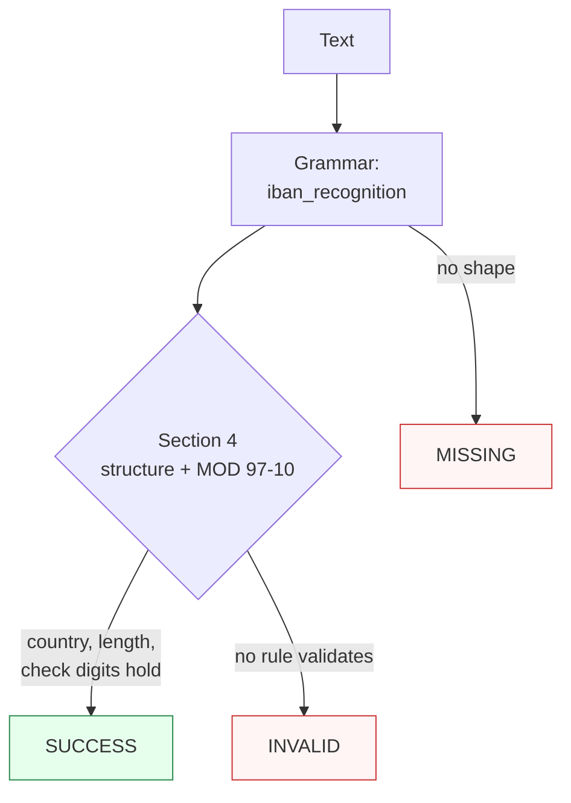

Canonicalizes **one IBAN mention** per call — an electronic contiguous string or paper groups-of-four (with an optional `IBAN` label) — to compact electronic form.

> **In plain language:** give it `DE89370400440532013000`, `DE89 3704 0044 0532 0130 00`, or `IBAN: DE89 3704 0044 0532 0130 00` and it hands back `DE89370400440532013000` when the country code is in the SWIFT IBAN Registry, the per-country fixed length holds, and the MOD 97-10 checksum passes per ISO 13616-1:2020 §4-5 (via ISO/IEC 7064:2003). A bad checksum or an unregistered country is `INVALID`, never a guess; shapes outside the two spellings are `MISSING`.

---

## What it recognizes — and what it does not

| Recognizes | Does not recognize |
|------------|--------------------|
| Electronic contiguous, 15–34 alphanumerics (`DE89370400440532013000`, lowercase folds up) | Hyphen-separated (`DE89-3704-0044-0532-0130-00`) → `MISSING` |
| Paper groups-of-four with single spaces (`DE89 3704 0044 0532 0130 00`, `GB29 NWBK 6016 1331 9268 19`) | Double spaces or tabs (`DE89  3704 ...`, `DE89\t3704 ...`) → `MISSING` |
| Fused uppercase `IBAN` label with separator (`IBAN: DE89 ...`, `IBAN - FR14 ...`, `IBAN DE89370400440532013000`) | Glued label (`IBANDE89370400440532013000`, no separator) → `MISSING` |
| Lowercase `iban:` prefix does not block the core (`iban:gb29nwbk60161331926819` → `GB29NWBK60161331926819`) | Irregular single-space groups (`DE89 37040 04405 32013 000`) → `MISSING` |
| Glued alnum tails are absorbed and rejected downstream (`DE89370400440532013000Y`, `...00n` → `INVALID`) | Prose without an IBAN shape (`not an iban`) → `MISSING` |

---

## Canonical output

Default `output_format` is `"electronic"` (identity — `normalize()` returns the compact string).

| `output_format` | Renders | Example |
|-----------------|---------|---------|
| *(default)* `electronic` / `None` / `"default"` | Compact, no spaces | `DE89370400440532013000` |
| `paper` | Space-separated quartets (encoding — MOD 97-10 runs on the stripped form, so the rendering re-enters exactly) | `DE89 3704 0044 0532 0130 00` |

Any other value raises `ContractError` — including `compact`, which is not an offered alias (normalize outside the call if you need that spelling).

```python
from paxman.capabilities import IBAN
import paxman

paxman.register_all_shipped()
print(paxman.canonicalize("DE89 3704 0044 0532 0130 00", IBAN.create_contract()).canonicalized_value)
print(paxman.canonicalize("IBAN: GB29 NWBK 6016 1331 9268 19", IBAN.create_contract()).canonicalized_value)
print(paxman.canonicalize("NO9386011117947", IBAN.create_contract()).canonicalized_value)
print(paxman.canonicalize("DE89370400440532013000", IBAN.create_contract(output_format="paper")).canonicalized_value)
print(paxman.canonicalize("GB29NWBK60161331926819", IBAN.create_contract(output_format="paper")).canonicalized_value)
```

---

## Contract

```python
contract = IBAN.create_contract(
    output_format=None,  # "electronic" (default), "paper"
    # plus every common field: suppress_common_words / excluded_rules / pinned_rules / year / extra_grammars
)
```

- No grammar toggles: one grammar (`iban_recognition`), one rule (`Section 4-iban-structure-mod97`).
- `year` filters by `publication_year`; e.g., `year=2019` drops the ISO 13616-1:2020 rule → `DE89370400440532013000` becomes `INVALID`.
- Single-value: two distinct IBANs in one call raise `MultipleMentionsError` — split first per `docs/recipes/segmentation.md`.

---

## Statuses

| Input | Contract | Status | Value / why |
|-------|----------|--------|-------------|
| `DE89370400440532013000` | defaults | `SUCCESS` | `"DE89370400440532013000"` |
| `DE89 3704 0044 0532 0130 00` | defaults | `SUCCESS` | `"DE89370400440532013000"` (paper recognized, spaces stripped) |
| `IBAN: DE89 3704 0044 0532 0130 00` | defaults | `SUCCESS` | label absorbed into the span |
| `not an iban` | any | `MISSING` | no IBAN shape |
| `DE89-3704-0044-0532-0130-00` | any | `MISSING` | hyphens are not a paper separator |
| `IBANDE89370400440532013000` | any | `MISSING` | glued label needs a separator |
| `DE89370400440532013001` | any | `INVALID` | MOD 97-10 checksum fails |
| `DE89 3704 0044` | any | `INVALID` | recognized short paper, per-country length fails |
| `DE89370400440532013000Y` | any | `INVALID` | glued tail absorbed, length/checksum fail |
| `DE89370400440532013000` | `year=2019` | `INVALID` | rule is 2020, dropped |
| `DE89370400440532013000` | `output_format="compact"` | raises `ContractError` | not an offered format |
| Two distinct IBANs in one call | any | raises `MultipleMentionsError` | split first |

A single grammar plus a single deterministic rule yields at most one value, so `AMBIGUOUS` is unreachable for this capability.



---

## Notebook snippet — normalize a mixed column

```python
import paxman
from paxman.capabilities import IBAN
from paxman.core.domain import Resolution
from paxman.core.errors import ContractError

paxman.register_all_shipped()
contract = IBAN.create_contract()

rows = [
    "DE89370400440532013000",
    "DE89 3704 0044 0532 0130 00",
    "IBAN: GB29 NWBK 6016 1331 9268 19",
    "NO9386011117947",
    "DE89370400440532013001",
    "DE89 3704 0044",
    "DE89-3704-0044-0532-0130-00",
    "IBANDE89370400440532013000",
    "not an iban",
]

for text in rows:
    r = paxman.canonicalize(text, contract)
    val = r.canonicalized_value if r.status == Resolution.SUCCESS else "—"
    rule = r.candidates[0].validation_rule if r.candidates else "—"
    print(f"{text!r:38} → {r.status.value:10} {val!r:26} ({rule})")

try:
    IBAN.create_contract(output_format="compact")
except ContractError as e:
    print(f"compact → ContractError: {e}")
```

---

## Provenance

- **ISO 13616-1:2020** §4-5 Structure + MOD 97-10 checksum (normative reference to ISO/IEC 7064:2003; check digits 02-98; `mod97 == 1`) — `Section 4-iban-structure-mod97`
- **SWIFT IBAN Registry** Release 99 (Dec 2024, mirrors R100 Oct 2025) — 111 registered country codes and per-country fixed lengths (e.g. DE22, GB22, NO15) backing the allowlist/length checks

Each candidate's `validation_rule` carries the section, and `candidate.provenance[0].publication_year` the year.

See also: [Execution Result](../concepts/execution-result/), [Provenance](../concepts/provenance/), [Segmentation](https://github.com/nexusnv/paxman-python/blob/main/docs/recipes/segmentation.md).
