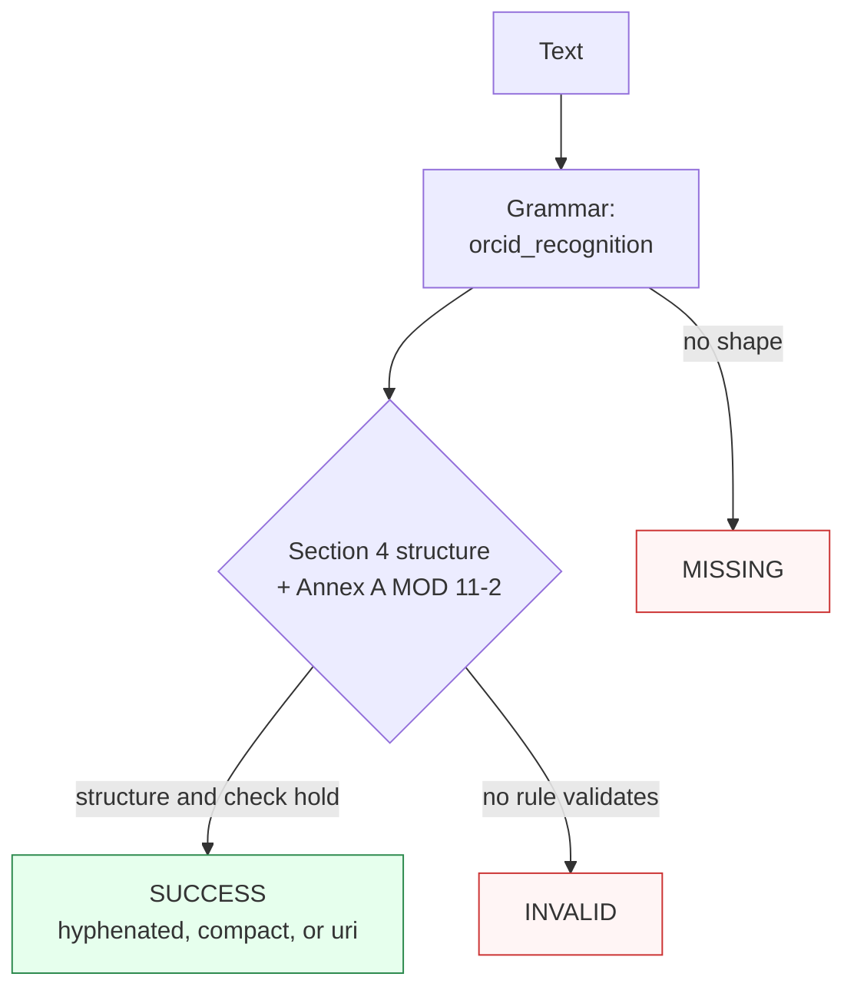

Canonicalizes **one ORCID mention** per call — a hyphenated `XXXX-XXXX-XXXX-XXXC` identifier, its bare-digit compact form, or an `orcid.org` URI (with an optional `ORCID`/`ISNI` label) — to hyphenated form.

> **In plain language:** give it `0000-0002-1825-0097`, `0000000218250097`, `https://orcid.org/0000-0002-1825-0097`, or `ORCID: 0000-0002-1825-0097` and it hands back `0000-0002-1825-0097` when the 16-character structure holds and the MOD 11-2 check character passes per ISO 27729:2024 §4 + Annex A. A wrong check character is `INVALID`, never a guess; shapes outside the hyphenated/compact/URI spellings are `MISSING`.

---

## What it recognizes — and what it does not

| Recognizes | Does not recognize |
|------------|--------------------|
| Hyphenated 4-4-4-4 (`0000-0002-1825-0097`; lowercase `x` folds to `X`) | Space-grouped (`0000 0002 1825 0097`) → `MISSING` |
| Compact bare 16 characters (`0000000218250097`, incl. re-entry of `compact` output) | Truncated or overlong runs (`0000-0002-1825-009`, `...-00977`) → `MISSING` |
| URI forms (`https://orcid.org/...`, `http://...`, `orcid.org/...`, `www.orcid.org/...`) | Glued label (`ORCID0000-0002-1825-0097`, no separator) → `MISSING` |
| Fused `ORCID`/`ISNI` label with separator (`ORCID: 0000-0002-1825-0097`, `orcid - ...`) | Digit-glued runs (`X0000-0002-1825-0097`, `...0097Y`) → `MISSING` |
| Embedded in prose, quoted, or bracketed (`see ... for author`, `"..."`, `[...]`) | Fullwidth digits → `MISSING` (payload is ASCII-only) |
| | Prose without an ORCID shape (`not an orcid`) → `MISSING` |

---

## Canonical output

Default `output_format` is `"orcid"` (identity — `normalize()` returns hyphenated form).

| `output_format` | Renders | Example |
|-----------------|---------|---------|
| *(default)* `orcid` / `None` / `"default"` | Hyphenated `XXXX-XXXX-XXXX-XXXC` | `0000-0002-1825-0097` |
| `compact` | Bare 16 characters, no hyphens (encoding) | `0000000218250097` |
| `uri` | Canonical `https://` URI (encoding — `http://` input still renders `https://`) | `https://orcid.org/0000-0002-1825-0097` |

Any other value raises `ContractError` — including `isni` (the grammar accepts an `ISNI:` label, but `isni` is not an output format).

```python
from paxman.capabilities import ORCID
import paxman

paxman.register_all_shipped()
print(paxman.canonicalize("0000000218250097", ORCID.create_contract()).canonicalized_value)
print(paxman.canonicalize("https://orcid.org/0000-0002-1825-0097", ORCID.create_contract()).canonicalized_value)
print(paxman.canonicalize("ORCID: 0000-0002-1694-233x", ORCID.create_contract()).canonicalized_value)
print(paxman.canonicalize("0000-0002-1825-0097", ORCID.create_contract(output_format="compact")).canonicalized_value)
print(paxman.canonicalize("0000-0002-1825-0097", ORCID.create_contract(output_format="uri")).canonicalized_value)
```

---

## Contract

```python
contract = ORCID.create_contract(
    output_format=None,  # "orcid" (default), "compact", "uri"
    # plus every common field: suppress_common_words / excluded_rules / pinned_rules / year / extra_grammars
)
```

- No grammar toggles: one grammar (`orcid_recognition`), two rules (`Section 4-orcid-structure`, `Section A-mod11-2-check-character`).
- Both rules validate the full structure-plus-checksum conjunction and normalize identically, so a `SUCCESS` carries dual provenance on one value.
- `year` filters by `publication_year`; e.g., `year=2020` drops both ISO 27729:2024 rules → `0000-0002-1825-0097` becomes `INVALID`.
- Single-value: two distinct ORCIDs in one call raise `MultipleMentionsError` — split first per `docs/recipes/segmentation.md`.

---

## Statuses

| Input | Contract | Status | Value / why |
|-------|----------|--------|-------------|
| `0000-0002-1825-0097` | defaults | `SUCCESS` | `"0000-0002-1825-0097"` |
| `0000000218250097` | defaults | `SUCCESS` | `"0000-0002-1825-0097"` (compact recognized) |
| `https://orcid.org/0000-0002-1825-0097` | defaults | `SUCCESS` | URI host absorbed, hyphenated value |
| `ORCID: 0000-0002-1825-0097` | defaults | `SUCCESS` | label absorbed into the span |
| `0000-0002-1694-233x` | defaults | `SUCCESS` | `"0000-0002-1694-233X"` (lowercase `x` folds up) |
| `0000000218250097` (re-entry of `compact` output) | defaults | `SUCCESS` | fixed point: renders `0000-0002-1825-0097` again |
| `https://orcid.org/0000-0002-1825-0097` (re-entry of `uri` output) | defaults | `SUCCESS` | fixed point: renders `0000-0002-1825-0097` again |
| `not an orcid` | any | `MISSING` | no ORCID shape |
| `0000 0002 1825 0097` | any | `MISSING` | spaces are not separators |
| `ORCID0000-0002-1825-0097` | any | `MISSING` | glued label needs a separator |
| `0000-0002-1825-0098` | any | `INVALID` | structure holds, MOD 11-2 check fails |
| `0000-0002-1825-0097` | `year=2020` | `INVALID` | rules are 2024, dropped |
| `0000-0002-1825-0097` | `output_format="isni"` | raises `ContractError` | not an offered format |
| Two distinct ORCIDs in one call | any | raises `MultipleMentionsError` | split first |

Both rules normalize identically, so the two candidates always agree on one value and `AMBIGUOUS` is unreachable for this capability.



---

## Notebook snippet — normalize a mixed column

```python
import paxman
from paxman.capabilities import ORCID
from paxman.core.domain import Resolution
from paxman.core.errors import ContractError

paxman.register_all_shipped()
contract = ORCID.create_contract()

rows = [
    "0000-0002-1825-0097",
    "0000000218250097",
    "https://orcid.org/0000-0002-1825-0097",
    "ORCID: 0000-0002-1694-233x",
    "0000-0002-1825-0098",
    "0000 0002 1825 0097",
    "ORCID0000-0002-1825-0097",
    "not an orcid",
]

for text in rows:
    r = paxman.canonicalize(text, contract)
    val = r.canonicalized_value if r.status == Resolution.SUCCESS else "—"
    rule = r.candidates[0].validation_rule if r.candidates else "—"
    print(f"{text!r:44} → {r.status.value:10} {val!r:42} ({rule})")

# compact re-entry fixed point (v0.4.0): compact output re-enters to the hyphenated form
compact_out = paxman.canonicalize("0000-0002-1825-0097", ORCID.create_contract(output_format="compact")).canonicalized_value
back = paxman.canonicalize(compact_out, contract)
print(f"{compact_out!r} re-enters → {back.status.value} {back.canonicalized_value!r}")

try:
    ORCID.create_contract(output_format="isni")
except ContractError as e:
    print(f"isni → ContractError: {e}")
```

---

## Provenance

- **ISO 27729:2024** §4 ISNI/ORCID structure (16 characters: 15 digits + MOD 11-2 check character, with Annex A check) — `Section 4-orcid-structure`
- **ISO 27729:2024** Annex A MOD 11-2 check character over the first 15 decimal digits (`X` = 10, with §4 structure) — `Section A-mod11-2-check-character`

Each candidate's `validation_rule` carries the section, and `candidate.provenance[0].publication_year` the year.

See also: [Execution Result](../concepts/execution-result/), [Provenance](../concepts/provenance/), [Segmentation](https://github.com/nexusnv/paxman-python/blob/main/docs/recipes/segmentation.md).
